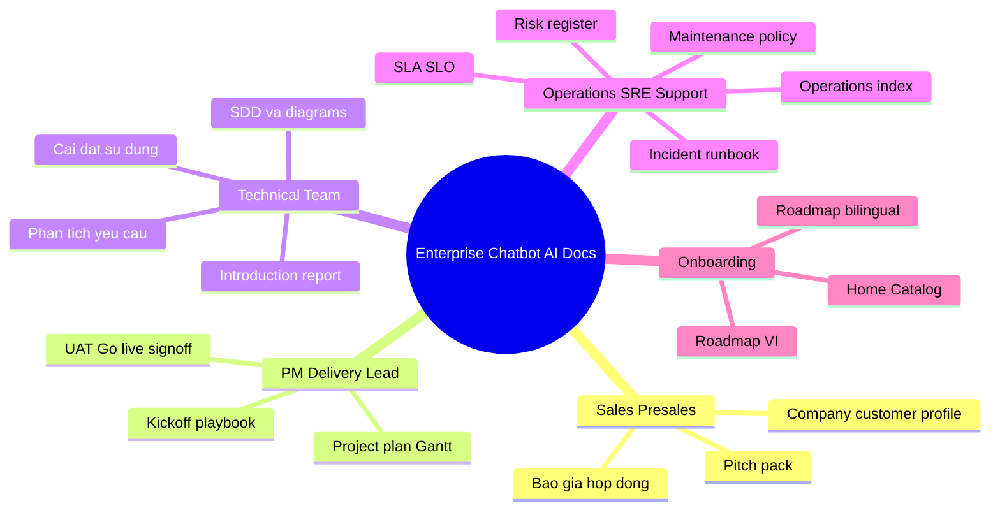

# Danh Muc Tai Lieu | Document Catalog (Public Docs)

Tai lieu duoc sap xep theo nhom nghiep vu de de tim, de onboarding, va de review theo tung phase trien khai.

## Truy cap nhanh | Quick Access

[Home page](./index.md){ .md-button .md-button--primary }
[Huong dan Publish](./publish_github_pages.md){ .md-button }
[Repo GitHub](https://github.com/vntayemm/demo-chatbot){ .md-button }

## 1) Tong quan va huong dan

Tai lieu nen doc dau tien cho team moi vao du an.

- [Tong quan repo | README](https://github.com/vntayemm/demo-chatbot/blob/main/README.md)
- [Bao cao gioi thieu | Introduction Report](./content/01-overview/introduction_report.md)
- [Huong dan cai dat va su dung | Setup and Usage Guide](./content/01-overview/huong_dan_cai_dat_va_su_dung.md)
- [Huong dan cai dat va su dung | Setup and Usage Guide](./content/01-overview/huong_dan_cai_dat_va_su_dung_bilingual.md)
- [Huong dan nguoi dung | User Guideline/Help](./content/01-overview/user_guideline_help.md)

## 2) Governance va operations

Khung van hanh, rui ro, chat luong va quy trinh.

- [Chi muc van hanh | Operations Index](./content/02-governance/operations_index.md)
- [Khung kiem soat hoan chinh vu viec / nghiep vu | Complete Control Framework](./content/02-governance/kiem_soat_hoan_chinh_vu_viec_nghiep_vu.md)
- [Checklist phan mem va theo role | Software & Role Checklists](./content/02-governance/checklist_phan_mem_va_theo_role.md)
- [Cam ket muc dich vu | SLA/SLO](./content/02-governance/slo_sla.md)
- [So dang ky rui ro | Risk Register](./content/02-governance/risk_register.md)
- [So tay xu ly su co | Incident Runbook](./content/02-governance/runbook_incident.md)
- [Danh sach go-live | Go-live Checklist](./content/02-governance/go_live_checklist.md)
- [Danh sach UAT | UAT Checklist](./content/02-governance/uat_checklist.md)
- [Chinh sach bao tri | Maintenance Policy](./content/02-governance/chinh_sach_bao_tri.md)
- [Chinh sach bao cao | Report Policy](./content/02-governance/report_policy.md)
- [Chinh sach binh luan | Comment Policy](./content/02-governance/comment_policy.md)
- [Quy trinh tiep nhan yeu cau | Request Intake Process](./content/02-governance/quy_trinh_tiep_nhan_yeu_cau.md)
- [Quy trinh quan ly du an | Project Management Process](./content/02-governance/quy_trinh_quan_ly_du_an.md)
- [Pipeline theo nhom thanh vien | Team Pipeline](./content/02-governance/pipeline_theo_tung_nhom_thanh_vien.md)

## 3) Sign-off va quality gates

Bo mau bien ban va checkpoint de khoa chat luong ban giao.

- [Mau sign-off | Sign-off Template](./content/03-signoff/sign_off_template.md)
- [Bien ban UAT sign-off | UAT Sign-off Minutes](./content/03-signoff/uat_sign_off_bien_ban.md)
- [Bien ban go-live sign-off | Go-live Sign-off Minutes](./content/03-signoff/go_live_sign_off_bien_ban.md)

## 4) Kien truc, thiet ke, phan tich

Tai lieu phuc vu team technical, architecture review va implementation planning.

- [Tai lieu thiet ke he thong | SDD](./content/04-architecture/tai_lieu_thiet_ke_he_thong.md)
- [Tai lieu thiet ke he thong | SDD](./content/04-architecture/tai_lieu_thiet_ke_he_thong_bilingual.md)
- [So do kien truc | Architecture Diagrams](./content/04-architecture/tai_lieu_kien_truc_va_diagrams.md)
- [So do kien truc | Architecture Diagrams](./content/04-architecture/tai_lieu_kien_truc_va_diagrams_bilingual.md)
- [Tai lieu phan tich yeu cau | Requirement Analysis](./content/04-architecture/tai_lieu_phan_tich_yeu_cau.md)
- [Quy trinh BPMN | BPMN Business Process](./content/04-architecture/bpmn_quy_trinh_nghiep_vu.md)

## 5) Project execution

Tai lieu dieu phoi tien do, team setup va implementation tracking.

- [Ke hoach du an Gantt | Project Plan Gantt](./content/05-execution/project_plan_gantt.md)
- [Ke hoach du an theo goi | Package-based Gantt Plan](./content/05-execution/project_plan_gantt_by_package_ABC.md)
- [So tay kickoff | Kickoff Playbook](./content/05-execution/kickoff_playbook.md)
- [To chuc du an va vai tro | Project Team Structure and Roles](./content/05-execution/to_chuc_du_an_team_role_va_thuc_hien.md)
- [Ho so doi ngu | Team Profile](./content/05-execution/team_profile.md)
- [Ho so thanh vien | Member Resume Profiles](./content/05-execution/member_resume_profiles.md)

## 6) Thuong mai, phap ly, hop dong

Bo tai lieu phuc vu pre-sales, negotiation va legal handover.

- [Chi muc hop dong | Contract Pack Index](./content/06-commercial-legal/contract_pack_index.md)
- [Bao gia de xuat | Proposal Pricing](./content/06-commercial-legal/bao_gia_de_xuat.md)
- [Bao gia rut gon | One-page Pricing](./content/06-commercial-legal/bao_gia_rut_gon_1_trang.md)
- [Bao gia song ngu | Pricing VI-EN](./content/06-commercial-legal/bao_gia_rut_gon_1_trang_bilingual.md)
- [Bao gia song ngu + USD | Pricing VI-EN + USD](./content/06-commercial-legal/bao_gia_rut_gon_1_trang_bilingual_usd_reference.md)
- [Mail chao gia | Offer Email](./content/06-commercial-legal/mail_chao_gia_offers.md)
- [Mail chao gia theo goi | Offer Email by Package](./content/06-commercial-legal/mail_chao_gia_theo_goi_ABC.md)
- [Mail chao gia theo goi | Offer Email by Package](./content/06-commercial-legal/mail_chao_gia_theo_goi_ABC_bilingual.md)
- [Hop dong mau | Master Contract Template](./content/06-commercial-legal/hop_dong_dich_vu_trien_khai_chatbot_mau.md)
- [Hop dong rut gon | Short Contract Template](./content/06-commercial-legal/hop_dong_dich_vu_trien_khai_chatbot_rut_gon.md)
- [Hop dong song ngu | Contract VI-EN](./content/06-commercial-legal/hop_dong_dich_vu_trien_khai_chatbot_bilingual.md)
- [Checklist ky hop dong | Contract Signing Checklist](./content/06-commercial-legal/checklist_ky_hop_dong.md)
- [Email gui hop dong ky | Contract Signing Cover Email](./content/06-commercial-legal/contract_signing_cover_email.md)
- [Dieu khoan dich vu | Terms of Service](./content/06-commercial-legal/terms_of_service.md)
- [Chinh sach quyen rieng tu | Privacy Policy](./content/06-commercial-legal/privacy_policy.md)
- [Chinh sach thanh toan | Payment Policy](./content/06-commercial-legal/payment_policy.md)

## 7) Sales, pitch, company profile

Bo tai lieu de chuan hoa thong diep kinh doanh va profile nang luc.

- [Bo pitch kinh doanh | Pitch Pack](./content/07-sales-profile/pitch_pack.md)
- [Mau hop 15 phut | 15-minute Meeting Template](./content/07-sales-profile/meeting_template_15min.md)
- [Tuyen bo tuan thu khach hang | Customer Compliance Statement](./content/07-sales-profile/customer_compliance_statement.md)
- [Tuyen bo tuan thu khach hang | Customer Compliance Statement](./content/07-sales-profile/customer_compliance_statement_bilingual.md)
- [Tom tat dieu hanh | Executive Summary](./content/07-sales-profile/customer_compliance_statement_executive.md)
- [Ho so cong ty | Company Profile](./content/07-sales-profile/company_profile.md)
- [Ho so khach hang | Customer Profile](./content/07-sales-profile/customer_profile.md)
- [Case study tong quan | Case Study](./content/07-sales-profile/case_study_demo_chatbot.md)
- [Case study chi tiet | Detailed Case Study](./content/07-sales-profile/case_study_demo_chatbot_detailed.md)

## 8) Marketing content

Tai lieu phuc vu campaign planning va content execution.

- [Bo blog marketing | Marketing Blog Pack](./content/08-marketing/marketing_blog_pack.md)
- [Danh sach blog | Blogs Listing](./content/01-overview/blogs_listing.md)
- [Bo bai dang mang xa hoi | Social Post Pack](./content/08-marketing/social_post_pack.md)
- [Bo email newsletter | Email Newsletter Pack](./content/08-marketing/email_newsletter_pack.md)
- [Lich chien dich marketing | Marketing Campaign Calendar](./content/08-marketing/marketing_campaign_calendar.md)
- [Ban tin cap nhat | News Feed](./content/08-marketing/news_feed.md)

## 9) Frontend pages (web demo)

Cac trang HTML duoc build kem site MkDocs (thu muc `docs/frontend/`).

- [Landing page (VI)](./frontend/landing.html)
- [Landing page](./frontend/landing_bilingual.html)
- [Trang danh sach blog | Blogs Listing Web](./frontend/blogs.html)
- [Trang danh sach tinh nang | Features Listing Web](./frontend/features.html)
- [Trang tin tuc | News Web](./frontend/news.html)

## 10) Mindmap lo trinh theo vai tro | Role roadmap (tom tat)

**VI:** Cung mot so do voi [Home](./index.md) va [Roadmap](./roadmap.md): bon nhom vai tro + onboarding.  
**EN:** Same mind map as Home / Roadmap: four role tracks plus onboarding.

