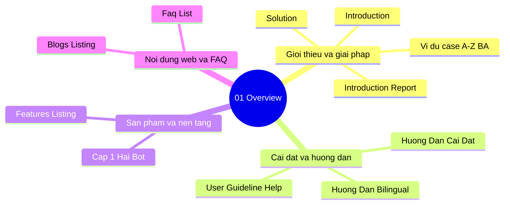

# 01-overview | Overview

Danh sach tai lieu trong nhom `01-overview`.

> Goi y: chon mot tai lieu de mo truc tiep trong Docs site.

- [Blogs Listing](./blogs_listing.md)
- [Cap 1 — Hai bot va nen tang local](./cap1.md)
- [Faq List](./faq_list.md)
- [Features Listing](./features_listing.md)
- [Huong Dan Cai Dat Va Su Dung](./huong_dan_cai_dat_va_su_dung.md)
- [Huong Dan Cai Dat Va Su Dung Bilingual](./huong_dan_cai_dat_va_su_dung_bilingual.md)
- [Introduction](./introduction.md)
- [Introduction Report](./introduction_report.md)
- [Vi Du Case A-Z Container Va CRM Lead](./vi_du_case_az_container_va_crm_lead.md)
- [Solution](./solution.md)
- [User Guideline Help](./user_guideline_help.md)

## Mindmap nhom tai lieu | Section mind map (tom tat)

**VI:** So do tu duy tom tat cac nhom tai lieu trong `01-overview`.  
**EN:** Mind map summarizing document themes in this section.

