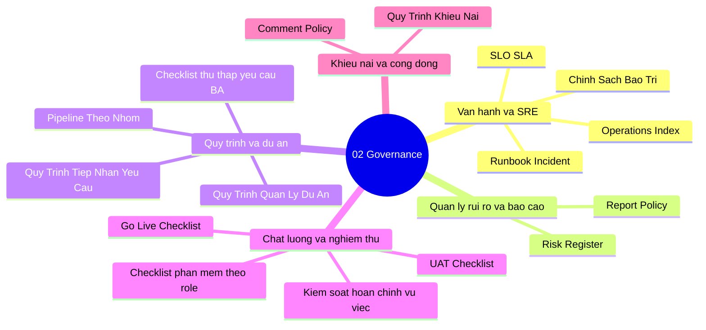

# 02-governance | Governance

Danh sach tai lieu trong nhom `02-governance`.

> Goi y: chon mot tai lieu de mo truc tiep trong Docs site.

- [Chinh Sach Bao Tri](./chinh_sach_bao_tri.md)
- [Checklist Phan Mem Va Theo Role](./checklist_phan_mem_va_theo_role.md)
- [Checklist Thu Thap Yeu Cau Nguoi Dung (BA)](./checklist_thu_thap_yeu_cau_nguoi_dung_ba.md)
- [Comment Policy](./comment_policy.md)
- [Go Live Checklist](./go_live_checklist.md)
- [Kiem Soat Hoan Chinh Vu Viec Nghiep Vu](./kiem_soat_hoan_chinh_vu_viec_nghiep_vu.md)
- [Operations Index](./operations_index.md)
- [Pipeline Theo Tung Nhom Thanh Vien](./pipeline_theo_tung_nhom_thanh_vien.md)
- [Quy Trinh Giai Quyet Khieu Nai Khieu Kien](./quy_trinh_giai_quyet_khieu_nai_khieu_kien.md)
- [Quy Trinh Quan Ly Du An](./quy_trinh_quan_ly_du_an.md)
- [Quy Trinh Tiep Nhan Yeu Cau](./quy_trinh_tiep_nhan_yeu_cau.md)
- [Report Policy](./report_policy.md)
- [Risk Register](./risk_register.md)
- [Runbook Incident](./runbook_incident.md)
- [SLO SLA](./slo_sla.md)
- [UAT Checklist](./uat_checklist.md)

## Mindmap nhom tai lieu | Section mind map (tom tat)

**VI:** So do tu duy tom tat cac nhom tai lieu trong `02-governance`.  
**EN:** Mind map summarizing governance and operations docs in this section.

