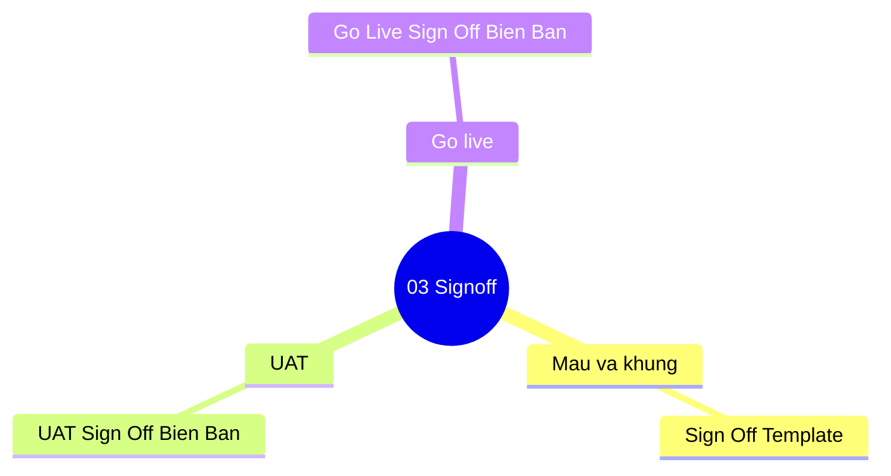

# 03-signoff | Signoff

Danh sach tai lieu trong nhom `03-signoff`.

> Goi y: chon mot tai lieu de mo truc tiep trong Docs site.

- [Go Live Sign Off Bien Ban](./go_live_sign_off_bien_ban.md)
- [Sign Off Template](./sign_off_template.md)
- [UAT Sign Off Bien Ban](./uat_sign_off_bien_ban.md)

## Mindmap nhom tai lieu | Section mind map (tom tat)

**VI:** So do tu duy nhom tai lieu nghiem thu va ban giao.  
**EN:** Mind map for signoff and acceptance documents.

