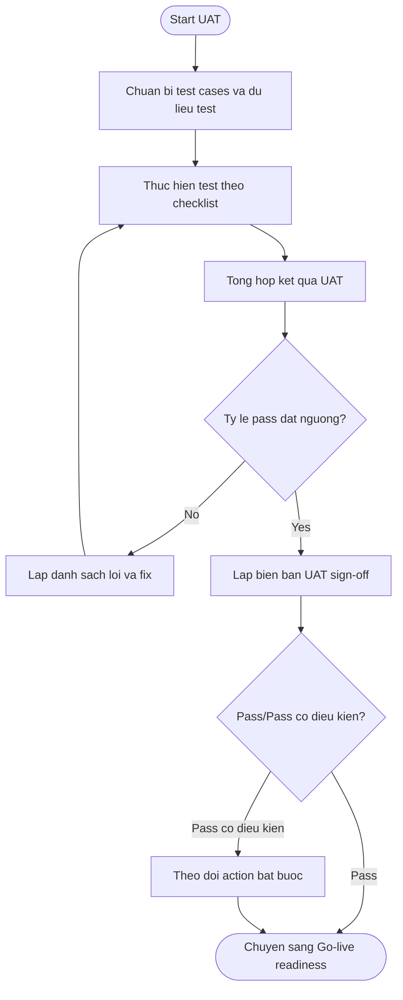
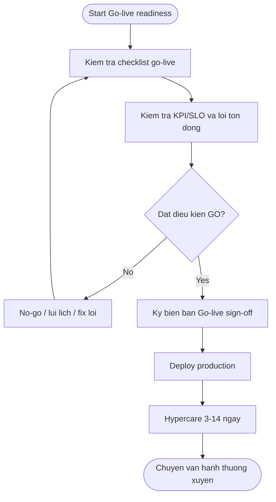
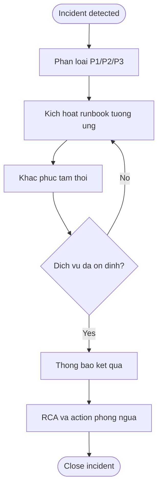

# BPMN QUY TRINH NGHIEP VU - Enterprise Chatbot | AI

## 1. Muc dich

Tai lieu nay mo ta quy trinh nghiep vu tu tiep nhan nhu cau den van hanh chatbot theo huong production-ready.

## 2. Dinh nghia lane/role

- **Business/Sponsor**
- **BA/PO**
- **Delivery Team (PM/Dev/QA/DevOps)**
- **End User**
- **Ops/Support**

## 3. BPMN cap tong the (tu demand den operation)

**Muc dich:** Mo ta vong doi tu nhu cau chatbot den van hanh on dinh, gom cac diem quyet dinh phe duyet scope, UAT va GO.

```mermaid
flowchart LR
    A([Start: Nhu cau chatbot]) --> B[Thu thap yeu cau nghiep vu]
    B --> C[Phan tich va xac nhan pham vi]
    C --> D{Phe duyet scope?}
    D -- No --> B
    D -- Yes --> E[Lap ke hoach trien khai]
    E --> F[Phat trien va cau hinh he thong]
    F --> G[Test ky thuat noi bo]
    G --> H[Thuc hien UAT voi business]
    H --> I{UAT Pass?}
    I -- No --> F
    I -- Yes --> J[Go-live readiness check]
    J --> K{Du dieu kien GO?}
    K -- No --> F
    K -- Yes --> L[Production go-live]
    L --> M[Hypercare va giam sat]
    M --> N([End: Van hanh on dinh])
```

**Ghi chu thanh phan:**

- **Start/End:** Diem bat dau va ket thuc quy trinh tong the.
- **Thu thap … Phat trien:** Chuoi giai doan tuyen tinh tu yeu cau den build.
- **Phe duyet scope? / UAT Pass? / Du dieu kien GO?:** Cac nhanh quyet dinh co the quay lai buoc truoc.
- **Hypercare va giam sat:** Giai doan on dinh sau go-live.

## 4. BPMN quy trinh UAT sign-off

**Muc dich:** Chuan hoa luong UAT tu chuan bi test case den bien ban sign-off va xu ly pass co dieu kien.

**Ghi chu thanh phan:**

- **Start UAT / Chuan bi test cases:** Khoi dong va dau vao kiem thu.
- **Thuc hien test / Tong hop ket qua:** Thuc thi va tong hop.
- **Ty le pass dat nguong?:** Cong chat luong; nhanh No quay ve fix.
- **Bien ban UAT sign-off / Pass co dieu kien:** Dau ra nghiep vu va theo doi action bat buoc.

## 5. BPMN quy trinh go-live sign-off

**Muc dich:** Kiem soat san sang go-live (checklist, KPI, loi ton dong) truoc ky bien ban va deploy.

**Ghi chu thanh phan:**

- **Kiem tra checklist / KPI-SLO:** Dau vao dieu kien GO.
- **Dat dieu kien GO?:** Nhanh No-go quay lai chuan bi.
- **Ky bien ban / Deploy / Hypercare:** Chuoi hanh dong sau khi GO.
- **Chuyen van hanh thuong xuyen:** Ket thuc hypercare.

## 6. BPMN quy trinh xu ly su co van hanh

**Muc dich:** Luong xu ly su co (phan loai P1-P3, runbook, tam thoi, RCA) de giam thoi gian ngung hoat dong.

**Ghi chu thanh phan:**

- **Incident detected / Phan loai:** Tiep nhan va muc do uu tien.
- **Runbook / Khac phuc tam thoi:** Hanh dong chuan hoa va giam thieu tac dong.
- **Dich vu da on dinh?:** Xac nhan truoc khi dong.
- **RCA va phong ngua:** Hoc hoi sau su co.

## 7. Input/Output theo giai doan

| Giai doan | Input | Output |
|---|---|---|
| Requirement | Nhu cau business | Tai lieu phan tich yeu cau |
| Build/Test | Scope + plan | He thong san sang UAT |
| UAT | UAT checklist + test cases | UAT sign-off bien ban |
| Go-live | Go-live checklist + KPI | Go-live sign-off bien ban |
| Operation | SLO/SLA + runbook | Bao cao van hanh + incident records |

## 8. Tieu chi chuyen giai doan

- Requirement -> Build:
  - Scope duoc phe duyet
- Build -> UAT:
  - Test ky thuat dat nguong toi thieu
- UAT -> Go-live:
  - UAT pass hoac pass co dieu kien da kiem soat
- Go-live -> Operation:
  - GO sign-off + hypercare on dinh

## 9. Tai lieu lien quan

- [Tai lieu phan tich yeu cau (BRD/SRS)](./tai_lieu_phan_tich_yeu_cau.md)
- [Project plan Gantt](../05-execution/project_plan_gantt.md)
- [Bien ban UAT sign-off](../03-signoff/uat_sign_off_bien_ban.md)
- [Bien ban Go-live sign-off](../03-signoff/go_live_sign_off_bien_ban.md)
- [Runbook incident](../02-governance/runbook_incident.md)
