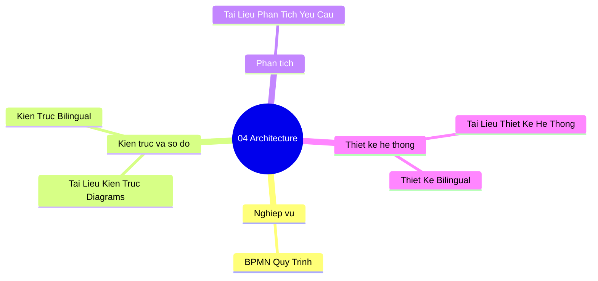

# 04-architecture | Architecture

Danh sach tai lieu trong nhom `04-architecture`.

> Goi y: chon mot tai lieu de mo truc tiep trong Docs site.

- [BPMN Quy Trinh Nghiep Vu](./bpmn_quy_trinh_nghiep_vu.md)
- [Tai Lieu Kien Truc Va Diagrams](./tai_lieu_kien_truc_va_diagrams.md)
- [Tai Lieu Kien Truc Va Diagrams Bilingual](./tai_lieu_kien_truc_va_diagrams_bilingual.md)
- [Tai Lieu Phan Tich Yeu Cau](./tai_lieu_phan_tich_yeu_cau.md)
- [Tai Lieu Thiet Ke He Thong](./tai_lieu_thiet_ke_he_thong.md)
- [Tai Lieu Thiet Ke He Thong Bilingual](./tai_lieu_thiet_ke_he_thong_bilingual.md)

## Mindmap nhom tai lieu | Section mind map (tom tat)

**VI:** So do tu duy kien truc phan tich va thiet ke.  
**EN:** Mind map for architecture, analysis, and design docs.

