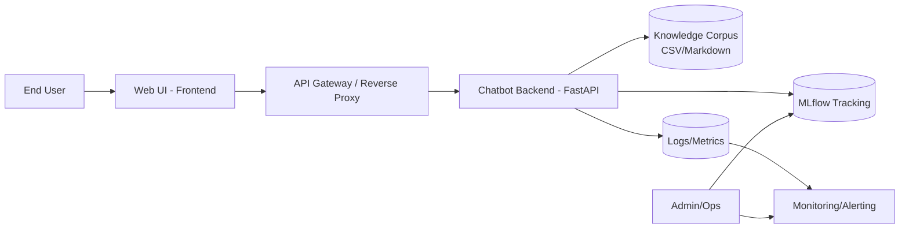
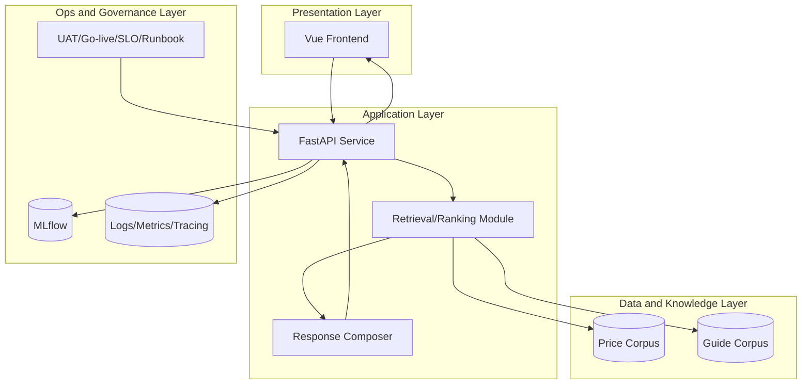
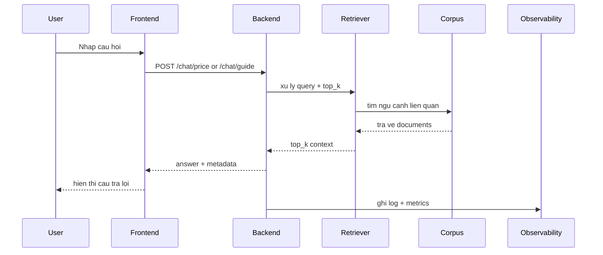
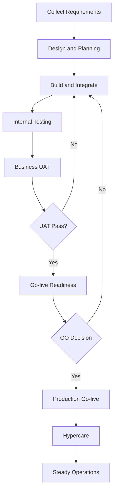
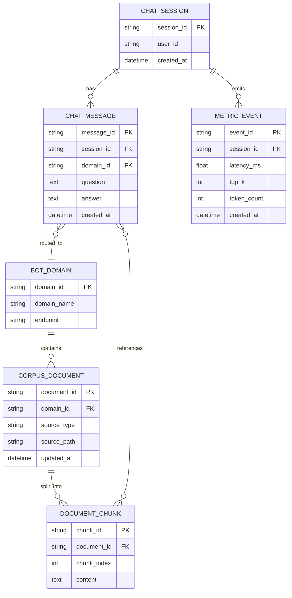
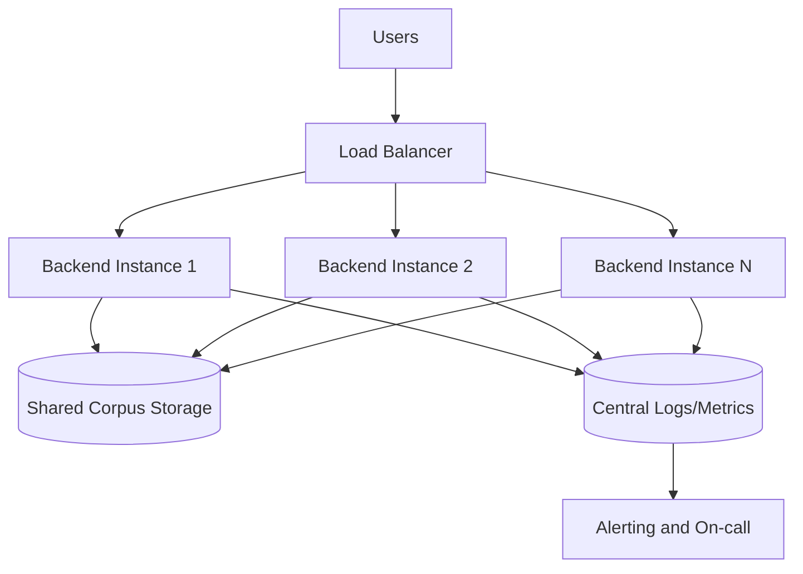
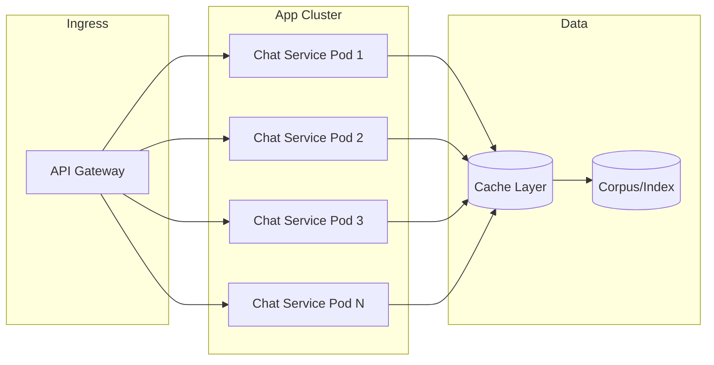
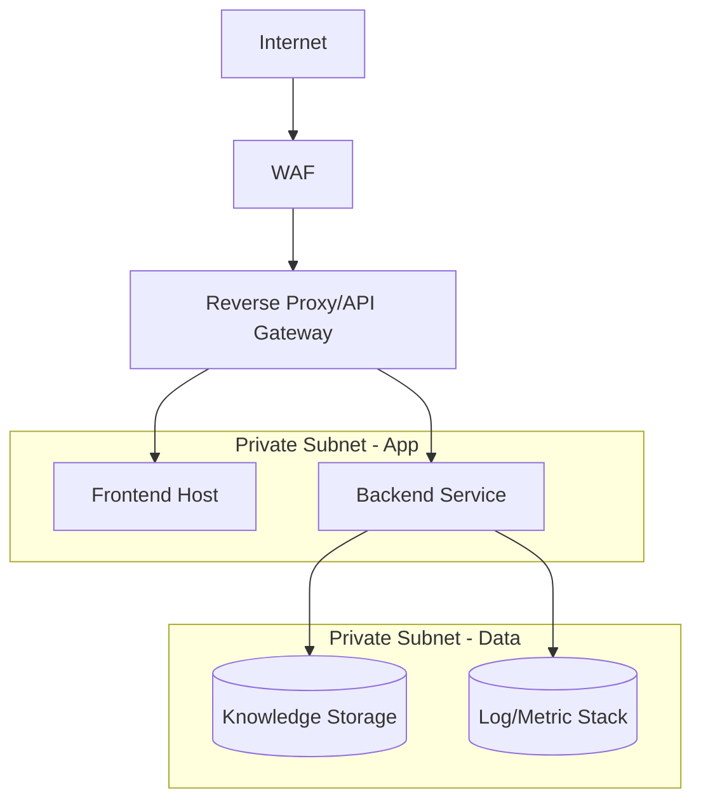
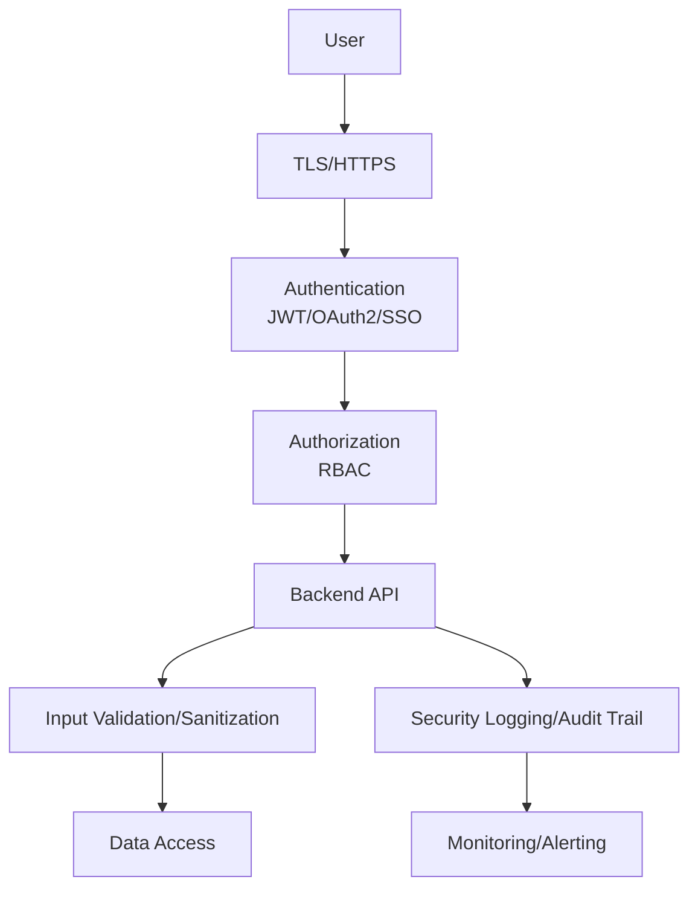
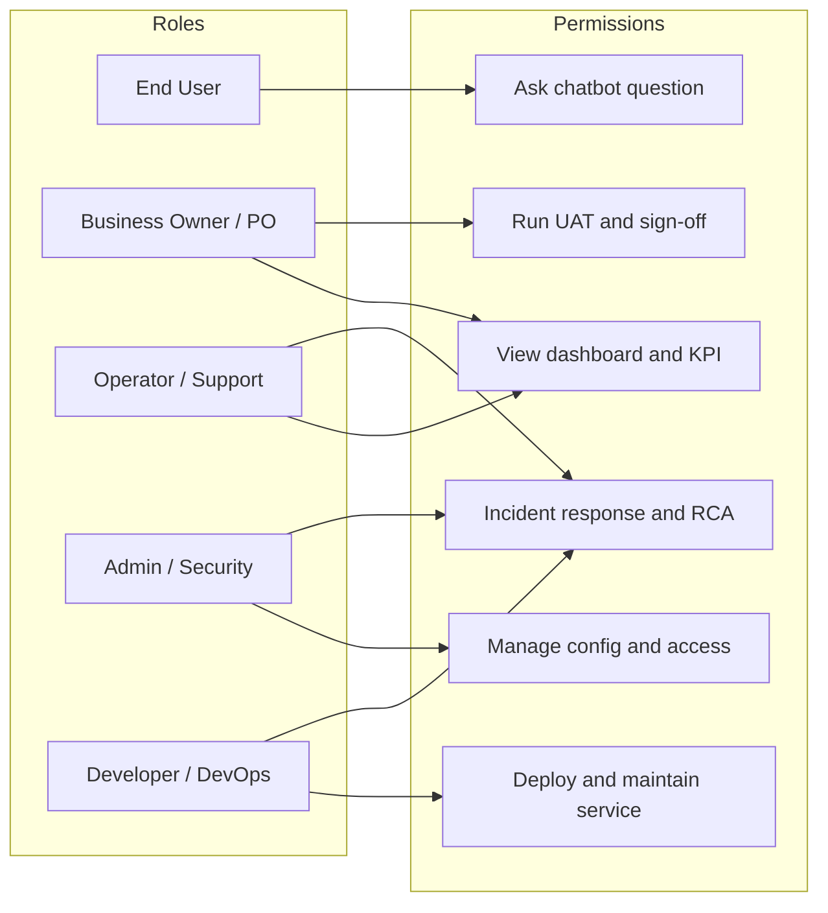

# TAI LIEU KIEN TRUC ARCHITECT VA DIAGRAMS - DEMO-CHATBOT

## 1. Muc dich

Tai lieu nay tong hop cac so do kien truc va luong xu ly de phuc vu:
- Thiet ke ky thuat
- Review voi stakeholder/business/IT/security
- Lam can cu trien khai production

## 2. Landscape Diagram (Tong the he sinh thai)

## 3. High Level Architecture Diagram

## 4. Sequence Diagram (Chat request)

## 5. Workflow Diagram (Business to Operation)

## 6. ERD (Logical Data Model)

## 7. High Availability Diagram

## 8. Scale Diagram (Horizontal scaling strategy)

## 9. Network Diagram (Production reference)

## 10. Security Diagram (Control layers)

## 11. User Role Diagram

## 12. Ghi chu su dung

- Cac diagram la logical reference de review va planning.
- Khi trien khai production, can cap nhat theo ha tang thuc te (cloud/on-prem, subnet, IAM, monitoring stack).
- Neu can trinh bay cho khach hang, uu tien dung:
  - Landscape
  - High Level Architecture
  - Sequence
  - Security
  - User Role
