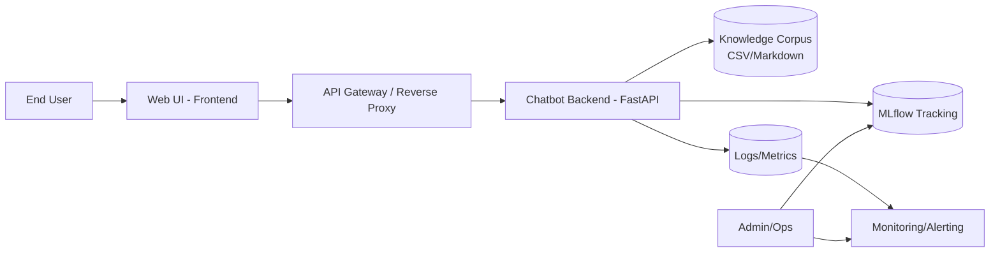
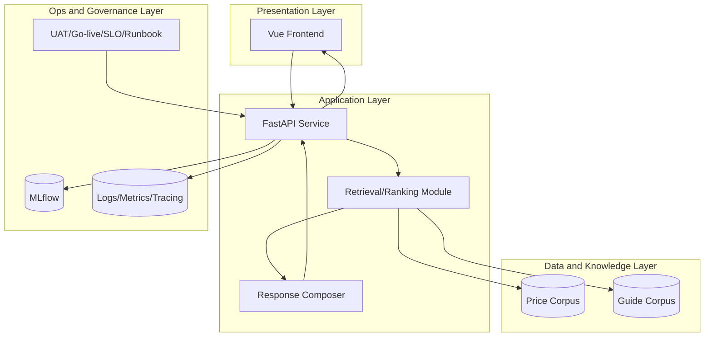
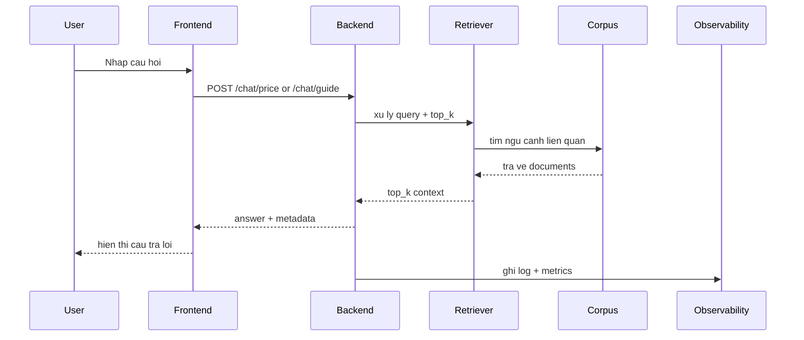
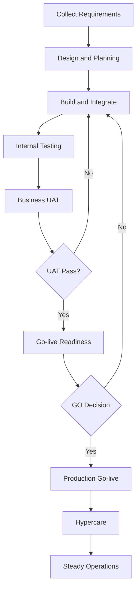
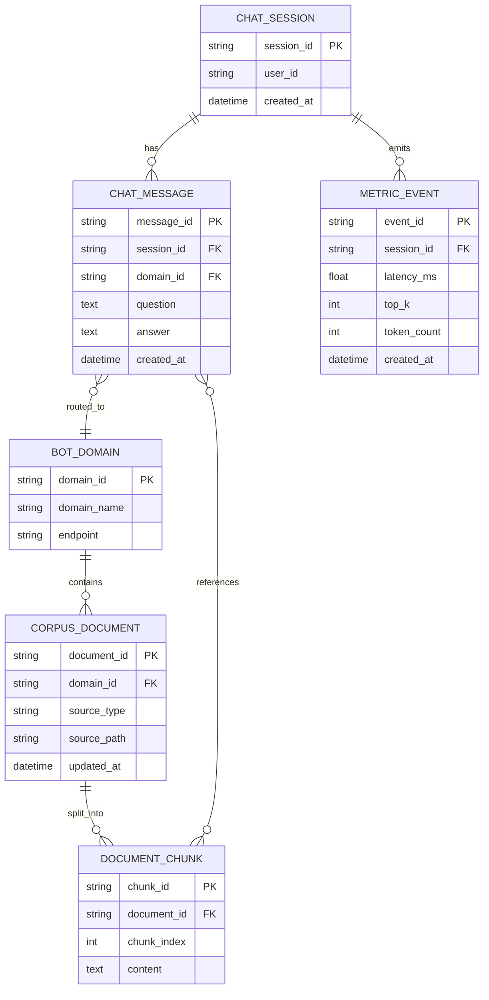
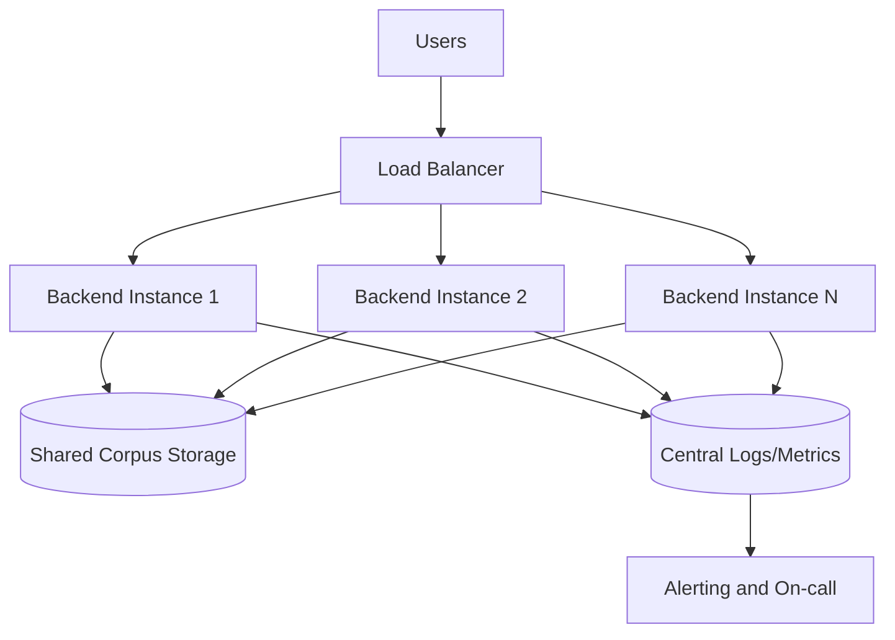
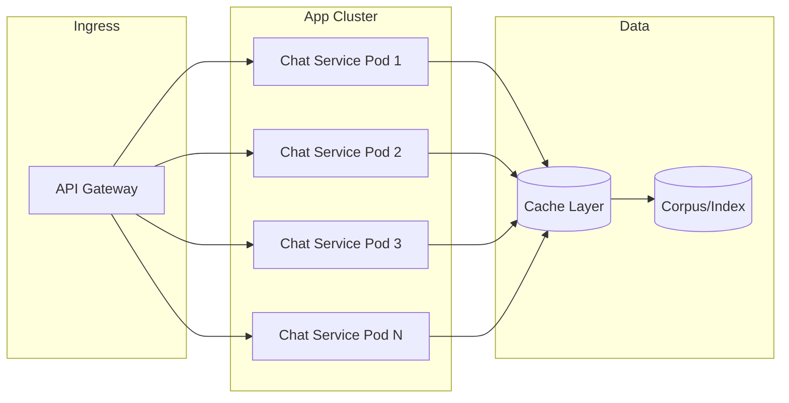
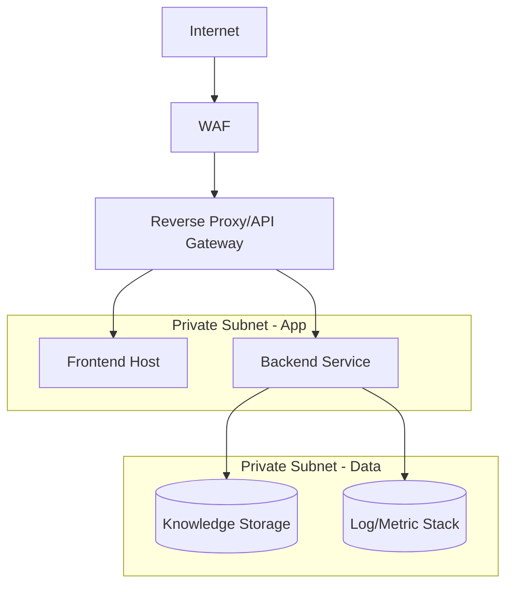
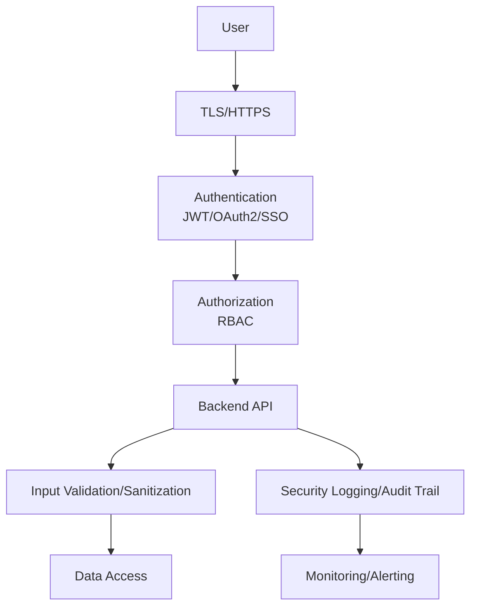
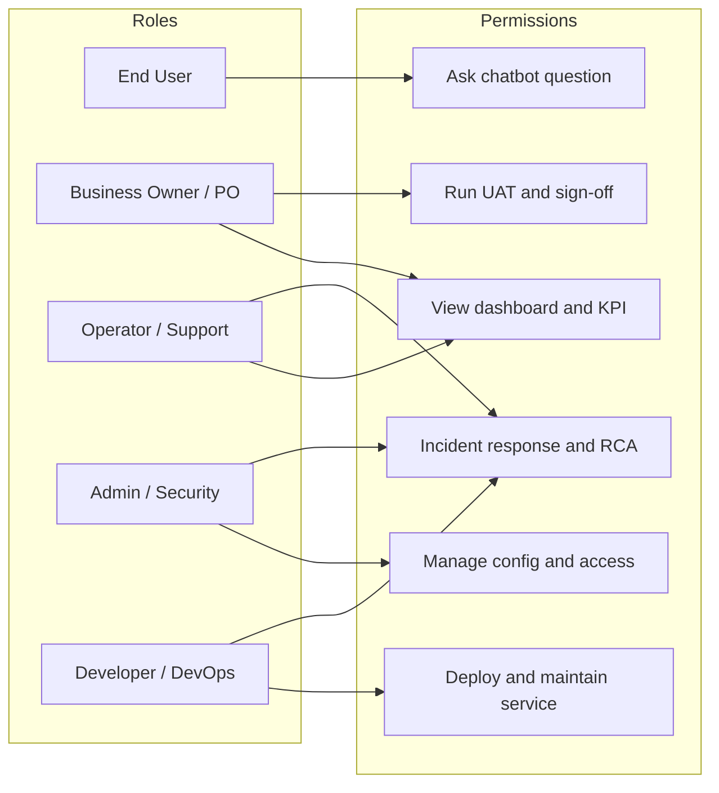

# TAI LIEU KIEN TRUC ARCHITECT VA DIAGRAMS - Enterprise Chatbot | AI

## 1. Muc dich

Tai lieu nay tong hop cac so do kien truc va luong xu ly de phuc vu:
- Thiet ke ky thuat
- Review voi stakeholder/business/IT/security
- Lam can cu trien khai production

## 2. Landscape Diagram (Tong the he sinh thai)

**Muc dich:** Mo ta toan canh luong tu nguoi dung den frontend, backend, kho tri thuc, thuc nghiem ML va giam sat — giup review ranh gio trach nhiem va phu thuoc he thong.

**Ghi chu thanh phan:**

- **End User:** Nguoi dung cuoi hoi chatbot.
- **Web UI - Frontend:** Lop giao dien nguoi dung.
- **API Gateway / Reverse Proxy:** Diem vao tap trung (TLS, routing, rate limit).
- **Chatbot Backend - FastAPI:** Dich vu xu ly hoi/dap va orchestration.
- **Knowledge Corpus:** Du lieu ngu canh (CSV/Markdown) phuc vu retrieval.
- **MLflow Tracking:** Ghi lai thuc nghiem/prompt/model phien ban.
- **Logs/Metrics:** Du lieu quan sat luong request/latency/loi.
- **Monitoring/Alerting:** Canh bao va dashboard van hanh.
- **Admin/Ops:** Van hanh, xem MLflow va monitoring.

## 3. High Level Architecture Diagram

**Muc dich:** Phan tach cac lop Presentation / Application / Data / Ops de thiet ke va review tich hop noi bo giua UI, API, retrieval va quan tri.

**Ghi chu thanh phan:**

- **Vue Frontend:** UI chat, goi API va hien thi cau tra loi + metadata.
- **FastAPI Service:** API REST/WebSocket, routing domain, dieu phoi luong.
- **Retrieval/Ranking Module:** Truy van corpus, xep hang chunk ngu canh.
- **Response Composer:** Tong hop cau tra loi tu ngu canh da xep hang.
- **Price Corpus / Guide Corpus:** Hai kho tri thuc (gia vs huong dan) tuong ung endpoint.
- **MLflow:** Theo doi run/prompt/metric thuc nghiem.
- **Logs/Metrics/Tracing:** Quan sat ky thuat (trace luong request).
- **UAT/Go-live/SLO/Runbook:** Tai lieu va tieu chuan van hanh anh huong toi trien khai.

## 4. Sequence Diagram (Chat request)

**Muc dich:** Lam ro thu tu tuong tac theo thoi gian tu cau hoi den cau tra loi va ghi nhan quan sat — huu ich cho debug va SLA.

**Ghi chu thanh phan:**

- **User:** Nguoi nhap cau hoi.
- **Frontend:** Gui HTTP POST toi backend theo domain (`/chat/price` hoac `/chat/guide`).
- **Backend:** Dieu phoi retrieval, hop thanh cau tra loi.
- **Retriever:** Xu ly query, `top_k`, goi corpus.
- **Corpus:** Luu tru chunk/document tra ve cho retrieval.
- **Observability:** Nhan log/metrics sau xu ly.

## 5. Workflow Diagram (Business to Operation)

**Muc dich:** Mo ta vong doi trien khai tu thu thap yeu cau den van hanh on dinh, nhan manh vong lap UAT/GO va hypercare.

**Ghi chu thanh phan:**

- **Collect Requirements … Steady Operations:** Cac giai doan tuyen tinh va quyet dinh (diamond) UAT Pass / GO Decision quyet dinh quay lai build hoac tiep tuc.

## 6. ERD (Logical Data Model)

**Muc dich:** Thong nhat tu dien du lieu logic (domain, session, message, chunk, metric) — co the khac schema vat ly khi trien khai.

**Ghi chu thanh phan:**

- **BOT_DOMAIN:** Domain chatbot (price/guide) va endpoint dinh tuyen.
- **CORPUS_DOCUMENT / DOCUMENT_CHUNK:** Tai lieu nguon va doan embedding/tim kiem.
- **CHAT_SESSION / CHAT_MESSAGE:** Phien va tung luot hoi/dap.
- **METRIC_EVENT:** Su kien do luong (latency, top_k, token) gan session.

## 7. High Availability Diagram

**Muc dich:** The hien nhieu instance backend dung chung corpus va tap trung log/metrics de tang san sang va kha nang phuc hoi.

**Ghi chu thanh phan:**

- **Users:** Luong truy cap qua load balancer.
- **Load Balancer:** Phan phoi request toi N instance.
- **Backend Instance 1..N:** Node xu ly doc lap, stateless neu co the.
- **Shared Corpus Storage:** Kho ngu canh dung chung.
- **Central Logs/Metrics:** Tap trung quan sat.
- **Alerting and On-call:** Canh bao toi nguoi truc.

## 8. Scale Diagram (Horizontal scaling strategy)

**Muc dich:** Mo ta mo rong ngang: nhieu pod dich vu, cache giam ap corpus/index, ingress thong nhat.

**Ghi chu thanh phan:**

- **API Gateway:** Diem vao va co the ket hop TLS/routing.
- **Chat Service Pod 1..N:** Replica ung dung scale out.
- **Cache Layer:** Giam doc lap corpus, giam latency.
- **Corpus/Index:** Kho tri thuc hoac vector index.

## 9. Network Diagram (Production reference)

**Muc dich:** Tham chieu phan tang mang: Internet -> bao ve bien -> mang rieng app/data — can chinh sua theo cloud/on-prem thuc te.

**Ghi chu thanh phan:**

- **WAF:** Loc tan cong lop ung dung.
- **Reverse Proxy/API Gateway:** Ket noi an toan vao subnet private.
- **Frontend Host / Backend Service:** Workload trong mang rieng.
- **Knowledge Storage / Log-Metric Stack:** Du lieu va quan sat tach khoi public.

## 10. Security Diagram (Control layers)

**Muc dich:** Tong hop lop kiem soat: van tai, xac thuc, phan quyen, validate dau vao, truy cap du lieu va ghi nhan phuc vu audit/SIEM.

**Ghi chu thanh phan:**

- **TLS/HTTPS:** Ma hoa kenh.
- **Authentication (JWT/OAuth2/SSO):** Xac dinh danh tinh.
- **Authorization (RBAC):** Gan quyen theo vai tro.
- **Backend API:** Diem thuc thi nghiep vu.
- **Input Validation/Sanitization:** Giam injection va payload bat hop le.
- **Data Access:** Truy cap du lieu theo chinh sach.
- **Security Logging/Audit Trail + SIEM:** Phat hien va dieu tra su kien.

## 11. User Role Diagram

**Muc dich:** Anh xa vai tro nghiep vu sang quyen/hanh dong de thiet ke RBAC va RACI.

**Ghi chu thanh phan:**

- **End User … Developer/DevOps:** Nhom vai tro ben trai.
- **Permissions P1..P6:** Hanh dong duoc phep (hoi chatbot, KPI, UAT, cau hinh, trien khai, su co).

## 12. Ghi chu su dung

- Cac diagram la logical reference de review va planning.
- Khi trien khai production, can cap nhat theo ha tang thuc te (cloud/on-prem, subnet, IAM, monitoring stack).
- Neu can trinh bay cho khach hang, uu tien dung:
  - Landscape
  - High Level Architecture
  - Sequence
  - Security
  - User Role
