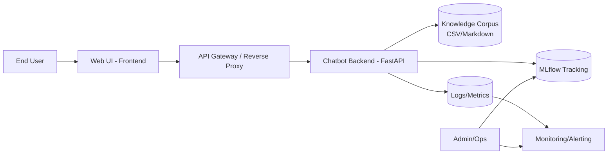
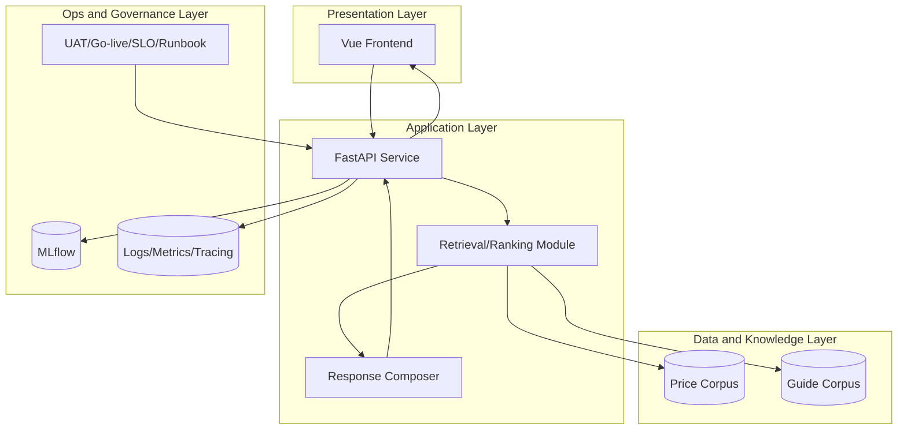
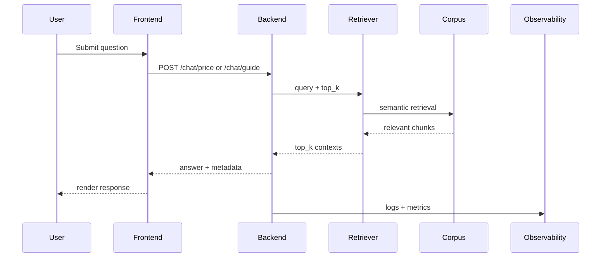
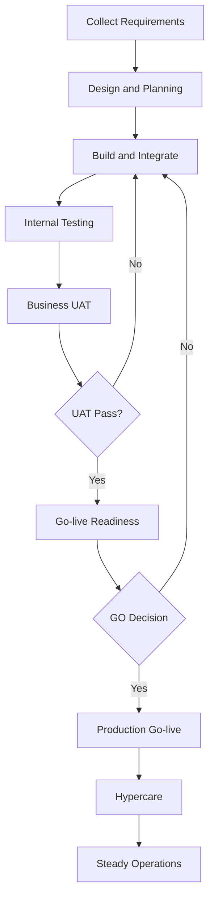
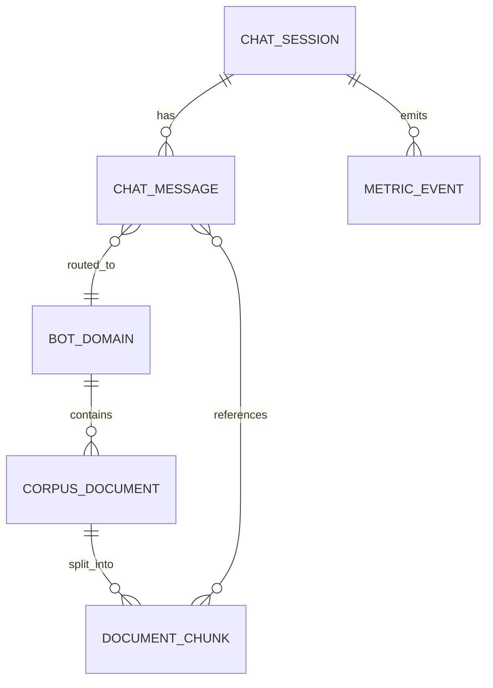
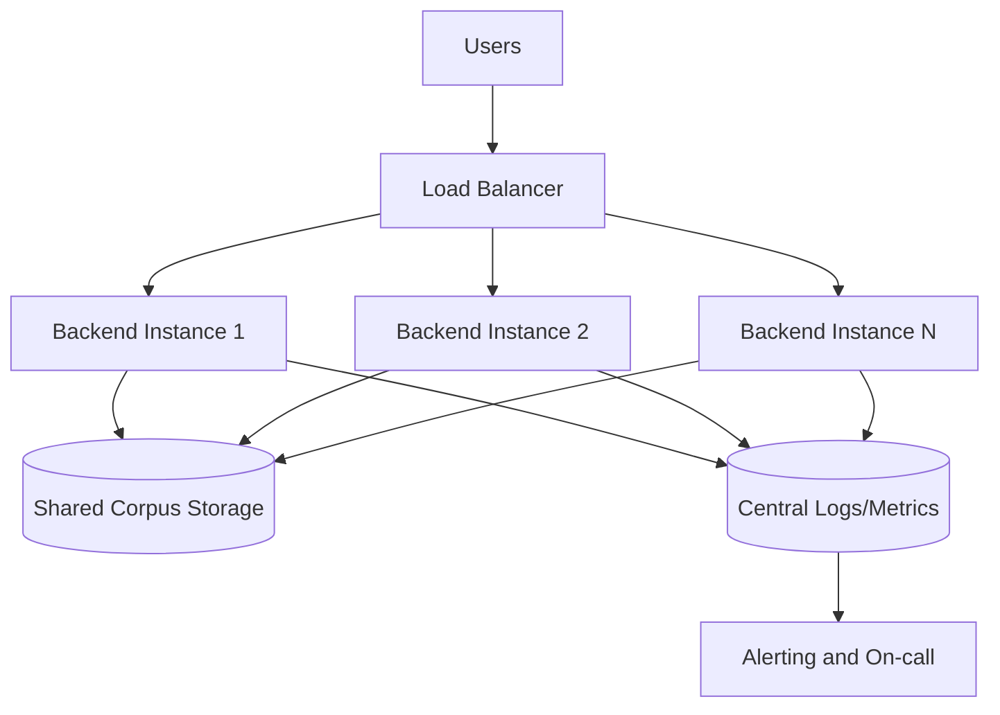
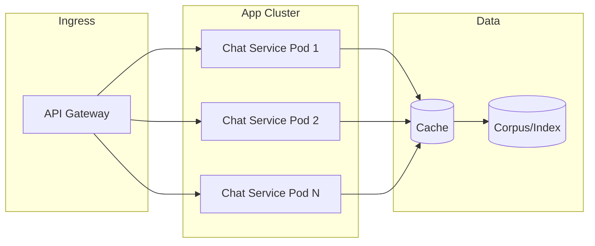
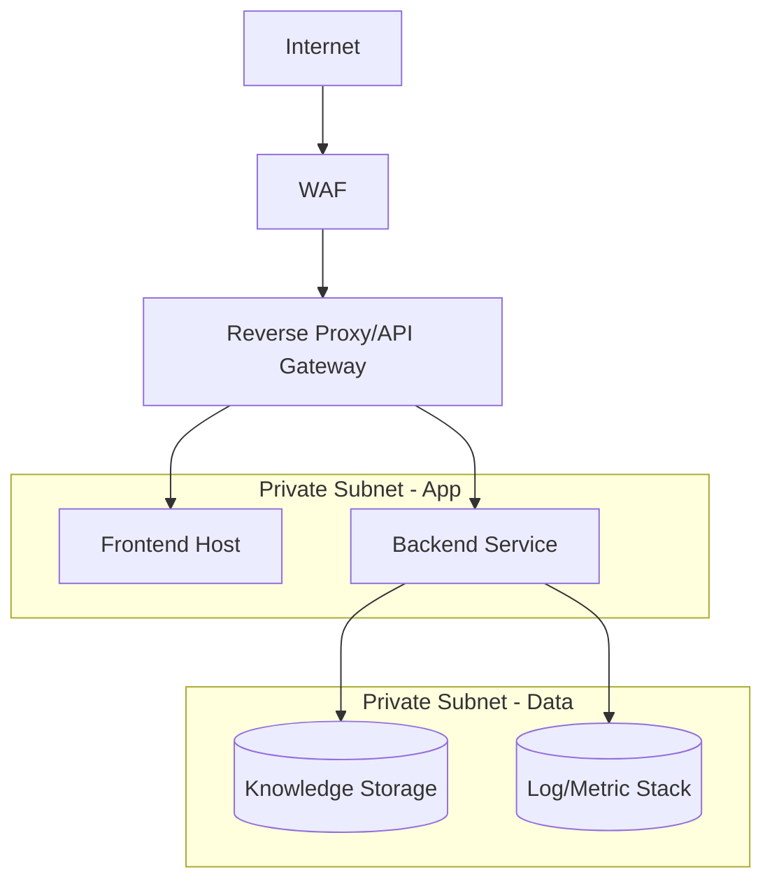
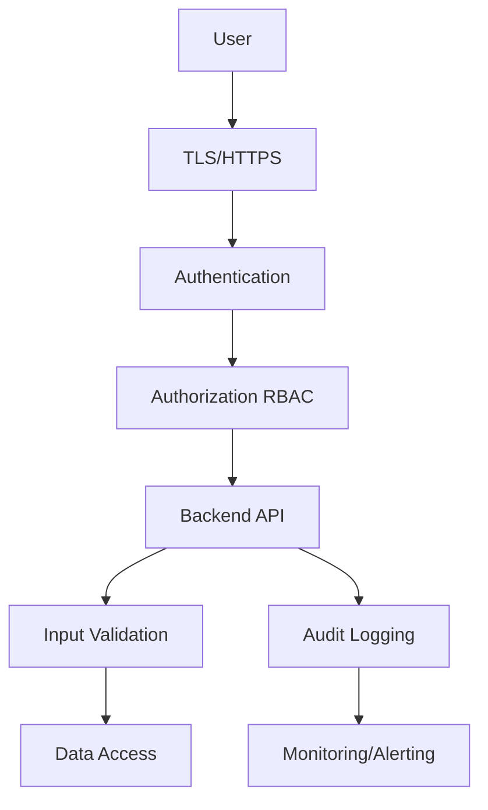
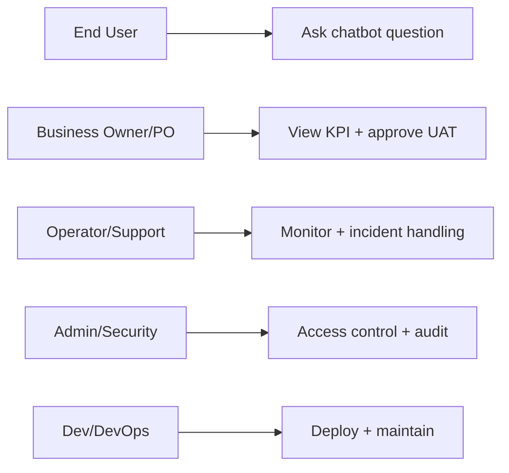

# ARCHITECTURE DOCUMENT AND DIAGRAMS (VI-EN) - Enterprise Chatbot | AI

## 1. Muc dich / Purpose

**VI:** Tai lieu tong hop cac so do kien truc va luong xu ly de phuc vu design review, pre-sales va trien khai production.  
**EN:** This document consolidates architecture and process diagrams for design review, pre-sales, and production planning.

## 2. Landscape Diagram

**VI:** So do mo ta bo canh tong the tu nguoi dung den cac lop ung dung/du lieu/van hanh.  
**EN:** This diagram shows the end-to-end context from user to application/data/operations layers.

## 3. High Level Architecture Diagram

## 4. Sequence Diagram

## 5. Workflow Diagram

## 6. ERD (Logical Data Model)

**VI:** ERD la mo hinh logic de thong nhat tu dien du lieu, khong bat buoc trung 100% voi storage vat ly hien tai.  
**EN:** The ERD is a logical model for data dictionary alignment and may differ from physical storage implementation.

## 7. High Availability Diagram

## 8. Scale Diagram

## 9. Network Diagram

## 10. Security Diagram

## 11. User Role Diagram

## 12. Ghi chu su dung / Usage Notes

- **VI:** Cac so do mang tinh tham chieu logic, can tuy chinh theo ha tang thuc te khi trien khai.  
- **EN:** Diagrams are logical references and should be adapted to actual deployment infrastructure.

- **VI:** Khi trinh bay cho khach hang, uu tien 5 so do: Landscape, HLA, Sequence, Security, User Role.  
- **EN:** For customer-facing reviews, prioritize 5 diagrams: Landscape, HLA, Sequence, Security, and User Role.
