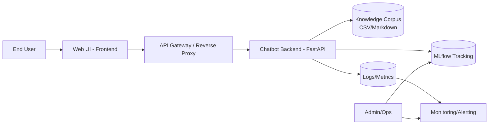
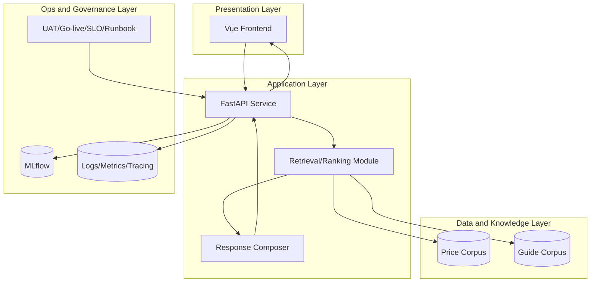
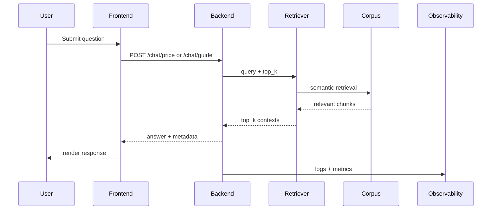
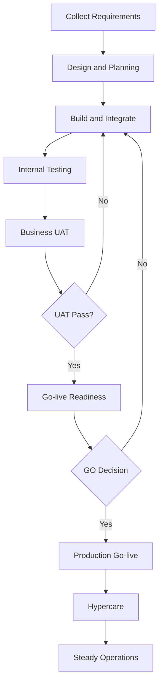
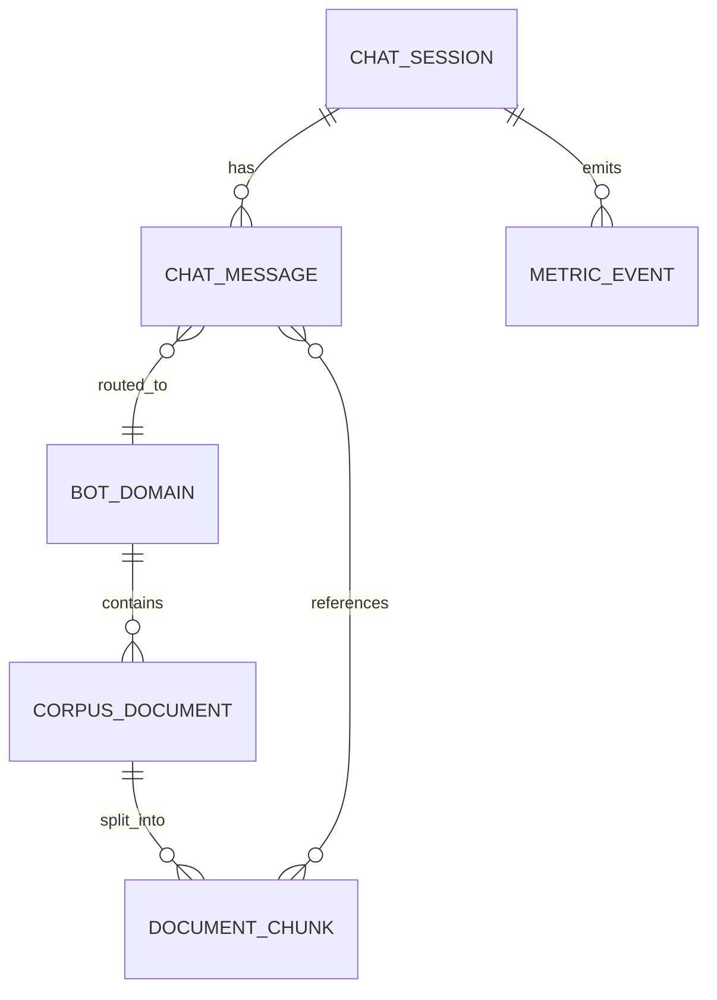
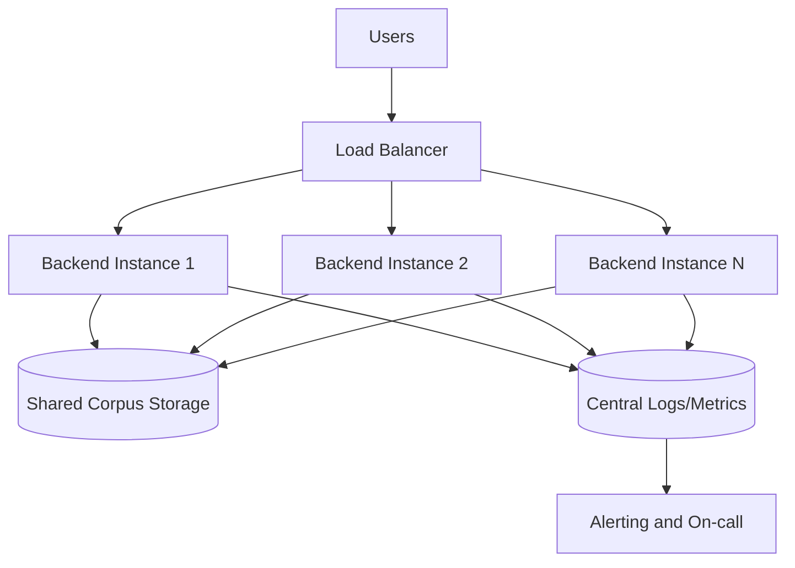
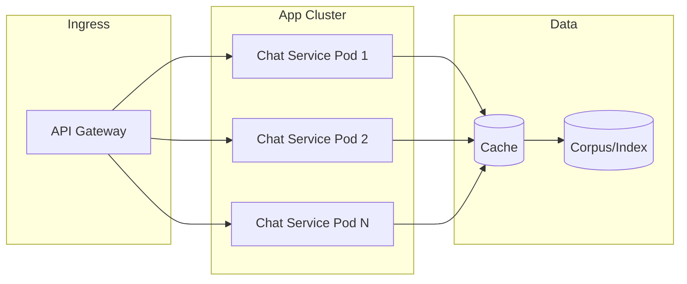
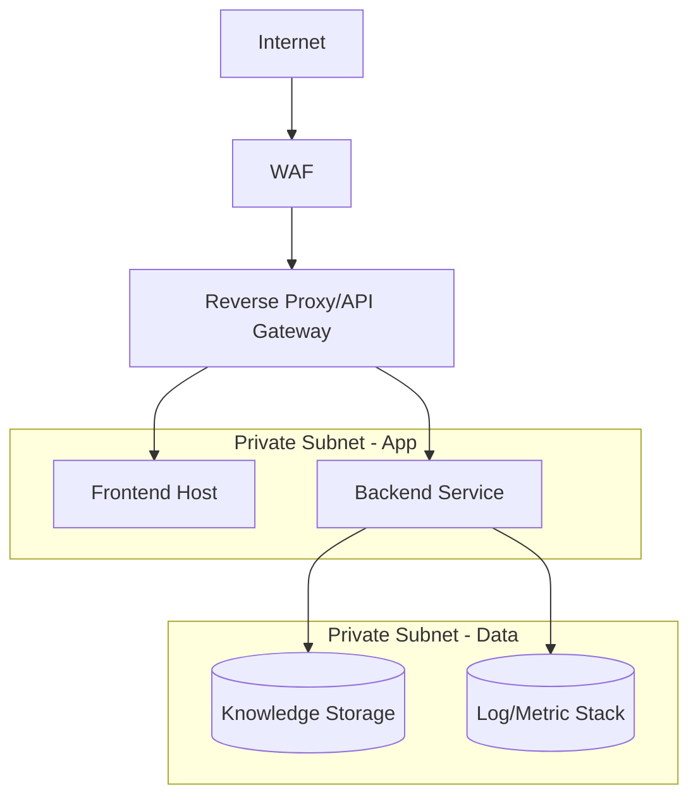
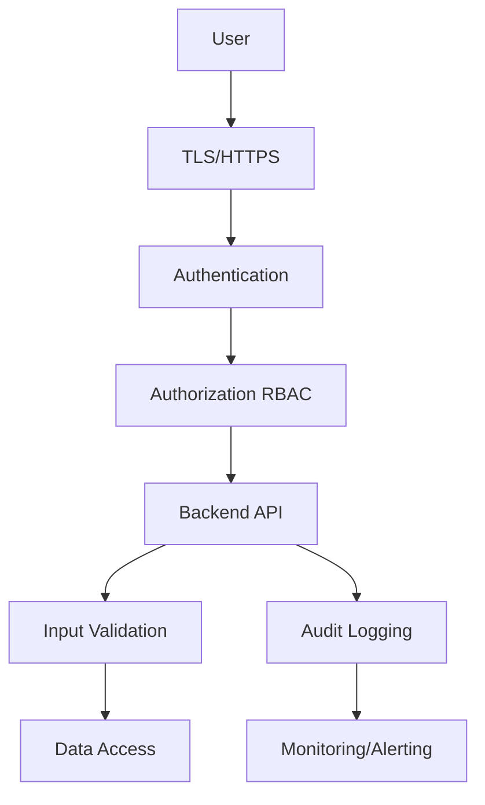
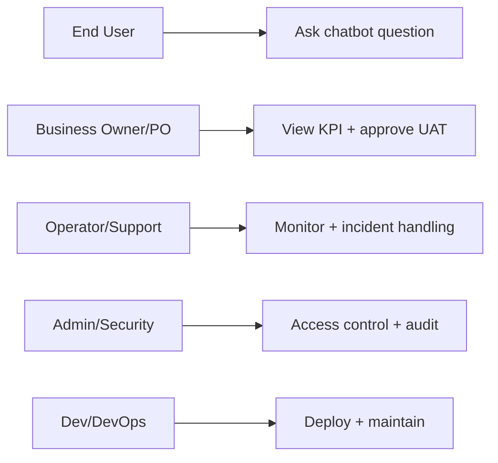

# ARCHITECTURE DOCUMENT AND DIAGRAMS - Enterprise Chatbot | AI

## 1. Muc dich / Purpose

**VI:** Tai lieu tong hop cac so do kien truc va luong xu ly de phuc vu design review, pre-sales va trien khai production.  
**EN:** This document consolidates architecture and process diagrams for design review, pre-sales, and production planning.

## 2. Landscape Diagram

**VI:** So do mo ta bo canh tong the tu nguoi dung den cac lop ung dung, du lieu, thuc nghiem ML va giam sat.  
**EN:** End-to-end context from the user through the UI, API, knowledge store, ML tracking, and observability.

**Ghi chu thanh phan / Component legend:**

- **End User:** Nguoi dung cuoi / End user of the chatbot.
- **Web UI - Frontend:** Giao dien / Browser UI layer.
- **API Gateway / Reverse Proxy:** Diem vao tap trung / Ingress, TLS, routing.
- **Chatbot Backend - FastAPI:** Dich vu xu ly hoi-dap / Core API service.
- **Knowledge Corpus:** Ngu canh retrieval / Grounding documents (CSV/Markdown).
- **MLflow Tracking:** Ghi experiment, metric, artifact / Experiment tracking.
- **Logs/Metrics:** Telemetry co ban / Baseline telemetry.
- **Monitoring/Alerting:** Canh bao van hanh / Ops alerting.
- **Admin/Ops:** Van hanh truy cap MLflow va monitoring / Operators.

## 3. High Level Architecture Diagram

**VI:** Phan lop kien truc (UI, ung dung, du lieu, van hanh) de review tich hop va phu thuoc.  
**EN:** Layered architecture (presentation, application, data, ops) for integration and dependency reviews.

**Ghi chu thanh phan / Component legend:**

- **Vue Frontend:** UI chat va goi API / Chat UI calling backend APIs.
- **FastAPI Service:** REST/WebSocket, routing domain / API orchestration.
- **Retrieval/Ranking Module:** Tim va xep hang chunk / Context retrieval and ranking.
- **Response Composer:** Hop thanh cau tra loi tu ngu canh / Answer synthesis from ranked context.
- **Price Corpus / Guide Corpus:** Hai kho tri thuc / Two knowledge bases by use case.
- **MLflow / Logs-Metrics-Tracing:** Quan sat va thuc nghiem / Observability and experiments.
- **UAT/Go-live/SLO/Runbook:** Tai lieu tieu chuan trien khai va van hanh / Governance artifacts feeding delivery.

## 4. Sequence Diagram

**VI:** Luong thoi gian mot luot hoi-dap, phuc vu SLA va go loi.  
**EN:** Time-ordered request/response flow for SLA discussions and troubleshooting.

**Ghi chu thanh phan / Component legend:**

- **User / Frontend / Backend:** Luot tu nhap cau hoi den xu ly / Question entry through processing.
- **Retriever / Corpus:** Truy van va tra ve chunk / Semantic retrieval over documents.
- **Observability:** Ghi log va metric sau xu ly / Post-request telemetry.

## 5. Workflow Diagram

**VI:** Vong doi trien khai tu yeu cau den van hanh, nhan manh UAT va quyet dinh GO.  
**EN:** Delivery lifecycle from requirements to steady ops, highlighting UAT loops and GO decisions.

**Ghi chu thanh phan / Component legend:**

- **Collect … Internal Testing:** Xay dung va kiem thu ky thuat / Build and engineering test stages.
- **Business UAT / UAT Pass?:** Xac nhan nghiep vu / Business acceptance gate.
- **Go-live Readiness / GO Decision:** San sang san xuat / Production readiness gate.
- **Hypercare / Steady Operations:** On dinh sau go-live / Post-launch stabilization.

## 6. ERD (Logical Data Model)

**VI:** Mo hinh du lieu logic thong nhat domain, session, message, chunk va metric — co the khac schema vat ly.  
**EN:** Logical data model aligning domains, sessions, messages, chunks, and metrics; may differ from physical schemas.

**Ghi chu thanh phan / Component legend:**

- **BOT_DOMAIN:** Domain chatbot va dinh tuyen / Chat domain and routing target.
- **CORPUS_DOCUMENT / DOCUMENT_CHUNK:** Tai lieu nguon va doan embedding/tim kiem / Source docs and searchable segments.
- **CHAT_SESSION / CHAT_MESSAGE:** Phien va luot hoi-dap / Conversation state and Q&A turns.
- **METRIC_EVENT:** Su kien do luong gan session / Measurement events tied to sessions.

## 7. High Availability Diagram

**VI:** Nhieu instance backend, kho dung chung va log tap trung de tang san sang.  
**EN:** Multiple backend instances, shared corpus, and centralized telemetry for availability.

**Ghi chu thanh phan / Component legend:**

- **Load Balancer:** Phan phoi tai / Traffic distribution across instances.
- **Backend Instance 1..N:** Node xu ly doc lap / Horizontally scaled app nodes.
- **Shared Corpus Storage:** Ngu canh dung chung / Single logical knowledge store.
- **Central Logs/Metrics + Alerting:** Quan sat va canh bao / Ops visibility and paging.

## 8. Scale Diagram

**VI:** Chien luoc mo rong ngang qua nhieu pod va cache truoc corpus/index.  
**EN:** Horizontal scaling via replicas and a cache layer in front of corpus/index.

**Ghi chu thanh phan / Component legend:**

- **API Gateway:** Ingress thong nhat / Single entry to the app cluster.
- **Chat Service Pod 1..N:** Replica ung dung / Stateless or lightly stateful workers.
- **Cache:** Giam ap doc corpus / Hot-path latency reduction.
- **Corpus/Index:** Kho tri thuc hoac vector store / Grounding data or search index.

## 9. Network Diagram

**VI:** Tham chieu phan tang mang (WAF, proxy, subnet app/data) — tuy chinh theo ha tang that.  
**EN:** Reference network tiers (WAF, proxy, private app/data subnets); adapt to real infra.

**Ghi chu thanh phan / Component legend:**

- **Internet / WAF / Reverse Proxy:** Bien mang va bao ve / Edge and application protection.
- **Frontend Host / Backend Service:** Workload private / App tier in private network.
- **Knowledge Storage / Log-Metric Stack:** Du lieu va quan sat tach biet / Isolated data and observability backends.

## 10. Security Diagram

**VI:** Chuoi kiem soat bao mat tu ket noi den audit/SIEM.  
**EN:** Security control chain from transport to audit/SIEM.

**Ghi chu thanh phan / Component legend:**

- **TLS/HTTPS:** Ma hoa kenh / Transport encryption.
- **Authentication / Authorization RBAC:** Xac thuc va phan quyen / Identity and role checks.
- **Backend API / Input Validation / Data Access:** Thuc thi nghiep vu an toan / Safe execution path to data.
- **Audit Logging / Monitoring-Alerting:** Ghi nhan va phat hien su kien / Evidence and detection.

## 11. User Role Diagram

**VI:** Anh xa vai tro nghiep vu sang quyen hanh dong (RBAC/RACI).  
**EN:** Maps business roles to allowed actions for RBAC/RACI design.

**Ghi chu thanh phan / Component legend:**

- **End User / Business Owner/PO / Operator/Support / Admin-Security / Dev-DevOps:** Cac nhom nguoi dung he thong / Stakeholder groups.
- **Cac nut P1..P5:** Hanh dong duoc phan cong (hoi, KPI, UAT, truy cap, trien khai) / Assigned permissions per role.

## 12. Ghi chu su dung / Usage Notes

- **VI:** Cac so do mang tinh tham chieu logic, can tuy chinh theo ha tang thuc te khi trien khai.  
- **EN:** Diagrams are logical references and should be adapted to actual deployment infrastructure.

- **VI:** Khi trinh bay cho khach hang, uu tien 5 so do: Landscape, HLA, Sequence, Security, User Role.  
- **EN:** For customer-facing reviews, prioritize 5 diagrams: Landscape, HLA, Sequence, Security, and User Role.
