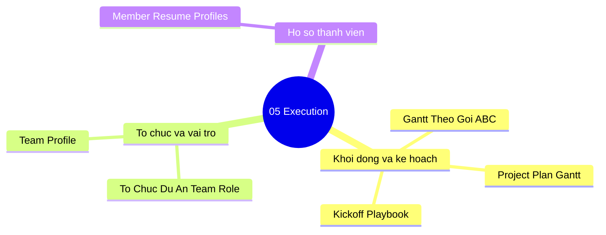

# 05-execution | Execution

Danh sach tai lieu trong nhom `05-execution`.

> Goi y: chon mot tai lieu de mo truc tiep trong Docs site.

- [Kickoff Playbook](./kickoff_playbook.md)
- [Member Resume Profiles](./member_resume_profiles.md)
- [Project Plan Gantt](./project_plan_gantt.md)
- [Project Plan Gantt By Package Abc](./project_plan_gantt_by_package_ABC.md)
- [Team Profile](./team_profile.md)
- [To Chuc Du An Team Role Va Thuc Hien](./to_chuc_du_an_team_role_va_thuc_hien.md)

## Mindmap nhom tai lieu | Section mind map (tom tat)

**VI:** So do tu duy trien khai du an va doi ngu.  
**EN:** Mind map for execution, planning, and team docs.

