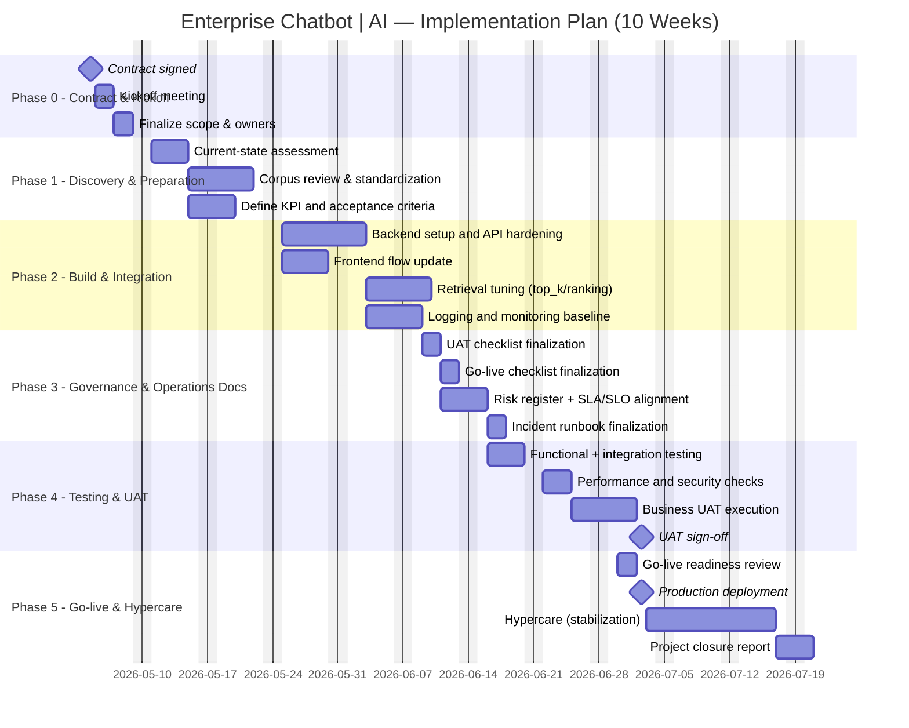

# PROJECT PLAN - GANTT CHART & TASK LIST

## 1. Tong quan ke hoach

- Tong thoi gian du kien: **10 tuan**
- Pham vi: tu kickoff -> UAT -> go-live -> hypercare
- Muc tieu: dua he thong chatbot vao production co governance day du

## 2. Gantt chart (Mermaid)

**Muc dich:** Truc quan hoa timeline 10 tuan tu kickoff den hypercare, giup doi chieu milestone va duong critical path.

**Ghi chu thanh phan:**

- **section Phase 0..5:** Nhom cong viec theo giai doan hop dong/trien khai.
- **milestone:** Diem khong co thoi luong thuc hien (Contract, UAT sign-off, Go-live).
- **Task bars (a1, b1, …):** Cong viec co bat dau/ket thuc hoac `after` task khac.

## 3. Task list chi tiet

| ID | Task | Owner chinh | Dau ra mong doi | Phu thuoc |
|---|---|---|---|---|
| T01 | Kickoff va chot RACI | Project Lead | Bien ban kickoff + danh sach owner | Contract signed |
| T02 | Ra soat corpus | BA + AI Engineer | Corpus da chuan hoa theo domain | T01 |
| T03 | Chot KPI/SLO/UAT criteria | PO + Tech Lead | KPI baseline + acceptance criteria | T01 |
| T04 | Hoan thien backend API | Backend Engineer | API on dinh, co logging co ban | T02, T03 |
| T05 | Toi uu retrieval | AI Engineer | Do chinh xac tra loi tang theo benchmark | T04 |
| T06 | Hoan thien tai lieu van hanh | PM + Ops | UAT/Go-live/Risk/SLA/Runbook final | T03 |
| T07 | Test ky thuat | QA + Tech Team | Test report (functional/integration/perf/sec) | T04, T05 |
| T08 | UAT nghiep vu | PO + BA + Key users | Bien ban UAT pass/fail | T07 |
| T09 | Go-live | DevOps + Tech Lead | He thong production running | T08, T06 |
| T10 | Hypercare & closure | PM + Ops + Tech Team | Bao cao dong du an + lesson learned | T09 |

## 4. Milestone quan trong

- `M1`: Contract signed
- `M2`: UAT sign-off
- `M3`: Production go-live

## 5. Nguong kiem soat tien do (project control)

- Weekly governance meeting: 1 lan/tuan
- Trang thai task: `Not started` / `In progress` / `Blocked` / `Done`
- Rule canh bao:
  - Task tre > 2 ngay: PM phai escalation
  - Task critical-path tre > 1 ngay: review ke hoach va tai phan bo nguon luc

## 6. Mau cap nhat tien do hang tuan

- Tuan so:
- % hoan thanh tong:
- Task hoan thanh trong tuan:
- Task dang blocker:
- Rui ro moi:
- Hanh dong tiep theo:
