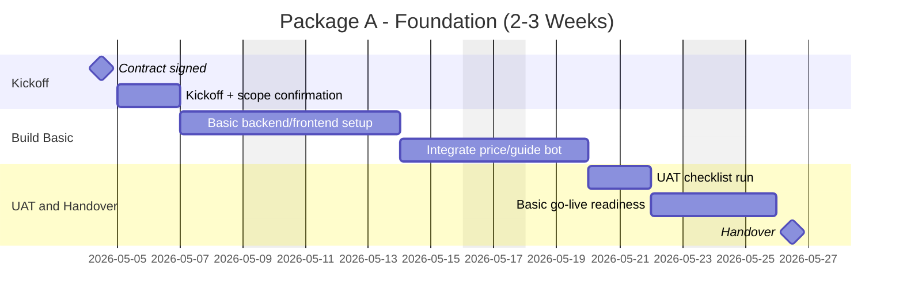
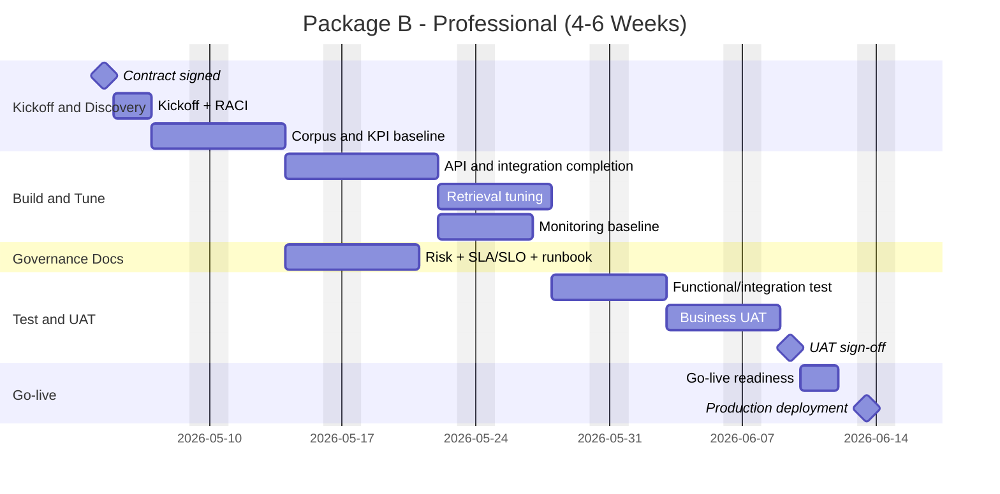
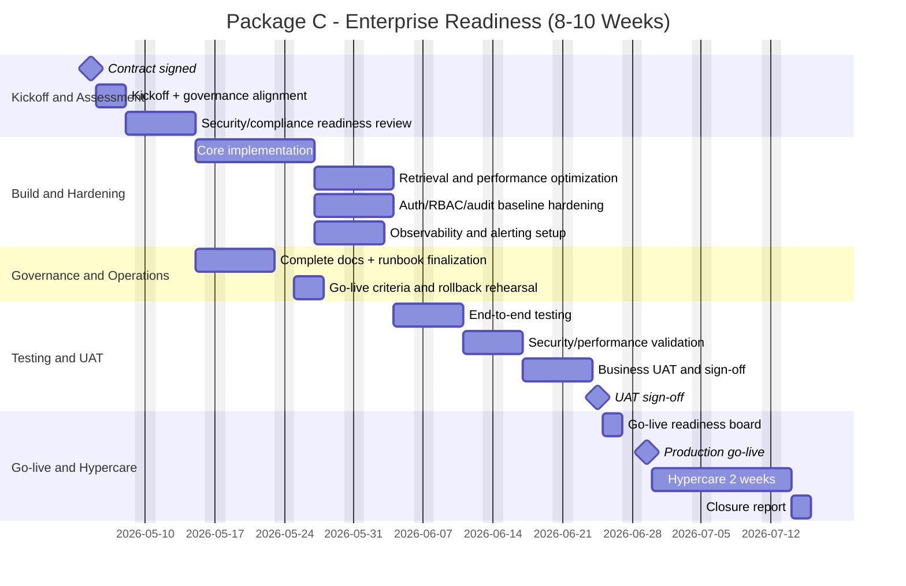

# PROJECT PLAN GANTT - THEO GOI A/B/C

## 1. Muc dich

Tai lieu nay mo ta ke hoach trien khai rut gon theo tung goi dich vu trong bao gia:

- Goi A (Foundation)
- Goi B (Professional)
- Goi C (Enterprise Readiness)

## 2. Goi A - Foundation (2-3 tuan)

### Gantt (Mermaid)

**Muc dich:** Lich rut gon goi A (nen tang toi thieu) de uoc luong 2-3 tuan.

**Ghi chu thanh phan:** `milestone` = moc ky/handover; cac thanh ngang = task theo ngay; `after` = phu thuoc noi tiep.

### Dau ra chinh
- Bot co ban hoat dong duoc (`price`, `guide`)
- UAT/go-live checklist co ban
- Ban giao cho team su dung noi bo

---

## 3. Goi B - Professional (4-6 tuan)

### Gantt (Mermaid)

**Muc dich:** Lich goi B (chuyen nghiep) gom discovery, build, governance docs, test/UAT va go-live.

**Ghi chu thanh phan:** Tuong tu goi A — them cac section Build and Tune, Governance Docs, Test; milestone UAT va Production deployment.

### Dau ra chinh
- Bot on dinh cho van hanh noi bo
- Day du tai lieu governance/operations
- Co benchmark co ban va KPI UAT/go-live

---

## 4. Goi C - Enterprise Readiness (8-10 tuan)

### Gantt (Mermaid)

**Muc dich:** Lich goi C (enterprise) voi security/compliance, hardening, E2E test, hypercare dai hon.

**Ghi chu thanh phan:** Them cac task bao mat, quan sat, rollback rehearsal; milestone UAT/Go-live/Closure.

### Dau ra chinh
- He thong san sang production o muc governance cao
- Hardening auth/RBAC/audit + observability
- Hypercare 2 tuan va bao cao dong du an

---

## 5. Bang so sanh nhanh theo goi

| Tieu chi | Goi A | Goi B | Goi C |
|---|---|---|---|
| Timeline | 2-3 tuan | 4-6 tuan | 8-10 tuan |
| Muc tieu | PoC nhanh | Van hanh noi bo on dinh | Enterprise readiness |
| Tai lieu governance | Co ban | Day du | Day du + hardening |
| UAT/go-live | Co ban | Chuan hoa | Chuan hoa + rehearsal |
| Hypercare | Khong bat buoc | Tuy chon | Co (2 tuan) |
