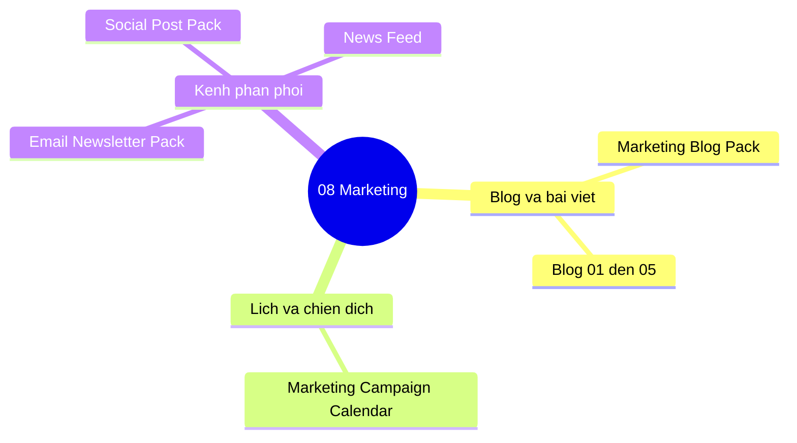

# 08-marketing | Marketing

Danh sach tai lieu trong nhom `08-marketing`.

> Goi y: chon mot tai lieu de mo truc tiep trong Docs site.

- [Email Newsletter Pack](./email_newsletter_pack.md)
- [Marketing Blog 01 Demo Vs Production](./marketing_blog_01_demo_vs_production.md)
- [Marketing Blog 02 Go Live Checklist](./marketing_blog_02_go_live_checklist.md)
- [Marketing Blog 03 Case Study](./marketing_blog_03_case_study.md)
- [Marketing Blog 04 Security Compliance](./marketing_blog_04_security_compliance.md)
- [Marketing Blog 05 Kpi SLO SLA](./marketing_blog_05_kpi_slo_sla.md)
- [Marketing Blog Pack](./marketing_blog_pack.md)
- [Marketing Campaign Calendar](./marketing_campaign_calendar.md)
- [News Feed](./news_feed.md)
- [Social Post Pack](./social_post_pack.md)

## Mindmap nhom tai lieu | Section mind map (tom tat)

**VI:** So do tu duy marketing noi dung va lich chien dich.  
**EN:** Mind map for blogs, campaigns, and channel packs.

