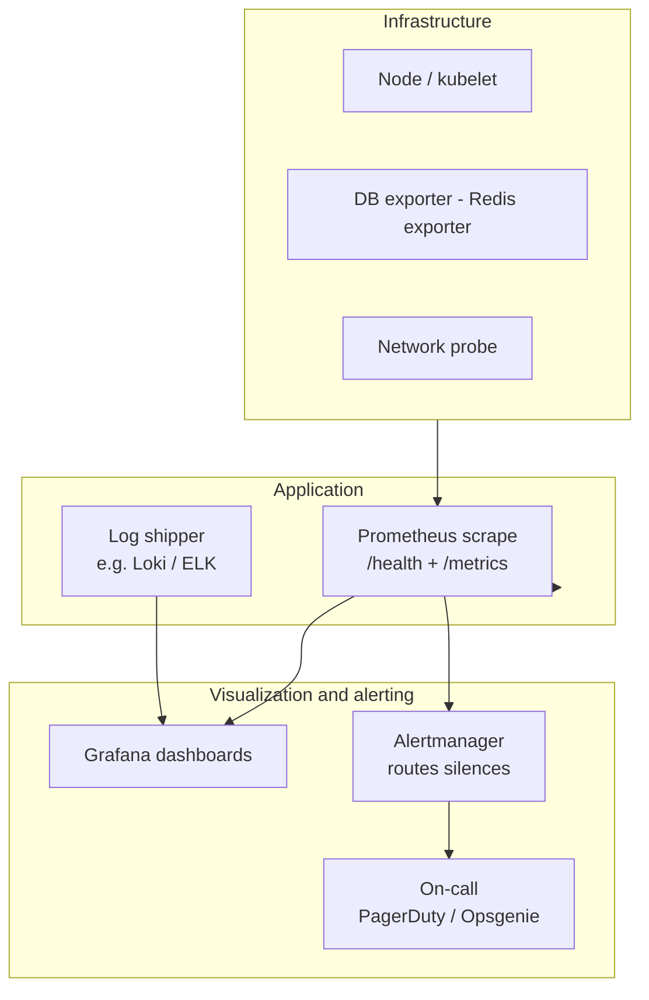

# Giới thiệu hệ thống giám sát và cảnh báo (CEIAP / demo-cmit-api)

**Mục đích:** mô tả **giám sát** (*monitoring*: đo, tích lũy, trực quan hóa) và **cảnh báo** (*alerting*: quy tắc, thông báo, leo thang) phù hợp với kiến trúc monorepo này — những gì **đã có trong code/tài liệu**, và **khuyến nghị** khi lên production.  
**Phạm vi:** không thay thế lựa chọn công cụ cụ thể của tổ chức (Prometheus/Grafana/Datadog…); tập trung **nguyên tắc** và **điểm móc** trong repo.  
**Đọc thêm:** [huong-dan-setup-scale.md](./huong-dan-setup-scale.md) (LB, readiness) · [huong-dan-setup-server-mang-bao-mat.md](./huong-dan-setup-server-mang-bao-mat.md) (log, correlation id) · [gioi-thieu-kien-truc-tong-the-he-thong.md](./gioi-thieu-kien-truc-tong-the-he-thong.md) · [bang-cam-ket-tieu-chi-he-thong.md](./bang-cam-ket-tieu-chi-he-thong.md) (SLO / gap).

---

## 1. Giám sát và cảnh báo khác nhau thế nào

| Khía cạnh | Giám sát (monitoring) | Cảnh báo (alerting) |
|-----------|------------------------|---------------------|
| **Câu hỏi** | “Hệ thống đang khỏe không? Xu hướng ra sao?” | “Có điều bất thường cần người can thiệp không?” |
| **Đầu ra** | Dashboard, graph, log traceable | Ticket, SMS, Slack, PagerDuty… |
| **Thời gian** | Liên tục, lưu lịch sử | Khi vượt ngưỡng hoặc mất tín hiệu |

Cả hai cần **định nghĩa rõ** phạm vi: chỉ stack CEIAP hay gồm cả DB/Redis/queue do team vận hành.

---

## 2. Những gì đã có trong repo (điểm móc kỹ thuật)

### 2.1 Health check (sẵn sàng / sống)

- **`GET /health`** trên `api-gateway`, `sync-service`, `scheduler-service` và các microservice theo convention (tham chiếu README / compose).  
- **Readiness:** LB/K8s chỉ route traffic khi `/health` phản ánh DB/Redis đã kết nối được — xem [huong-dan-setup-scale.md](./huong-dan-setup-scale.md).  
- **Smoke sau deploy:** [quy-trinh-bao-tri-va-backup-database.md](./quy-trinh-bao-tri-va-backup-database.md).

### 2.2 Metrics Prometheus (một phần)

| Thành phần | Endpoint / cơ chế | Ghi chú |
|-------------|---------------------|---------|
| **scheduler-service** | `GET /metrics` | `prom-client` — dispatcher, enqueue — [services/scheduler-service/README.md](../services/scheduler-service/README.md) |
| **scheduler-worker** | `GET /metrics` trên port riêng nếu `WORKER_METRICS_PORT > 0` | [workers/scheduler-worker/README.md](../workers/scheduler-worker/README.md) |

Các service khác **có thể** bổ sung `/metrics` theo cùng pattern; inventory: [software-inventory-licenses-and-layers.md](./software-inventory-licenses-and-layers.md).

### 2.3 Audit & truy vết nghiệp vụ (không thay metrics hạ tầng)

- **`sync_audit` / `sync_state`** (`sync-service`): trả lời “đồng bộ lần nào, thành công hay lỗi” — [vi-du-luong-e2e-sync-payment-einvoice.md](./vi-du-luong-e2e-sync-payment-einvoice.md).  
- **Gateway audit / SIEM** (tùy cấu hình OIDC & export): [huong-dan-cau-hinh.md](./huong-dan-cau-hinh.md) (`api-gateway/.env.identity.example`).

### 2.4 `platform/alert-engine` — cảnh báo theo rule (nền tảng thư viện)

- Luồng **event-first**: dịch vụ `POST` sự kiện; engine lưu ingest, áp rule **JSONLogic** (từ Mongo), tùy chọn **cooldown Redis**, ghi `alert_instances`.  
- HTTP ingest tùy chọn: `GET /health`, `POST /v1/events`, dry-run header — [platform/alert-engine/README.md](../platform/alert-engine/README.md).  
- Đây là **động cơ cảnh báo trong nền tảng**, không thay thế hoàn toàn **Alertmanager** ở tầng hạ tầng — hai lớp có thể **cùng tồn tại**: infra alert (disk, pod restart) vs **business alert** (rule trên event nghiệp vụ).

---

## 3. Mô hình tầng giám sát (khuyến nghị production)

---

## 4. Tín hiệu nên theo dõi (gợi ý theo “four golden signals”)

| Tín hiệu | Ví dụ trong stack này |
|----------|-------------------------|
| **Latency** | p95 gateway → upstream; thời gian job BullMQ |
| **Traffic** | Requests/giây theo route; số job enqueue |
| **Errors** | HTTP 5xx rate; job `FAILED`; DLQ depth (`dbsync-service`) |
| **Saturation** | CPU/RAM pod; độ sâu queue Redis; connection pool DB |

Thêm **synthetic check** (ping `/health` từ bên ngoài VPC) để phát hiện lỗi DNS/TLS/LB mà metrics nội bộ không thấy.

---

## 5. Cảnh báo — nguyên tắc thiết kế rule

1. **Alert phải hành động được** — nếu chỉ “để biết”, đưa vào dashboard thay vì 3h sáng.  
2. **Ưu tiên SLO** — ví dụ “gateway error rate < 1% trong 5 phút” thay vì cảnh báo mỗi lần lỗi đơn lẻ (nhiễu).  
3. **Cooldown / grouping** — `alert-engine` hỗ trợ cooldown Redis; Alertmanager hỗ trợ `group_wait`, `group_interval`.  
4. **Runbook** mỗi alert: link tới [`docs/content/09-CMIT/`](./index.md) hoặc wiki (restart service, scale worker, kiểm tra integration instance).  
5. **Disk & object storage** — ngưỡng 80% volume / bucket — [quy-trinh-bao-tri-va-backup-file-storage.md](./quy-trinh-bao-tri-va-backup-file-storage.md).

---

## 6. Log và correlation

- Log có **request id / correlation id** giúp nối gateway → service — [huong-dan-setup-server-mang-bao-mat.md](./huong-dan-setup-server-mang-bao-mat.md).  
- **Không** log secret, PAN, JWT đầy đủ — [giai-phap-van-hanh-va-giao-nhan.md](./giai-phap-van-hanh-va-giao-nhan.md) mục bảo mật.

---

## 7. Bảo mật của chính hệ giám sát

- Metrics và dashboard **RBAC**; không public Grafana không mật khẩu.  
- Scrape Prometheus qua mạng nội bộ hoặc mTLS.  
- Token ingest `alert-engine` (`ALERT_INGEST_TOKEN`) như secret — [huong-dan-cau-hinh.md](./huong-dan-cau-hinh.md).

---

## 8. Checklist tối thiểu trước go-live

- [ ] Mọi service quan trọng có `/health` phản ánh dependency.  
- [ ] Ít nhất một nguồn metrics (scheduler + worker đã có sẵn pattern).  
- [ ] Cảnh báo: gateway 5xx, pod restart loop, DB connection fail, queue depth, disk.  
- [ ] On-call rotation + kênh thứ cấp khi primary fail.  
- [ ] Runbook 1 trang cho top 5 alert.

---

## 9. Gap & mục tiêu đo lường

Bảng cam kết ghi **Performance SLO** còn cần baseline — [bang-cam-ket-tieu-chi-he-thong.md](./bang-cam-ket-tieu-chi-he-thong.md). Repo **cung cấp điểm móc**; tổ chức điền **số p95/p99** sau load test và gắn vào dashboard.

---

## 10. Liên quan nhanh

| Chủ đề | Tài liệu |
|--------|----------|
| Kiến trúc tổng thể | [gioi-thieu-kien-truc-tong-the-he-thong.md](./gioi-thieu-kien-truc-tong-the-he-thong.md) |
| Scale & LB health | [huong-dan-setup-scale.md](./huong-dan-setup-scale.md) |
| Bảo mật tầng | [tong-quan-tieu-chi-thiet-ke-theo-kien-truc-su.md](./tong-quan-tieu-chi-thiet-ke-theo-kien-truc-su.md) §2 |
| Cấu trúc package `alert-engine` | [cau-truc-repo-mau-platform.md](./cau-truc-repo-mau-platform.md) |

---

| Trường | Giá trị |
|--------|---------|
| File | [`docs/content/09-CMIT/gioi-thieu-he-thong-giam-sat-va-canh-bao.md`](./gioi-thieu-he-thong-giam-sat-va-canh-bao.md) |
