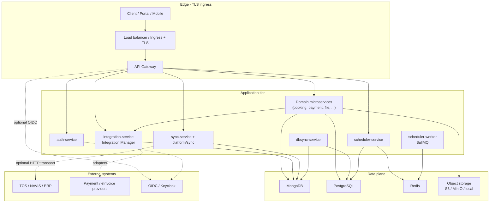
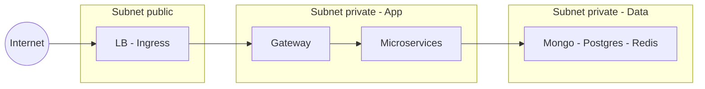

# Giới thiệu kiến trúc tổng thể hệ thống (CEIAP / demo-cmit-api)

**Mục đích:** một trang **tổng quan** kiến trúc — tích hợp, mạng, cài đặt, bảo mật, mở rộng — có **sơ đồ** và **chú thích từng thành phần**, phục vụ trình bày cho lãnh đạo, kiến trúc sư mới hoặc đối tác. Chi tiết triển khai nằm ở các tài liệu chuyên sâu được liên kết cuối mỗi mục.  
**Đọc sâu:** [giai-phap-van-hanh-va-giao-nhan.md](./giai-phap-van-hanh-va-giao-nhan.md) · [tong-quan-tieu-chi-thiet-ke-theo-kien-truc-su.md](./tong-quan-tieu-chi-thiet-ke-theo-kien-truc-su.md) · [huong-dan-setup-server-mang-bao-mat.md](./huong-dan-setup-server-mang-bao-mat.md) · [huong-dan-setup-docker.md](./huong-dan-setup-docker.md) · [huong-dan-setup-scale.md](./huong-dan-setup-scale.md).

---

## 1. Giới thiệu

Monorepo **demo-cmit-api** mô tả nền tảng **CEIAP** (*Composable Enterprise Integration & Application Platform*): một **cổng API** thống nhất, nhiều **microservice** nghiệp vụ (cảng / portal khách hàng), lớp **tích hợp** (Integration Manager, đồng bộ có audit), **lập lịch & worker**, và thư viện **`platform/*`** (adapter tại biên — storage, messaging, KMS, …).

Tài liệu này trả lời nhanh: **hệ thống được tổ chức thế nào**, **dữ liệu và lưu lượng đi đâu**, và **mở rộng theo hướng nào** — trước khi đi sâu từng service hoặc từng file `docker-compose.yml`.

---

## 2. Vấn đề (problem)

| Thách thức | Hệ quả nếu không có kiến trúc rõ |
|------------|-----------------------------------|
| Nhiều hệ thống độc lập (TOS, thanh toán, kho chứng từ…) | Trùng lặp dữ liệu, không có “sự thật đơn”, khó truy vết |
| Tích hợp point-to-point | Mỗi lần đổi nhà cung cấp phải sửa nhiều chỗ; secret rải rác |
| API trần trụi nhiều nơi | Khó gắn TLS, rate limit, audit, OIDC thống nhất |
| Một monolith lớn | Scale và deploy “cùng nhảy”, rủi ro regression cao |
| Thiếu ranh giới bảo mật | DB và queue lộ ra ngoài; khó đạt chuẩn vận hành |

---

## 3. Giải pháp (solution) — định hướng CEIAP

1. **API Gateway** làm điểm vào duy nhất cho client; định tuyến tới từng domain service.  
2. **Microservice** theo bounded context; mỗi service sở hữu DB logic phù hợp (Postgres/Mongo tùy service).  
3. **Integration Manager** (`integration-service`) đăng ký provider/instance; cấu hình **active** theo loại (payment, storage, …) — không hardcode secret trong code.  
4. **Đồng bộ có kiểm soát:** `sync-service` + `platform/sync` (mapper, idempotency, `sync_audit`); `dbsync-service` cho luồng bảng/event khi cần.  
5. **`platform/*`:** abstraction (messaging, storage, KMS, …) để **đổi nhà cung cấp** ở biên.  
6. **Scheduler + Redis + worker:** tách job nặng khỏi request HTTP đồng bộ.  
7. **Bảo mật nhiều lớp** và **mạng phân vùng** khi lên production — không chỉ “code đúng”.

---

## 4. Sơ đồ kiến trúc logic (tổng thể)

Sơ đồ dưới **rút gọn** số lượng microservice thành nhóm **Domain**; triển khai thực tế có đầy đủ service trong `services/` và `docker-compose.yml`.

**Chú thích sơ đồ:** mũi tên liền = luồng chính trong VPC/runtime; mũi tên đứt = tích hợp bên ngoài hoặc bật theo cấu hình (OIDC, HTTP sync).

---

## 5. Giới thiệu từng thành phần trong sơ đồ

| Ký hiệu / nhóm | Vai trò | Ghi chú triển khai |
|----------------|---------|---------------------|
| **Client / Portal** | Người dùng cuối, hệ thống đối tác gọi API | Chỉ biết URL công khai + TLS |
| **TLS + LB / Ingress** | Chấm dứt TLS, health check, (tuỳ) WAF | Production bắt buộc; dev có thể bỏ qua — [huong-dan-setup-server-mang-bao-mat.md](./huong-dan-setup-server-mang-bao-mat.md) |
| **API Gateway** | Reverse proxy, `/api/v1`, upstream `*_SERVICE_URL` | `api-gateway`; cổng nội bộ Docker khác cổng host — [huong-dan-setup-docker.md](./huong-dan-setup-docker.md) |
| **auth-service** | Đăng nhập, JWT (theo triển khai) | Có thể kết hợp IdP |
| **Microservice nghiệp vụ** | Booking, payment, file, CRM nhẹ, … | Mỗi service + DB phù hợp; scale replica — [huong-dan-setup-scale.md](./huong-dan-setup-scale.md) |
| **integration-service** | Registry provider/instance, cấu hình active | Secret qua instance, không trong git |
| **sync-service + platform/sync** | Đồng bộ DTO, audit, idempotency | Mongo `sync_service`; token nội bộ tùy cấu hình |
| **dbsync-service** | Đồng bộ dòng dữ liệu, DLQ tùy cấu hình | Khác sync DTO — chọn đúng công cụ |
| **scheduler-service + worker** | Lập lịch job, consumer Redis | Postgres `scheduler_db`; planner an toàn đa instance |
| **MongoDB / PostgreSQL / Redis** | Lưu trữ & hàng đợi | Private subnet; backup — [quy-trinh-bao-tri-va-backup-database.md](./quy-trinh-bao-tri-va-backup-database.md) |
| **Object storage** | File media, object lớn | Adapter S3/MinIO/local qua `file-service` + platform |
| **TOS / NAVIS / ERP** | Hệ thống vận hành cảng hoặc back-office | [gioi-thieu-tich-hop-navis-he-thong-thu-ba.md](./gioi-thieu-tich-hop-navis-he-thong-thu-ba.md) |
| **Payment / eInvoice** | Nhà cung cấp bên thứ ba | Qua adapter + Integration Manager |
| **OIDC / Keycloak** | Nhận thực tập trung | `identity-setup/`, gateway env — [huong-dan-cau-hinh.md](./huong-dan-cau-hinh.md) |

---

## 6. Tích hợp (integration)

- **Biên hợp đồng:** mọi gọi nhà cung cấp nên đi qua **adapter** + cấu hình **Integration Manager** — giảm khóa nhà cung cấp.  
- **Hai kiểu đồng bộ:** `sync-service` (use case / DTO + audit) và `dbsync-service` (dòng/bảng) — xem [vi-du-luong-e2e-sync-payment-einvoice.md](./vi-du-luong-e2e-sync-payment-einvoice.md).

---

## 7. Mạng (network)

Nguyên tắc: **client chỉ vào edge**; **DB/Redis không public**; subnet **public** (LB) tách **private** (app + data). Chi tiết CIDR, egress, MTU: [huong-dan-setup-server-mang-bao-mat.md](./huong-dan-setup-server-mang-bao-mat.md) mục mạng.

---

## 8. Cài đặt (installation)

| Môi trường | Cách làm | Tài liệu |
|------------|----------|----------|
| Dev full stack | `docker compose` từ root | [huong-dan-setup-docker.md](./huong-dan-setup-docker.md) |
| Dev hybrid | DB/Redis Docker + `npm run dev` từng service | [phat-trien-local-cho-dev.md](./phat-trien-local-cho-dev.md) |
| Staging / production | TLS, secret store, HA | [huong-dan-setup-server-mang-bao-mat.md](./huong-dan-setup-server-mang-bao-mat.md) · [huong-dan-cau-hinh.md](./huong-dan-cau-hinh.md) |

---

## 9. Bảo mật (security)

Tóm tắt: **defense in depth** — từ supply chain & CI/CD đến OS, mạng, gateway OIDC, phân quyền, dữ liệu & backup. Bảng tầng chi tiết: [tong-quan-tieu-chi-thiet-ke-theo-kien-truc-su.md](./tong-quan-tieu-chi-thiet-ke-theo-kien-truc-su.md) **§2**; checklist cam kết: [bang-cam-ket-tieu-chi-he-thong.md](./bang-cam-ket-tieu-chi-he-thong.md).

---

## 10. Mở rộng (extensibility & scale)

| Hướng | Cách mở rộng trong kiến trúc này |
|-------|----------------------------------|
| **Thêm domain service** | Thêm service + route gateway + (tuỳ) DB |
| **Thêm nhà cung cấp** | Adapter mới + instance trong Integration Manager |
| **Polyglot** | Service .NET hoặc **Java / Spring Boot** sau gateway — [cau-truc-repo-mau-dotnet.md](./cau-truc-repo-mau-dotnet.md) · [cau-truc-repo-mau-java.md](./cau-truc-repo-mau-java.md) |
| **Scale ngang** | Replica stateless + pool DB + Redis HA + nhiều worker — [huong-dan-setup-scale.md](./huong-dan-setup-scale.md) |
| **Sản phẩm dài hạn** | Roadmap CRM/ERP/no-code/AI — các file `huong-mo-rong-*.md` trong [`docs/content/09-CMIT/`](./index.md) |

---

## 11. Tổng kết

CEIAP trong repo này thể hiện **một kiến trúc có lớp rõ**: biên (gateway + TLS), nghiệp vụ (microservice), tích hợp (Integration Manager + sync/dbsync), nền tảng dùng chung (`platform/*`), dữ liệu và hàng đợi tách biệt. Điều đó cho phép **triển khai dần**, **đo lường theo domain**, và **thay đổi nhà cung cấp** ở biên mà không phá vỡ toàn bộ monolith.

---

## 12. Kết quả đạt được — hiệu suất — mục tiêu

**Lưu ý:** hàng dưới phân biệt **“đã có trong repo / tài liệu”** và **“cần tổ chức triển khai & đo”**; không nhầm demo `docker-compose` với production đã sizing.

| Mục | Trạng thái / kết quả |
|-----|----------------------|
| **Kiến trúc tham chiếu** | Đã mô tả đầy đủ: gateway, đa service, integration, sync, scheduler, platform — tài liệu + code mẫu |
| **Tích hợp có kiểm soát** | Integration Manager + adapter pattern; ví dụ luồng sync/payment/eInvoice |
| **Bảo mật theo tầng** | Khung mục 2 [tong-quan-tieu-chi-thiet-ke-theo-kien-truc-su.md](./tong-quan-tieu-chi-thiet-ke-theo-kien-truc-su.md); triển khai prod theo [bang-cam-ket-tieu-chi-he-thong.md](./bang-cam-ket-tieu-chi-he-thong.md) |
| **HA / scale số** | Thiết kế worker + planner an toàn; HA DB/Redis/gateway — gap ghi trong bảng cam kết |
| **Hiệu suất p95/p99** | **Chưa** cam kết số trong repo — cần APM + load test theo môi trường khách; điểm móc metrics/health: [gioi-thieu-he-thong-giam-sat-va-canh-bao.md](./gioi-thieu-he-thong-giam-sat-va-canh-bao.md) |
| **Chứng nhận SOC/ISO** | Luận cứ trong [tai-sao-he-thong-bao-mat-scale-chuan-va-thong-minh.md](./tai-sao-he-thong-bao-mat-scale-chuan-va-thong-minh.md) — chứng nhận là chương trình riêng của doanh nghiệp |

**Kết luận ngắn:** repo và bộ tài liệu [`docs/content/09-CMIT/`](./index.md) **đạt mục tiêu** mô tả nền tảng tích hợp có kiểm soát và lộ trình mở rộng; **hiệu suất và chứng nhận** là mục tiêu **đạt được khi** triển khai production đúng checklist + đo lường thực tế.

---

| Trường | Giá trị |
|--------|---------|
| File | [`docs/content/09-CMIT/gioi-thieu-kien-truc-tong-the-he-thong.md`](./gioi-thieu-kien-truc-tong-the-he-thong.md) |
