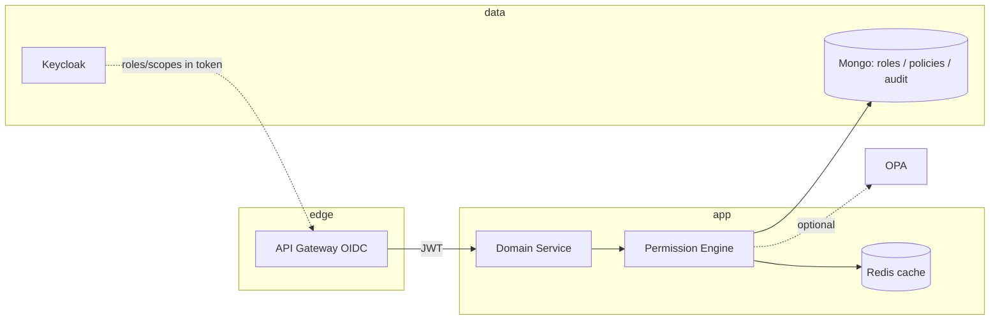
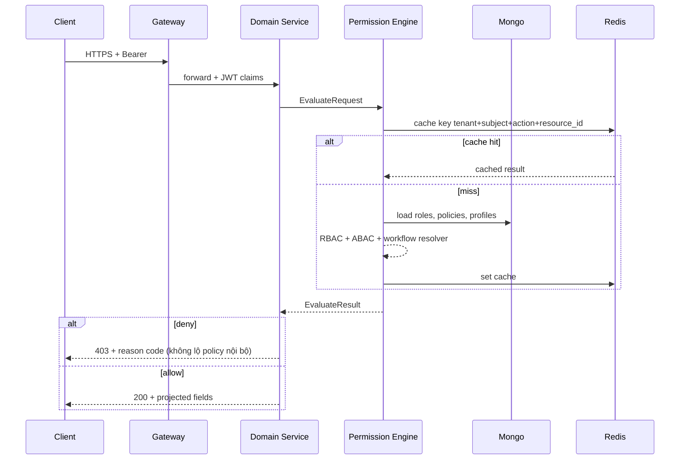

# Thiết kế chi tiết: RBAC + ABAC đa tenant, workflow, integration

Tài liệu này mô tả **mô hình dữ liệu**, **API**, **luồng đánh giá quyền runtime**, tích hợp **Keycloak**, tùy chọn **OPA**, và liên kết **workflow/approval** đã có trong repo (`platform/approval`, `services/payment-service`).

**Phạm vi:** toàn tenant + dịch vụ nghiệp vụ; không thay thế Keycloak làm IdP, mà **bổ sung** lớp authorization có phiên bản, có audit.

---

## 1. Mục tiêu và nguyên tắc

| Mục tiêu | Cách đạt |
|-----------|-----------|
| Đa tenant cô lập | Mọi bản ghi policy/role gắn `tenant_id`; query luôn lọc theo tenant. |
| RBAC (ai là ai) | Role + permission gán cho user (theo tenant). |
| ABAC (ngữ cảnh) | Policy rule JSON + input chuẩn (subject, resource, action, env). |
| Workflow | Permission theo **bước** + **resolver** (không chỉ role tĩnh). |
| Integration | Service account / client credentials + scope `integration.*` + IP/HMAC đã có. |
| Field / row level | Tách: (a) **authorize** API, (b) **projection** + (c) **query predicate**. |
| Không tin JWT tuyệt đối | Token mang snapshot role/scope; hành động nhạy cảm **re-evaluate** server-side. |

**Quy ước mã permission (bắt buộc thống nhất):**

```text
<domain>.<verb>.<scope>
```

- `domain`: `invoice`, `payment`, `workflow`, `integration`, …  
- `verb`: `read`, `write`, `delete`, `approve`, `execute`, …  
- `scope`: `own`, `team`, `tenant`, `all` (hoặc `step.<id>` cho workflow).

Ví dụ: `payment.read.tenant`, `workflow.approve.step finance_review`, `integration.salesforce.sync`.

---

## 2. Kiến trúc tổng thể



- **Permission Engine**: thư viện hoặc microservice nhỏ; input chuẩn → output `allow | deny | obligations` (ví dụ bắt buộc mask field).  
- **OPA** (tuỳ chọn): bundle Rego version hóa; engine gọi OPA cho rule phức tạp, còn rule đơn giản có thể chạy native.

---

## 3. Mô hình dữ liệu MongoDB

Database gợi ý: `cmit_authorization` (hoặc gộp `cmit_core` nếu muốn ít cluster hơn). Tất cả collection dưới đây **có `tenant_id`** trừ bảng catalog toàn cục (nếu dùng).

### 3.1 `permission_definitions` — catalog (tùy global hoặc per-tenant override)

| Trường | Kiểu | Mô tả |
|--------|------|--------|
| `_id` | ObjectId | |
| `code` | string | Ví dụ `payment.read.tenant` — **unique** trong phạm vi catalog |
| `description` | string | |
| `resource_type` | string | Gợi ý filter UI builder |
| `default_risk` | string | `low` \| `medium` \| `high` — dùng cho step-up MFA |
| `version` | int | Semantic versioning catalog |
| `created_at` | Date | |

**Index:** `{ code: 1 }` unique (global catalog) **hoặc** `{ tenant_id: 1, code: 1 }` unique nếu cho tenant định nghĩa thêm code riêng.

### 3.2 `roles`

| Trường | Kiểu | Mô tả |
|--------|------|--------|
| `_id` | ObjectId | |
| `tenant_id` | string | **Bắt buộc** |
| `key` | string | `finance_manager`, `payment_operator` — unique theo tenant |
| `name` | string | Hiển thị |
| `description` | string | |
| `system` | bool | `true` = role hệ thống, không xoá được |
| `kc_role_name` | string | Map sang Keycloak realm role (tuỳ chọn) |
| `updated_at` | Date | |

**Index:** `{ tenant_id: 1, key: 1 }` unique.

### 3.3 `role_permissions`

| Trường | Kiểu | Mô tả |
|--------|------|--------|
| `tenant_id` | string | |
| `role_id` | ObjectId | |
| `permission_code` | string | FK logic tới `permission_definitions.code` |
| `effect` | string | `allow` \| `deny` (deny wins nếu cùng cấp ưu tiên — nên quy ước rõ) |
| `granted_at` | Date | |
| `granted_by` | string | user id admin |

**Index:** `{ tenant_id: 1, role_id: 1, permission_code: 1 }` unique.

### 3.4 `user_role_assignments`

| Trường | Kiểu | Mô tả |
|--------|------|--------|
| `tenant_id` | string | |
| `subject_id` | string | `sub` Keycloak hoặc internal user id — thống nhất một kiểu |
| `role_id` | ObjectId | |
| `valid_from` | Date | |
| `valid_until` | Date | null = không hết hạn |
| `source` | string | `manual` \| `scim` \| `group_sync` |

**Index:** `{ tenant_id: 1, subject_id: 1 }`, `{ tenant_id: 1, subject_id: 1, role_id: 1 }` unique.

### 3.5 `abac_policies` — rule có điều kiện

| Trường | Kiểu | Mô tả |
|--------|------|--------|
| `tenant_id` | string | |
| `id` / `_id` | ObjectId | |
| `name` | string | |
| `priority` | int | Số nhỏ hơn = ưu tiên cao hơn (hoặc ngược — chốt một chiều) |
| `effect` | string | `allow` \| `deny` |
| `permission_codes` | string[] | Áp khi action khớp một trong các mã |
| `condition` | object | JSON Logic / CEL / schema nội bộ (xem §5) |
| `enabled` | bool | |
| `version` | int | |

**Index:** `{ tenant_id: 1, enabled: 1, priority: 1 }`.

### 3.6 `permission_release_snapshots` — version theo release

| Trường | Kiểu | Mô tả |
|--------|------|--------|
| `tenant_id` | string | nullable nếu snapshot global |
| `release_id` | string | Git tag / build id |
| `roles_digest` | string | Hash nội dung roles+permissions tại thời điểm build |
| `policy_digest` | string | |
| `created_at` | Date | |

Dùng để **so sánh** “token cấp trước release X có còn hiệu lực không” hoặc audit compliance.

### 3.7 `authorization_decision_log` (audit)

| Trường | Kiểu | Mô tả |
|--------|------|--------|
| `tenant_id` | string | |
| `ts` | Date | |
| `subject_id` | string | |
| `action` | string | HTTP method + path hoặc `domain.verb` |
| `resource` | object | `{ type, id, attrs }` tùy redact |
| `decision` | string | `allow` \| `deny` |
| `reason_codes` | string[] | `rbac_hit`, `abac_deny`, `workflow_step`, … |
| `matched_role_ids` | ObjectId[] | |
| `matched_policies` | string[] | id hoặc name |
| `trace_id` | string | |

**Index:** `{ tenant_id: 1, ts: -1 }`, TTL tùy chọn.

### 3.8 `field_visibility_profiles` (field-level)

| Trường | Kiểu | Mô tả |
|--------|------|--------|
| `tenant_id` | string | |
| `resource_type` | string | `invoice` |
| `permission_code` | string | Ví dụ `invoice.read.team` |
| `allowed_fields` | string[] | Whitelist cột JSON response |
| `masked_fields` | string[] | Luôn che (null / omit) |

Engine: sau khi `allow`, áp dụng profile theo **permission cụ thể** đã match (thường lấy permission “mạnh nhất” theo scope).

### 3.9 Liên kết workflow

Không trùng với `workflow_instances` — xem schema workflow tại `platform/approval/docs/workflow-mongo-schema.md` trong repo dịch vụ phê duyệt (đường dẫn tham chiếu, có thể không có trong repo docs này).

**Bổ sung logic:**

- Trên `workflow_definitions` (hoặc bảng riêng `workflow_step_policies`): mỗi transition / step có `required_permission_codes[]` hoặc `resolver_key` (string đăng ký trong code: `manager_of_requester`, `group:finance_approvers`).
- **Resolver** (interface trong code):

```ts
interface WorkflowPermissionResolver {
  resolve(input: {
    tenantId: string;
    stepKey: string;
    workflowInstanceId: string;
    subjectId: string;
    context: Record<string, unknown>;
  }): Promise<{ allowed: boolean; reason?: string }>;
}
```

Đăng ký trong DI: `Map<string, WorkflowPermissionResolver>`.

---

## 4. Input / output chuẩn của Permission Engine

### 4.1 `EvaluateRequest`

```json
{
  "tenant_id": "T1",
  "subject": {
    "id": "kc-sub-uuid",
    "roles": ["payment-reader"],
    "claims": { "department": "sales" }
  },
  "action": "payment.read",
  "resource": {
    "type": "payment",
    "id": "pay_123",
    "attributes": { "owner_id": "kc-sub-uuid", "amount_cents": 10000 }
  },
  "environment": { "ip": "10.0.1.2", "mfa_level": "high" }
}
```

### 4.2 `EvaluateResult`

```json
{
  "decision": "allow",
  "obligation": {
    "field_profile": "payment.read.tenant"
  },
  "matched": {
    "permissions": ["payment.read.tenant"],
    "roles": ["payment-reader"],
    "policies": ["abac_same_department"]
  },
  "cache_ttl_seconds": 60
}
```

---

## 5. ABAC `condition` (đề xuất triển khai theo giai đoạn)

**Giai đoạn 1 — tập toán tử hữu hạn (an toàn, dễ test):**

```json
{
  "all": [
    { "eq": ["$.subject.claims.department", "$.resource.attributes.department"] },
    { "in": ["$.subject.id", "$.resource.attributes.approver_ids"] }
  ]
}
```

- Engine map `$.subject`, `$.resource` từ `EvaluateRequest` (JSON Pointer hoặc path đơn giản).  
- Không `eval()` string tự do.

**Giai đoạn 2 — JSONLogic / CEL** nếu cần biểu thức phức tạp; hoặc **OPA** với bundle Rego.

**Thứ tự áp dụng (gợi ý):**

1. Deny explicit (role hoặc policy deny).  
2. ABAC allow.  
3. RBAC allow (role → permission).  
4. Default deny.

---

## 6. API (REST) — Permission Service (microservice hoặc module nội bộ)

Base path: `/api/v1/tenants/{tenant_id}/authz` (gateway strip prefix).

| Method | Path | Mô tả |
|--------|------|--------|
| POST | `/evaluate` | Body `EvaluateRequest` → `EvaluateResult` |
| POST | `/evaluate/batch` | Nhiều request — dùng UI builder / batch export |
| GET | `/roles` | List role tenant |
| POST | `/roles` | Tạo role (admin tenant) |
| PATCH | `/roles/{role_id}` | |
| PUT | `/roles/{role_id}/permissions` | Thay toàn bộ permission codes |
| GET | `/subjects/{subject_id}/roles` | |
| PUT | `/subjects/{subject_id}/roles` | Gán role (admin) |
| GET | `/definitions` | Catalog permission (read-only hoặc tenant-extended) |
| POST | `/policies` | CRUD ABAC (admin cao) |
| GET | `/audit/decisions` | Query `authorization_decision_log` (pagination + RBAC admin) |

**Bảo vệ:** mọi endpoint trên cần **platform-admin** hoặc **tenant-admin** + `tenant_id` khớp token (trừ `/evaluate` gọi nội bộ service-to-service với mTLS hoặc service JWT).

---

## 7. Tích hợp Keycloak

| Khía cạnh | Khuyến nghị |
|-----------|-------------|
| Nguồn sự thật role | **Mongo** cho role nghiệp vụ chi tiết; Keycloak realm roles **mirror** tập con (vd. `platform-admin`, `payment-reader`) để gateway/service nhanh. |
| Đồng bộ | Job hoặc event: thay đổi `user_role_assignments` → cập nhật group/role KC **hoặc** chỉ đọc KC groups map sang role nội bộ (một chiều). |
| Token | Giữ `realm_access.roles`, `scope`; có thể thêm **mapper** đưa `permission_codes[]` **rút gọn** (cache 5–15 phút tại login) — **không** đưa toàn bộ policy. |
| Multi-tenant | Claim `tenant` đã có; user đa tenant → **BFF chọn tenant** rồi token exchange hoặc session scoped tenant. |

---

## 8. Luồng runtime (sequence)



**Row-level:** trong service, luôn thêm `WHERE tenant_id = $tenant` và theo obligation (ví dụ chỉ `owner_id = subject` nếu scope `own`).

---

## 9. Tích hợp `payment-service` hiện tại

File `services/payment-service/src/security/authorization.policy.ts` là **bảng policy tĩnh theo route**.

**Lộ trình:**

1. Giữ `authorize(policy)` như middleware.  
2. Thay `AuthorizationPolicy` dần bằng **mã permission** + gọi engine (HTTP hoặc lib in-process).  
3. `PAYMENT_ROUTE_POLICY` → map `route → { permission: 'payment.read.tenant', require_abac: false }`.

---

## 10. OPA (tuỳ chọn)

- Bundle Rego version theo `release_id`; CI publish lên S3 / sidecar.  
- Engine: nếu `abac_policies.condition.engine === "opa"` thì gửi `input` chuẩn hoá tới OPA; ngược lại dùng native.  
- Ưu: tách team policy; Nhược: latency + vận hành.

---

## 11. Builder / UI (selling point)

- CRUD role + checklist permission theo `permission_definitions`.  
- Workflow designer: gán **step** → `required_permission_codes` hoặc `resolver_key`.  
- “Data access”: chọn scope `own | team | tenant | all` per resource — map sang policy + field profile.

**Lộ trình no-code / low-code tổng thể (tích hợp, flow, control plane):** [huong-mo-rong-no-code-low-code.md](./huong-mo-rong-no-code-low-code.md).

---

## 12. Checklist triển khai theo sprint

1. Chuẩn hóa **mã permission** + seed `permission_definitions`.  
2. Mongo collections `roles`, `role_permissions`, `user_role_assignments` + index.  
3. Thư viện `evaluate()` + Redis cache + `authorization_decision_log` (sample).  
4. Nối **một** service (payment) qua adapter.  
5. ABAC `condition` tập hạn chế + test unit.  
6. Liên kết **workflow step** + resolver đầu tiên (`manager_of_requester`).  
7. (Sau) OPA hoặc CEL nếu rule vượt ngưỡng.

---

## 13. Tài liệu liên quan trong repo

- Workflow / state: `platform/approval/docs/workflow-mongo-schema.md` (tham chiếu repo nguồn)  
- OIDC / claim: `identity-setup/claim-mapping.md` (tham chiếu repo nguồn)  
- RBAC route hiện tại: `services/payment-service/src/security/authorization.policy.ts`  
- Admin IP: `@cmit/platform-ip-allowlist` + `api-gateway`

---

## 14. Triển khai trong repo (đã có)

| Thành phần | Đường dẫn | Ghi chú |
|-------------|-----------|---------|
| **Policy engine** (thuần TS) | `platform/policy-engine/` (tham chiếu repo nguồn) | `evaluateAuthorization`, `evaluateCondition`, kiểu `EvaluateRequest` / `AuthorizationDataSnapshot`. Test: `npm test`. |
| **Authorization HTTP service** | `services/authorization-service/` (tham chiếu repo nguồn) | Mongo `cmit_authorization` (override `AUTHZ_MONGO_DB`), `POST /api/v1/tenants/:tenantId/authz/evaluate` và `.../evaluate/batch`, index + seed tùy chọn. Xem `.env.example`. |

**Gọi mẫu:**

```http
POST /api/v1/tenants/tenant-a/authz/evaluate
Content-Type: application/json
x-authz-service-key: <AUTHZ_SERVICE_API_KEY nếu có>

{
  "tenant_id": "tenant-a",
  "subject": { "id": "seed-subject", "roles": ["payment-reader"], "claims": { "department": "sales" } },
  "permission": "payment.read.tenant",
  "resource": { "type": "payment", "id": "p1", "attributes": { "department": "sales" } }
}
```

**Hạn chế MVP:** `role_permissions` chỉ nạp `effect: allow`; deny ở cấp role và cache Redis sẽ bổ sung sau.

---

*Tài liệu này là contract thiết kế; mở rộng OPA / workflow resolver / nối payment-service theo mục 12.*
