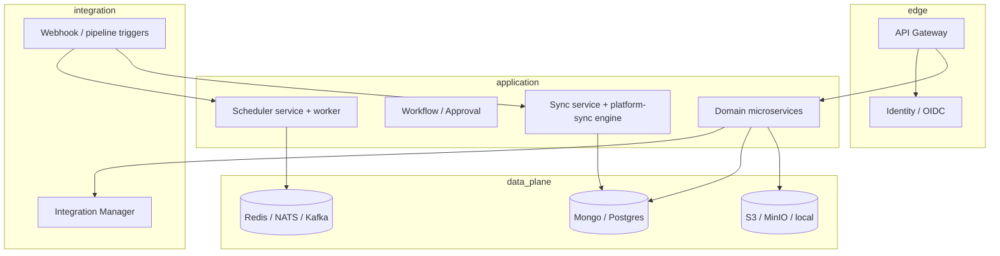
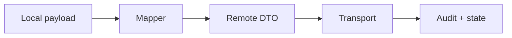

# Platform strategy & architecture handbook (CTO / CIO)

**Audience:** technical leadership, solution architects, security review.  
**Purpose:** one place that is both **sellable** (what/why) and **buildable** (how it maps to this repo).  
**Related:** [permission-system-design.md](./permission-system-design.md) (RBAC/ABAC, workflow, Keycloak) · [executive-summary-one-slide.md](./executive-summary-one-slide.md) · [ceiap-glossary.md](./ceiap-glossary.md) · [huong-mo-rong-no-code-low-code.md](./huong-mo-rong-no-code-low-code.md) (VN: roadmap no-code / low-code) · [huong-mo-rong-crm.md](./huong-mo-rong-crm.md) (VN: roadmap CRM) · [huong-mo-rong-erp.md](./huong-mo-rong-erp.md) (VN: roadmap ERP) · [huong-mo-rong-ai.md](./huong-mo-rong-ai.md) (VN: roadmap AI) · [bang-thuat-ngu-chuyen-nganh-tong-hop.md](./bang-thuat-ngu-chuyen-nganh-tong-hop.md) (VN master terminology table) · [giai-phap-van-hanh-va-giao-nhan.md](./giai-phap-van-hanh-va-giao-nhan.md) (VN: giải pháp, bảo mật, HA, UAT, checklist) · [trien-khai-onprem-cloud-linux-windows.md](./trien-khai-onprem-cloud-linux-windows.md) (VN: on-prem vs cloud, Linux vs Windows) · [huong-dan-setup-server-mang-bao-mat.md](./huong-dan-setup-server-mang-bao-mat.md) (VN: server, network, security setup) · [huong-dan-setup-scale.md](./huong-dan-setup-scale.md) (VN: setup scale) · [huong-dan-setup-docker.md](./huong-dan-setup-docker.md) (VN: Docker Compose local) · [huong-dan-cau-hinh.md](./huong-dan-cau-hinh.md) (VN: configuration layers & env templates) · [cau-truc-repo-mau-dotnet.md](./cau-truc-repo-mau-dotnet.md) (VN: sample .NET repo layout / polyglot) · [cau-truc-repo-mau-java.md](./cau-truc-repo-mau-java.md) (VN: sample Java / Spring Boot repo layout) · [cau-truc-repo-mau-platform.md](./cau-truc-repo-mau-platform.md) (VN: `platform/` package layout) · [tong-quan-tieu-chi-thiet-ke-theo-kien-truc-su.md](./tong-quan-tieu-chi-thiet-ke-theo-kien-truc-su.md) (VN: architecture design criteria overview) · [danh-sach-chu-de-blog-de-xuat.md](./danh-sach-chu-de-blog-de-xuat.md) (VN: proposed blog topic backlog) · [gioi-thieu-kien-truc-tong-the-he-thong.md](./gioi-thieu-kien-truc-tong-the-he-thong.md) (VN: overall architecture overview + diagrams) · [gioi-thieu-he-thong-giam-sat-va-canh-bao.md](./gioi-thieu-he-thong-giam-sat-va-canh-bao.md) (VN: monitoring & alerting) · [software-inventory-licenses-and-layers.md](./software-inventory-licenses-and-layers.md) (software + licenses + layers) · [summary-va-cam-ket.md](./summary-va-cam-ket.md) (VN: summary + commitment template) · [phuong-phap-to-chuc-va-timeline.md](./phuong-phap-to-chuc-va-timeline.md) (VN: methodology, org, timeline).

This is not a marketing deck; it is a **governance and alignment** document. Numbers like “50–80% faster” appear only as **targets** once you define baselines per squad.

---

## 1. What we are building

**Working name:** Composable Enterprise Integration & Application Platform (CEIAP).

**One-line pitch:** build services against **stable interfaces** (adapters), run them **behind a gateway** with **identity + policy**, and wire **workflows, sync, and events** without hard-coding vendors.

**Design rule:** *adapter at the boundary, domain in the middle.* Direct vendor SDKs belong inside adapter implementations, not in core business handlers.

---

## 2. Why (problems, assumptions, outcomes)

### Problems we address

| Pain | Platform response |
|------|---------------------|
| Vendor lock-in (cloud, DB, queue, storage) | Pluggable adapters + integration registry |
| Integration complexity overtakes product logic | Dedicated **sync** orchestration, **scheduler** execution ledger, **integration-service** for active provider resolution |
| Inconsistent security & config | **KMS / secure-config**, gateway OIDC, policy engine direction (see permission doc) |
| Hard to operate distributed jobs | Scheduler split planner/worker, metrics, idempotency, internal enqueue for webhooks/pipelines |

### Assumptions

- Hybrid and multi-vendor stacks are normal; **on-prem ↔ cloud** switching is a requirement for some customers.
- Teams will accept **extra upfront design** if runtime change (provider swap) is cheap.

### Expected outcomes (define KPIs per program)

- Time-to-first integrated flow (MVP with real IdP + one external system).
- Mean time to swap provider (storage, payment, email) without redeploying unrelated services.
- Incident MTTR with **correlation IDs** across gateway → service → job run → sync audit.

---

## 3. How (reference architecture)

High-level flow: **clients → API gateway → domain microservices → platform libraries & adapters → infrastructure.**

### Sync path (conceptual)

Bi-directional sync is **not** “DTO + cron only”. In this repo, **sync-service** + **`@cmit/platform-sync`** implement the minimum **orchestration** layer (mapper, transport, audit, state); **scheduler** and future webhook engines enqueue work with a **unified** execution model.

---

## 4. Inventory: vision modules ↔ this repository

Honest mapping for roadmap and staffing. Status: **Present** (usable in repo), **Partial** (stub or single provider), **Planned** (documented only).

| Capability | Location / notes | Status |
|------------|------------------|--------|
| API Gateway | `api-gateway/` | Present |
| Identity adapters (Keycloak, Auth0, …) | `platform/identity/` | Partial library |
| OIDC at gateway | `api-gateway` + identity-setup docs | Present |
| Secure config / KMS direction | `platform/secure-config/`, `platform/kms/` | Partial |
| Storage adapter | `platform/storage/`, file-service | Partial |
| Document DB abstraction | `platform/document-db/` | Present |
| Relational DB / cache | `platform/relational-db/`, `platform/cache-db/` | Present |
| Search adapter | `platform/search/` | Partial |
| Messaging / events | `platform/messaging/`, NATS usage in dbsync DLQ | Partial |
| Webhook engine (library) | `platform/webhook-engine/` | Partial |
| Scheduler (planner ≠ worker) | `services/scheduler-service/`, `workers/scheduler-worker/` | Present |
| Sync orchestration | `platform/sync/`, `services/sync-service/` | Present (MVP) |
| DB row sync / ETL style | `services/dbsync-service/` | Present |
| Integration registry | `services/integration-service/` | Present |
| Workflow / approval | `platform/approval/`, `services/approval-service/` | Present |
| Policy / isolation | `platform/policy-engine/`, `platform/isolate/` | Present |
| Alert / realtime / trace (libraries) | `platform/alert-engine/`, `platform/realtime/`, `platform/trace-broker/` | Partial |
| Admin / builder UI | Outside this API repo | Planned / separate product |

**CTO takeaway:** the **backbone** (gateway, integration manager, scheduler, sync engine, dbsync, secure-config direction) exists as code. **Presentation layer** and full **multi-tenant SaaS control plane** are not implied by this repo alone.

---

## 5. When to use which path

| Scenario | Preferred entry |
|----------|------------------|
| User-facing REST | Gateway + domain service |
| Time-based batch | Scheduler job → worker → optional call **sync-service** or domain API |
| External push | Webhook receiver → validate → **internal scheduler enqueue** or **sync POST /api/sync/runs** |
| Long-lived data copy | **dbsync-service** (row engine, DLQ) vs **sync-service** (DTO orchestration); do not conflate without a boundary doc per use case |

---

## 6. Where we draw boundaries (governance)

1. **New external system:** register in integration-service; implement adapter behind interface; no raw SDK in route handlers.
2. **New cross-system consistency:** prefer **sync-service** + mapper + audit; reserve **dbsync** for table/replication semantics.
3. **New scheduled behavior:** define job in scheduler DB; worker stays idempotent; attach `correlation_id` from caller.
4. **Security-sensitive config:** never commit secrets; use KMS/secure-config patterns already in platform docs.

---

## 7. Trade-offs (executive level)

| Advantage | Cost |
|-----------|------|
| Vendor substitution | More abstraction and onboarding for developers |
| Event / job observability | Operational complexity (brokers, retention, DLQ replay) |
| Unified sync API | Conflict resolution and UI still **product work**, not solved by HTTP alone |

---

## 8. Non-functional baseline (production)

Minimum bar before claiming “enterprise-ready” for a module:

- Authn/z for admin paths; rate limits where webhooks exist.
- Structured logs + **correlation ID** propagation (gateway → service → job → sync run).
- Metrics (Prometheus hooks started on scheduler; extend per service).
- Secrets via KMS/Vault integration aligned with `platform/kms` and `secure-config`.

---

## 9. Risks (explicit)

| Risk | Mitigation |
|------|------------|
| Over-engineering | “Adapter only at boundary”; forbid deep nesting of generic abstractions in domain |
| Adapter performance overhead | Measure hot paths; cache active provider config |
| Bi-directional sync conflicts | Policy per entity; conflict queue + UI (not in MVP sync-service); see sync README |
| Token expiry (3rd party) | Refresh strategy in adapter; short-lived credentials from KMS |

---

## 10. Required product surfaces (cross-repo)

These are **platform products**, not implied by microservices alone:

- Admin: integrations, secrets, job replay, DLQ.
- Workflow builder (ties to approval / policy).
- Sync conflict resolver (diff, accept local/remote).
- Observability stack (trace + dashboards).

---

## 11. Document control

| Field | Value |
|-------|--------|
| Repository | `demo-cmit-api` |
| Companion | [`permission-system-design.md`](./permission-system-design.md) (`docs/content/09-CMIT/permission-system-design.md`) |
| Owner | Architecture board (assign name) |
| Review cadence | Quarterly or after any new “platform-wide” adapter |

---

## 12. Companion artifacts (delivered)

- **One-slide executive summary:** [executive-summary-one-slide.md](./executive-summary-one-slide.md) — copy into Keynote / Slides.
- **CEIAP glossary:** [ceiap-glossary.md](./ceiap-glossary.md) — shared vocabulary for eng / product / sales.

**Still optional:** pitch deck PDF export; NestJS starter fork; single global ERD (prefer per–bounded-context schemas).

End of handbook.
