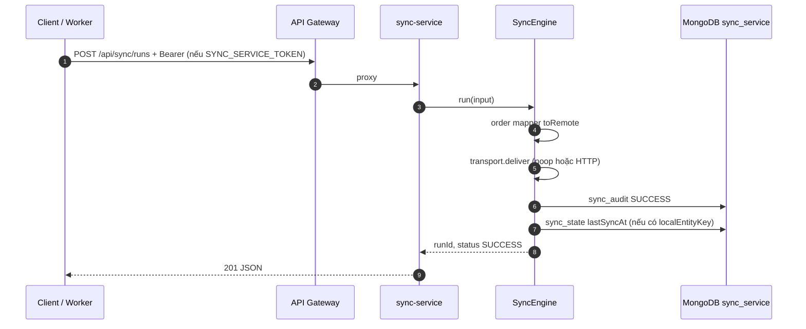
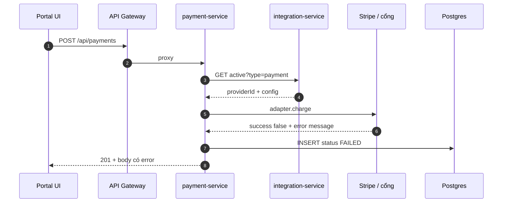
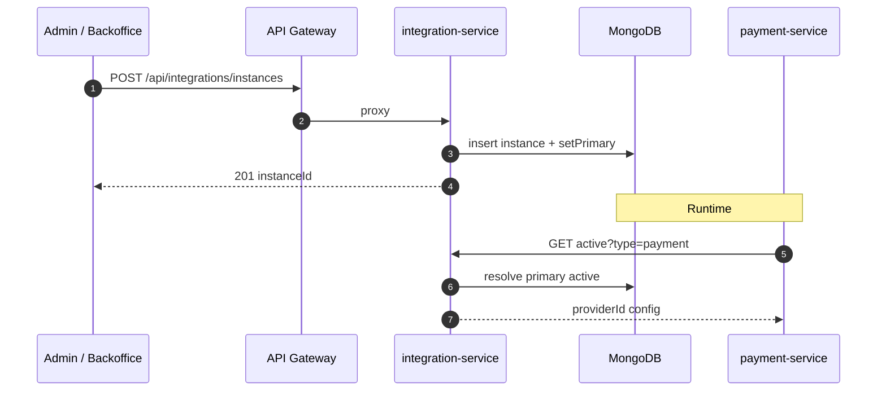
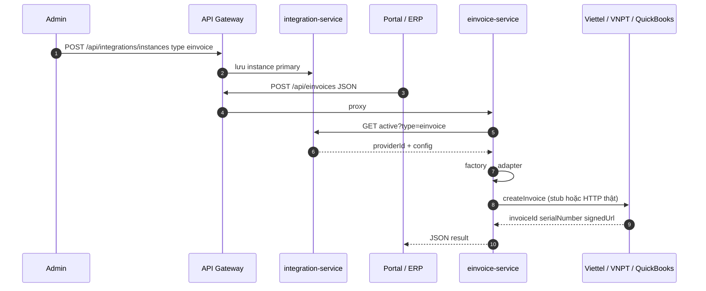

# Ví dụ luồng end-to-end: đồng bộ, thanh toán thất bại, tích hợp cổng thanh toán, quản lý eInvoice

**Mục đích:** bổ sung các **kịch bản tham chiếu** song song với [vi-du-luong-thanh-toan-end-to-end.md](./vi-du-luong-thanh-toan-end-to-end.md): luồng **đồng bộ ứng dụng** (`sync-service`), **thanh toán thất bại**, **cài đặt cổng thanh toán** qua Integration Manager, và **quản lý tích hợp hóa đơn điện tử (eInvoice)**.

**Căn cứ mã:** `api-gateway` (`/api/sync`, `/api/integrations`, `/api/payments`, `/api/einvoices`), `sync-service` + `@cmit/platform-sync`, `payment-service`, `integration-service`, `einvoice-service`.

**Liên quan:** [giai-phap-van-hanh-va-giao-nhan.md](./giai-phap-van-hanh-va-giao-nhan.md) · [gioi-thieu-tich-hop-navis-he-thong-thu-ba.md](./gioi-thieu-tich-hop-navis-he-thong-thu-ba.md) *(TOS / NAVIS — an toàn, bảo mật, giảm mất dữ liệu)* · [integration-service/note.md](../services/integration-service/note.md) · [einvoice-service/note.md](../services/einvoice-service/note.md) · [sync-service/README.md](../services/sync-service/README.md)

---

## 1. Luồng đồng bộ (push order → audit + state)

**Bối cảnh:** Một job hoặc service nghiệp vụ đẩy đơn hàng nội bộ sang đích tích hợp (HTTP khi bật transport) hoặc chạy **noop** (mặc định dev). Mỗi lần chạy ghi **MongoDB** `sync_audit`; nếu có `localEntityKey` và thành công thì cập nhật `sync_state`.

### 1.1 Tóm tắt kịch bản

1. Client (scheduler worker, pipeline, hoặc curl) gọi `POST /api/sync/runs` qua **gateway** hoặc trực tiếp sync-service.  
2. Body có `tenantId`, `entityType` (vd. `order` — mapper đăng ký trong `defaultMapperRegistry.ts`), `direction: push`, `localPayload` theo schema **OrderLocal**.  
3. **SyncEngine** map `toRemote` → gọi transport (noop trả OK mặc định, hoặc HTTP POST khi `SYNC_USE_HTTP_TRANSPORT=true`).  
4. Ghi audit `SUCCESS`, trả `201` + `runId`.  
5. Gọi lại với cùng `idempotencyKey` sau khi đã SUCCESS → `200` + `status: REPLAYED`.

### 1.2 Sơ đồ trình tự



### 1.3 Bảng công đoạn

| # | Công đoạn | Thành phần | Ghi chú |
|---|-----------|------------|---------|
| S1 | Gọi API | `POST .../api/sync/runs` | Gateway: `SYNC_SERVICE_URL`; port host dev **3092** |
| S2 | Bảo vệ tùy chọn | `SYNC_SERVICE_TOKEN` | Header `Authorization: Bearer` bắt buộc nếu env được set (≥8 ký tự) |
| S3 | Mapper | `entityType: order` | `orderId`, `amount`, `currency` → DTO remote |
| S4 | Idempotency | Cùng `tenantId` + `idempotencyKey` | Lần 2+: không gửi lại transport, trả REPLAYED |
| S5 | Tra cứu | `GET /api/sync/runs/:runId` | Đọc một bản ghi audit |

### 1.4 Ví dụ request (push order, noop transport)

```http
POST http://localhost:8080/api/sync/runs
Content-Type: application/json
X-Correlation-Id: corr-sync-demo-001

{
  "tenantId": "tenant-a",
  "entityType": "order",
  "direction": "push",
  "localPayload": {
    "orderId": "SO-2026-0042",
    "amount": 1500000,
    "currency": "VND"
  },
  "localEntityKey": "SO-2026-0042",
  "idempotencyKey": "push-SO-2026-0042-v1",
  "correlationId": "corr-sync-demo-001"
}
```

**Lưu ý:** `entityType` không có trong registry → lỗi, audit `FAILED`, HTTP **422** (theo `sync.routes.ts`). Đích HTTP thật: set `SYNC_USE_HTTP_TRANSPORT=true` + `integrationTargetUrl` trong body (xem [sync-service/README.md](../services/sync-service/README.md)).

### 1.5 Phân biệt với dbsync-service

| Công cụ | Khi dùng |
|---------|----------|
| **sync-service** | Đồng bộ **theo entity** qua mapper + audit + idempotency; đích là API / hệ thống khác. |
| **dbsync-service** | Đồng bộ **bảng** giữa hai CSDL (ETL/replica logic) — xem README service tương ứng. |

---

## 2. Luồng thanh toán thất bại

**Bối cảnh:** `POST /api/payments` với body hợp lệ thường trả **201** và payload JSON (kể cả khi nghiệp vụ thất bại); controller không đổi mã theo `status` trong DB. Căn cứ `payment.service.ts`: trạng thái `NO_PROVIDER`, `FAILED`, hoặc từ chối **403** trước khi vào handler.

### 2.1 Ba nhóm kịch bản

| Kịch bản | Điều kiện | Kết quả trong DB (`payments.status`) | Response cho client |
|----------|-----------|----------------------------------------|----------------------|
| **A — Không có provider** | Không có instance **payment** active / `getPaymentProvider()` null | `NO_PROVIDER` | **201** + `error` mô tả cần cấu hình Integration Manager |
| **B — Provider từ chối charge** | Adapter gọi Stripe (v.v.) lỗi; `chargeResult.success === false` | `FAILED` | **201** + `error` từ provider (vd. invalid API key) |
| **C — Không đủ quyền** | JWT thiếu scope/role theo `authorization.policy.ts` | *(không insert)* | **403** |

### 2.2 Sơ đồ (trường hợp B — charge thất bại)



### 2.3 Ví dụ hành vi A (NO_PROVIDER)

1. Xóa hoặc `PATCH` instance payment sang `inactive`, hoặc chưa từng tạo instance (compose mặc định có thể chưa có payment primary).  
2. `POST /api/payments` (như tài liệu thanh toán E2E).  
3. Kiểm tra bản ghi: `status = NO_PROVIDER`, field `error` giải thích.

### 2.4 Ví dụ hành vi B (FAILED — Stripe key sai)

Cấu hình instance `payment.stripe` với `secretKey` không hợp lệ. Gọi `POST /api/payments` → adapter bắt exception → `chargeResult.success === false` → insert `FAILED` + `error` trong JSON response.

### 2.5 Ví dụ hành vi C (403)

Gọi `POST /api/payments` với token **không** có scope `payment:write` (và không thỏa policy admin). Không có dòng `PENDING`/`FAILED` mới nếu middleware chặn trước handler.

---

## 3. Luồng tích hợp cổng thanh toán (Integration Manager → active → charge)

**Bối cảnh:** Quản trị đăng ký **instance** loại `payment` (Stripe, MoMo, PayPal, …). Runtime `payment-service` chỉ đọc `GET /api/integrations/active?type=payment`.

### 3.1 Tóm tắt kịch bản

1. **Kiểm tra provider:** `GET /api/integrations/providers` (hoặc tài liệu seed) — chọn `providerId` vd. `payment.stripe`.  
2. **Tạo instance:** `POST /api/integrations/instances` với `providerId`, `config` (secret key sandbox, currency…), `setPrimary: true`.  
3. **Xác minh:** `GET /api/integrations/active?type=payment` → 200 + `providerId` + `config` (secret có thể đã che trong tương lai; hiện tại demo cần cẩn trọng môi trường).  
4. **Luồng nghiệp vụ:** tiếp tục như [vi-du-luong-thanh-toan-end-to-end.md](./vi-du-luong-thanh-toan-end-to-end.md) — `POST /api/payments`.

### 3.2 Sơ đồ (quản trị + runtime)



### 3.3 Ví dụ request tạo instance Stripe (sandbox)

```http
POST http://localhost:8080/api/integrations/instances
Content-Type: application/json

{
  "providerId": "payment.stripe",
  "config": {
    "secretKey": "sk_test_...",
    "currency": "vnd"
  },
  "setPrimary": true
}
```

**Đổi cổng / đối tượng:** VNPAY, PayPal, MoMo — dùng đúng `providerId` trong seed `integration-service` và `configSchema` tương ứng.

### 3.4 Vận hành: đổi primary hoặc tạm ngưng

| Việc | API | Ý nghĩa |
|------|-----|---------|
| Đổi cấu hình (rotate key) | `PATCH /api/integrations/instances/:instanceId` body `{ "config": { ... } }` | Giữ nguyên instanceId |
| Chỉ định primary khác | `PATCH` với `setPrimary: true` trên instance đích | `setPrimaryForType` trong code |
| Tạm dừng cổng | `PATCH` `{ "status": "inactive" }` | `GET active?type=payment` có thể **404** → luồng NO_PROVIDER |

---

## 4. Luồng quản lý tích hợp eInvoice

**Bối cảnh:** `einvoice-service` lấy provider qua `GET /api/integrations/active?type=einvoice`. Seed có `einvoice.viettel`, `einvoice.vnpt`, `einvoice.quickbook` (xem `defaultProviders.ts` + [einvoice-service/note.md](../services/einvoice-service/note.md)).

### 4.1 Tóm tắt kịch bản

1. **Tạo instance eInvoice** (Viettel / VNPT / QuickBooks) với `config` đủ field bắt buộc theo provider.  
2. **Đặt primary** (`setPrimary: true`) để runtime chỉ định một nhà cung cấp.  
3. **Phát hành hóa đơn:** `POST /api/einvoices` qua gateway → `einvoice-service` → adapter → kết quả stub hoặc API thật khi đã nối.  
4. **Tra trạng thái (nếu adapter hỗ trợ):** `GET /api/einvoices/:invoiceId/status`.

### 4.2 Sơ đồ



### 4.3 Ví dụ tạo instance Viettel (mẫu cấu trúc)

```http
POST http://localhost:8080/api/integrations/instances
Content-Type: application/json

{
  "providerId": "einvoice.viettel",
  "config": {
    "apiUrl": "https://einvoice.example.viettel.vn",
    "username": "svc_user",
    "password": "secret",
    "clientId": "app-id",
    "clientSecret": "app-secret",
    "taxCode": "0123456789"
  },
  "setPrimary": true
}
```

*(Schema chi tiết theo từng provider trong seed — điền đúng key môi trường thật.)*

### 4.4 Ví dụ phát hành hóa đơn (qua gateway)

```http
POST http://localhost:8080/api/einvoices
Content-Type: application/json

{
  "customerName": "Công ty ABC",
  "customerTaxCode": "0312345678",
  "email": "ketoan@abc.vn",
  "items": [
    {
      "name": "Phí dịch vụ T4/2026",
      "quantity": 1,
      "unit": "Gói",
      "unitPrice": 5000000,
      "amount": 5000000
    }
  ],
  "total": 5000000,
  "currency": "VND",
  "templateCode": "1/001",
  "invoiceSeries": "C26TAA"
}
```

*(Mỗi phần tử `items` bắt buộc có `name`, `quantity`, `unit`, `unitPrice`, `amount` theo `einvoice.routes.ts`.)*

**Khi chưa có active eInvoice:** service trả lỗi nghiệp vụ dạng *No active e-invoice provider* (không gọi được nhà cung cấp ngoài).

### 4.5 Quản lý vòng đời (gợi ý vận hành)

| Nhu cầu | Thao tác |
|---------|----------|
| UAT nhà cung cấp B song song A | Tạo instance B `inactive`; bật `active` + `setPrimary` khi chuyển phiên test |
| Xoay secret / certificate | `PATCH` cập nhật `config`; có thể cần restart hoặc TTL cache provider (xem `resetEinvoiceProvider` nếu có gọi sau deploy) |
| Ngừng phát hành | `PATCH status: inactive` trên toàn bộ instance `einvoice` → `GET active?type=einvoice` 404 |

---

## 5. Cổng dev (tham chiếu docker-compose)

| Route gateway | Service | Port host (mặc định) |
|---------------|---------|------------------------|
| `/api/sync/*` | sync-service | 3092 (trực tiếp) hoặc 8080 |
| `/api/integrations/*` | integration-service | 3018 |
| `/api/payments` | payment-service | 3009 |
| `/api/einvoices` | einvoice-service | 3019 |

---

## 6. UAT / demo checklist (rút gọn)

- [ ] Sync: push `order` thành công; gọi lại cùng `idempotencyKey` → REPLAYED.  
- [ ] Sync: `entityType` lạ → FAILED + 422.  
- [ ] Payment: không instance → NO_PROVIDER.  
- [ ] Payment: Stripe key sai → FAILED + message.  
- [ ] Payment: tạo instance Stripe → active → PENDING + `clientSecret` / redirect.  
- [ ] eInvoice: tạo instance Viettel → POST `/api/einvoices` → có `invoiceId` (stub) hoặc lỗi mạng nếu URL thật sai.

---

## Kiểm soát phiên bản

| Trường | Giá trị |
|--------|---------|
| File | [`docs/content/09-CMIT/vi-du-luong-e2e-sync-payment-einvoice.md`](./vi-du-luong-e2e-sync-payment-einvoice.md) |
| Cập nhật | Khi đổi contract sync/payment/einvoice hoặc seed provider |
