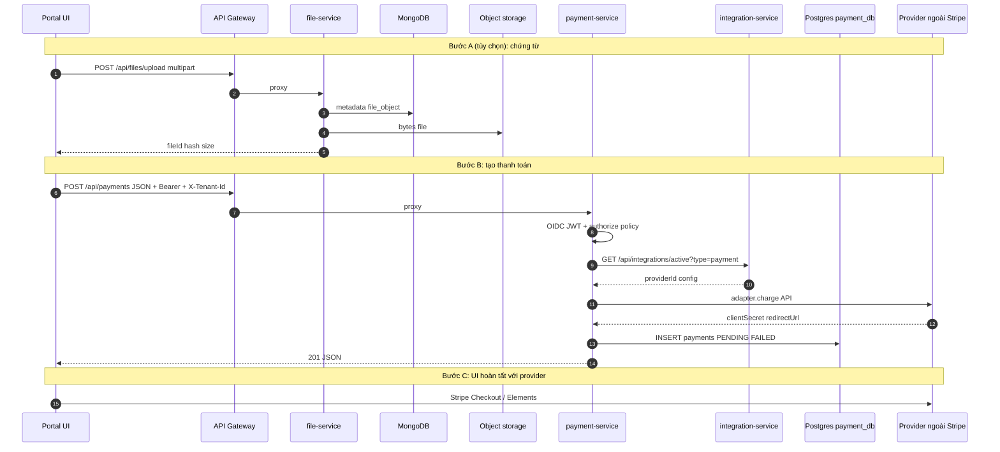

# Ví dụ luồng thanh toán end-to-end (UI → Gateway → Service → File → DB)

**Mục đích:** mô tả **một kịch bản tham chiếu** đi qua các tầng giải pháp trong **demo-cmit-api**: cổng API, nhận thực/phân quyền, tích hợp thanh toán, lưu DB; **tùy chọn** thêm bước lưu chứng từ qua **file-service**.  
**Căn cứ mã:** `api-gateway` (`/api/payments`), `payment-service` (`payment.routes`, `payment.service`, `integration/activePayment`), `integration-service`, Postgres `payments`, `file-service` (kịch bản mở rộng).

**Liên quan:** [permission-system-design.md](./permission-system-design.md) · [payment-service/note.md](../services/payment-service/note.md) · [integration-service/note.md](../services/integration-service/note.md)  
**Bổ sung luồng khác (sync, payment lỗi, cài cổng TT, eInvoice):** [vi-du-luong-e2e-sync-payment-einvoice.md](./vi-du-luong-e2e-sync-payment-einvoice.md)

---

## 1. Tóm tắt kịch bản

1. Người dùng đăng nhập (Keycloak / OIDC) trên **Portal (UI)** — UI **không** nằm trong repo API này.  
2. *(Tùy chọn)* Người dùng **upload hóa đơn PDF** → `file-service` qua gateway → MongoDB metadata + object storage.  
3. Người dùng (hoặc thủ quỹ) bấm **Thanh toán** → `POST /api/payments` qua **API Gateway** → **payment-service**.  
4. **payment-service** xác thực JWT, kiểm **policy** (scope `payment:write`, role…), gọi **integration-service** lấy provider active (vd. Stripe), gọi **adapter** charge, **ghi Postgres** bảng `payments`, trả `clientSecret` / `redirectUrl` cho UI.  
5. UI hoàn tất bước thanh toán trên Stripe/MoMo/… (hosted hoặc SDK).  
6. *(Webhook / cập nhật trạng thái — mở rộng)* Provider gọi webhook → service xử lý — **ngoài phạm vi tối thiểu** của ví dụ này nếu chưa triển khai.

---

## 2. Sơ đồ trình tự (sequence)



---

## 3. Bảng từng công đoạn (ai làm gì — giải pháp nào)

| # | Công đoạn | Tầng / thành phần | Việc xảy ra | Giải pháp / tài liệu |
|---|-----------|-------------------|-------------|----------------------|
| **A0** | Đăng nhập | **UI + IdP** | User lấy **access_token** (OIDC), có `scope` / `realm_access.roles` phù hợp | Keycloak: `identity-setup/`; token mẫu: `payment-service/identity-e2e.http` |
| **A1** | *(Tùy chọn)* Upload chứng từ | **UI → Gateway → file-service** | Multipart upload; metadata trong Mongo; file trong local/S3 | [file-service README](../services/file-service/README.md); chunk: `chunk-upload-e2e.http` |
| **A2** | Lưu chứng từ | **Mongo + storage** | Collection `file_object` (và version nếu có); dedup hash | Platform pattern storage + integration active storage |
| **B1** | Gọi thanh toán | **UI → Gateway** | `POST https://api.../api/payments` với `Authorization: Bearer`, header tenant | Gateway: `api-gateway/src/index.ts` proxy `PAYMENT_SERVICE_URL` |
| **B2** | Terminate TLS / LB | **Hạ tầng** | TLS ở LB hoặc Ingress (production) | [huong-dan-setup-server-mang-bao-mat.md](./huong-dan-setup-server-mang-bao-mat.md) |
| **B3** | Proxy không đổi path | **API Gateway** | `pathRewrite` giữ `/api/payments` | `http-proxy-middleware` |
| **B4** | Bảo vệ HTTP cơ bản | **payment-service** | `helmet`, `cors`, `express.json` | Lớp ứng dụng chuẩn Express |
| **B5** | Xác thực | **payment-service** | `oidcAuthMiddleware` — JWT hợp lệ, gắn `req.user` | `middleware/oidcAuth.ts`; cấu hình issuer/audience |
| **B6** | Phân quyền | **payment-service** | `authorize(PAYMENT_ROUTE_POLICY.processPayment)` — `payment:write` + role `platform-admin` (theo policy hiện tại) | `security/authorization.policy.ts`; chi tiết mở rộng: [permission-system-design.md](./permission-system-design.md) |
| **B7** | Chọn nhà cung cấp thanh toán | **integration-service** | `GET .../active?type=payment` → `providerId` + `config` (secret key sandbox, …) | [integration-service/note.md](../services/integration-service/note.md) |
| **B8** | Adapter pattern | **payment-service** | `getPaymentProvider()` → `StripeAdapter.charge()` (hoặc MoMo, PayPal…) | `payment/paymentFactory.ts`, `integration/activePayment.ts` |
| **B9** | Gọi API bên thứ ba | **Provider (Stripe…)** | Tạo PaymentIntent / redirect URL | ToS & PCI thuộc Stripe |
| **B10** | Ghi nhận giao dịch nội bộ | **PostgreSQL** | `INSERT INTO payments (...)` trạng thái `PENDING` hoặc `FAILED`; không provider → `NO_PROVIDER` | `payment.service.ts`; DB: `postgres-payment` trong compose |
| **B11** | Trả về cho UI | **payment-service → Gateway → UI** | `clientSecret` (Stripe) hoặc `redirectUrl` (MoMo/BIDV/PayPal) | `payment.service.ts` return shape |
| **C1** | Hoàn tất UI | **UI + Stripe.js / redirect** | User xác nhận thanh toán trên UI provider | Ngoài repo |
| **C2** | *(Mở rộng)* Webhook | **Provider → service** | Cập nhật `payments.status` = PAID | Cần route webhook + verify signature — triển khai theo dự án |

---

## 4. Dữ liệu chạm vào (tóm tắt)

| Store | Khi nào | Ghi chú |
|-------|---------|---------|
| **MongoDB** (`file_service` DB) | Bước upload file | `file_object`, … |
| **Object storage** (local/S3) | Bước upload file | Bytes PDF |
| **PostgreSQL** (`payment_db` / schema thực tế) | `POST /api/payments` | Bảng `payments` — các cột theo INSERT trong code |
| **MongoDB** (`integration_service`) | Bước B7 (đọc) | Instance active payment |

---

## 5. Ví dụ request (rút gọn)

**Qua gateway (dev):**

```http
POST http://localhost:8080/api/payments
Authorization: Bearer <access_token>
X-Tenant-Id: tenant-a
Content-Type: application/json

{
  "invoiceNo": "INV-2026-001",
  "amount": 100000,
  "currency": "vnd",
  "returnUrl": "https://portal.example/pay/return",
  "description": "Thanh toán hóa đơn INV-2026-001"
}
```

**Response (Stripe):** có thể có `clientSecret`; **MoMo/BIDV/PayPal:** có thể có `redirectUrl` — xem `payment-service/note.md`.

---

## 6. Liên hệ với các “giải pháp nền tảng” khác (tùy bật env)

| Tính năng | Env / route | Ý nghĩa trong luồng thanh toán |
|-----------|-------------|----------------------------------|
| **KMS** (mã hóa field) | `KMS_ENABLED=true` | Ví dụ mã hóa số thẻ/token tạm — route demo trong `payment-service` |
| **Cache** | `CACHE_ENABLED=true` | Giảm đọc lặp cấu hình / session ngắn |
| **Realtime** | `REALTIME_ENABLED=true` | Đẩy sự kiện “payment created” tới UI |

Đây là **tùy chọn**; luồng tối thiểu không bắt buộc bật.

---

## 7. Điểm cần lưu ý khi demo / UAT

- User gọi `POST /api/payments` phải có **đủ scope/role** theo `authorization.policy.ts` — nếu không sẽ **403**.  
- **integration-service** phải có instance **payment** active (vd. Stripe test key) — nếu không, DB ghi `NO_PROVIDER`.  
- **Gateway OIDC** (`API_GATEWAY_OIDC_ENABLED`) và **payment-service OIDC** là hai lớp có thể bật độc lập — cấu hình phải **khớp issuer/audience**.

---

## Kiểm soát phiên bản

| Trường | Giá trị |
|--------|---------|
| File | `docs/vi-du-luong-thanh-toan-end-to-end.md` |
| Cập nhật | Khi đổi policy route payment hoặc thêm webhook chính thức |
