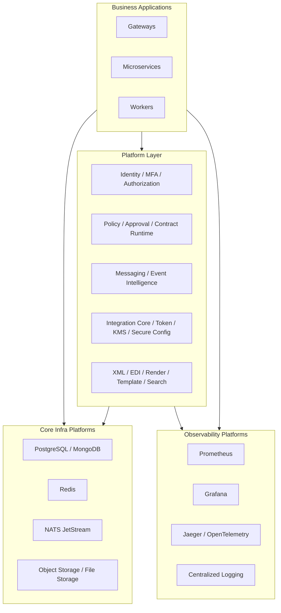

# Mô hình Cài đặt Platforms

## 1) Giới thiệu

Tài liệu này mô tả mô hình cài đặt các platform thành phần cho hệ thống `demo-cmit-api`, bao gồm tầng dữ liệu, messaging, observability, security và runtime nền tảng.

Mục tiêu:
- Chuẩn hóa cách triển khai các platform dùng chung.
- Tách lớp platform khỏi lớp business service để dễ mở rộng.
- Đảm bảo tính ổn định, bảo mật và khả năng vận hành lâu dài.

## 2) Diagram mô hình cài đặt Platforms

## 3) Giải thích các nhóm platform

### 3.1 Nhóm Security & Identity
- `Identity`, `MFA`, `Authorization` xử lý xác thực, phân quyền và kiểm soát truy cập.
- Áp dụng cho cả user cuối, service account và endpoint nội bộ.

### 3.2 Nhóm Governance & Workflow
- `Policy Engine`, `Approval`, `Contract Runtime/Registry` đảm bảo rule nghiệp vụ và chuẩn dữ liệu.
- Giúp kiểm soát thay đổi, truy vết quyết định và giảm lỗi tích hợp.

### 3.3 Nhóm Messaging & Event
- `Messaging`, `Event Intelligence`, `Trace` phục vụ kiến trúc event-driven.
- Hỗ trợ causation chain, audit event và xử lý bất đồng bộ.

### 3.4 Nhóm Integration & Security Runtime
- `Integration Core`, `Integration Token`, `KMS`, `Secure Config`.
- Quản lý kết nối đối tác ngoài, secret và mã hóa dữ liệu nhạy cảm.

### 3.5 Nhóm Data Engines
- `XML/EDI Engine`, `Render Engine`, `Template`, `Search`.
- Chuẩn hóa xử lý dữ liệu đầu vào/đầu ra và tài liệu nghiệp vụ.

## 4) Nguyên tắc cài đặt platform

- Tách môi trường theo `DEV / UAT / PROD`.
- Cấu hình bằng biến môi trường và secret manager, không hardcode.
- Version pin rõ ràng cho platform quan trọng.
- Cấu hình HA cho DB, messaging và storage trước khi go-live.
- Ưu tiên triển khai quan sát (metrics/log/trace) ngay từ đầu.

## 5) Trình tự cài đặt khuyến nghị

1. Cài tầng hạ tầng lõi: DB, Redis, NATS, Storage.
2. Cài security nền tảng: Identity, KMS, Secure Config.
3. Cài governance platforms: Policy, Approval, Contract Runtime.
4. Cài messaging/event platforms.
5. Cài data engines (XML/EDI/Render/Search).
6. Cài application services và gateway.
7. Kích hoạt monitoring, alert, backup, runbook.

## 6) Checklist vận hành platform

- Kiểm tra healthcheck và readiness từng platform.
- Kiểm tra compatibility version giữa platform và services.
- Kiểm tra backup/restore tối thiểu cho DB và storage.
- Kiểm tra alert rule cho CPU/RAM/disk/lag/error rate.
- Kiểm tra RBAC và phân quyền truy cập admin.

## 7) Kết luận

Mô hình cài đặt platforms giúp hệ thống có nền tảng kỹ thuật đồng nhất, dễ mở rộng theo domain nghiệp vụ và giảm rủi ro vận hành khi tăng quy mô.
