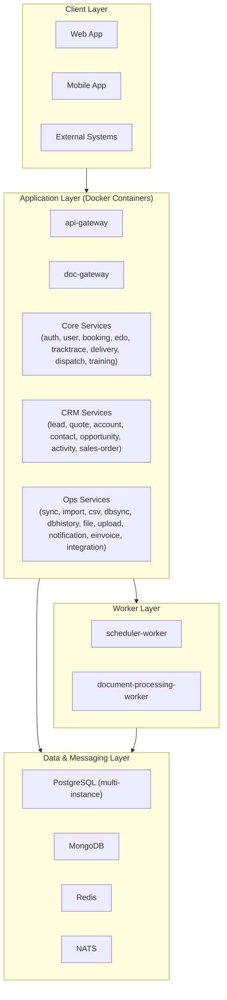

# Mô hình Cài đặt

## 1) Giới thiệu

Tài liệu này mô tả mô hình cài đặt cho hệ thống `demo-cmit-api` theo hướng triển khai bằng Docker Compose cho môi trường DEV/UAT và mở rộng lên mô hình production.

Mục tiêu:
- Chuẩn hóa cách dựng môi trường nhanh, đồng nhất giữa các máy.
- Tách rõ lớp ứng dụng, lớp xử lý nền và lớp hạ tầng dữ liệu.
- Dễ mở rộng thành mô hình HA/Auto Scale khi chuyển sang Kubernetes.

## 2) Diagram mô hình cài đặt

## 3) Giải thích các thành phần

### 3.1 Client Layer
- `Web App`, `Mobile App`, và hệ thống ngoài gọi vào qua API.
- Toàn bộ request đi qua gateway trước khi vào service nghiệp vụ.

### 3.2 Application Layer
- `api-gateway`: gateway chính, routing và orchestration liên service.
- `doc-gateway`: cổng tài liệu/file chuyên biệt.
- `Core Services`: dịch vụ nền tảng vận hành chung.
- `CRM Services`: dịch vụ nghiệp vụ bán hàng và chăm sóc khách hàng.
- `Ops Services`: dịch vụ tích hợp, import/sync, lịch sử và vận hành dữ liệu.

### 3.3 Worker Layer
- `scheduler-worker`: xử lý job nền theo lịch và pipeline không đồng bộ.
- `document-processing-worker`: xử lý hậu kỳ tài liệu/file.

### 3.4 Data & Messaging Layer
- `PostgreSQL`: lưu trữ dữ liệu quan hệ theo từng service.
- `MongoDB`: lưu dữ liệu document, event/audit, lịch sử.
- `Redis`: cache và queue phụ trợ.
- `NATS`: kênh messaging event-driven giữa các thành phần.

## 4) Quy trình cài đặt cơ bản

1. Clone source code và kiểm tra `.env` cho từng service cần chạy.
2. Build toàn bộ image:
   - `docker compose build`
3. Khởi động hệ thống:
   - `docker compose up -d`
4. Kiểm tra trạng thái:
   - `docker compose ps`
5. Kiểm tra gateway:
   - `http://localhost:8080`

## 5) Kết luận

Mô hình cài đặt theo container giúp rút ngắn thời gian triển khai, dễ quản trị cấu hình, và tạo nền tảng sẵn sàng để nâng cấp sang kiến trúc HA/Auto Scale trong giai đoạn production.
