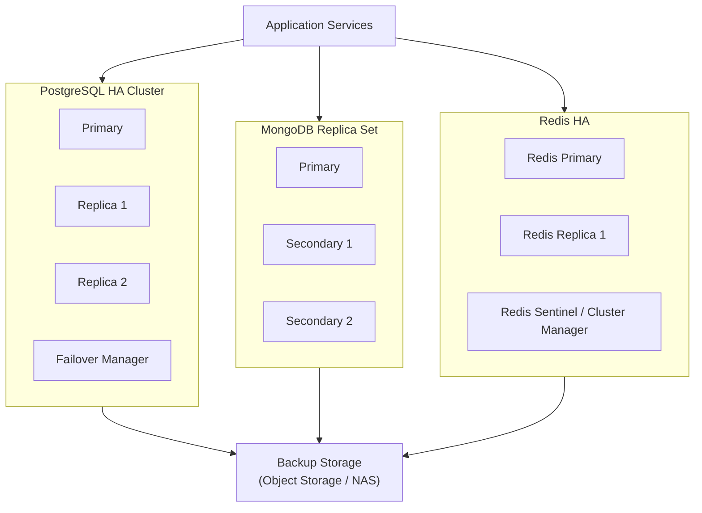

# Mô hình Database HA

## 1) Giới thiệu

Tài liệu này mô tả mô hình High Availability (HA) cho tầng database trong `demo-cmit-api`, nhằm đảm bảo hệ thống chịu lỗi tốt, giảm downtime và duy trì tính nhất quán dữ liệu.

Mục tiêu:
- Không có điểm lỗi đơn (single point of failure) ở tầng dữ liệu.
- Tự động failover khi node chính gặp sự cố.
- Có cơ chế backup/restore định kỳ và kiểm thử phục hồi.

## 2) Thành phần chính

- `PostgreSQL`: lưu dữ liệu quan hệ nghiệp vụ.
- `MongoDB`: lưu document/event/audit.
- `Redis`: cache và queue phụ trợ.
- `NATS JetStream`: lớp messaging cần cấu hình HA theo cụm.
- `Backup Storage`: nơi lưu bản backup định kỳ và snapshot.

## 3) Diagram mô hình Database HA

## 4) Giải thích mô hình

### 4.1 PostgreSQL HA
- Dùng 1 `Primary` + tối thiểu 2 `Replica`.
- Streaming replication đồng bộ hoặc bất đồng bộ theo SLA.
- Dùng failover manager để tự động promote replica khi primary lỗi.

### 4.2 MongoDB HA
- Dùng Replica Set 3 node (1 primary, 2 secondary).
- Ứng dụng kết nối qua connection string replica set để tự động chuyển node.
- Ưu tiên ghi vào primary, đọc có thể scale từ secondary cho báo cáo.

### 4.3 Redis HA
- Dùng `Primary + Replica` kết hợp Sentinel hoặc Redis Cluster.
- Redis chủ yếu cho cache/ephemeral nên cần chính sách persistence phù hợp.
- Khi primary lỗi, sentinel/cluster manager bầu chọn node mới.

## 5) Cơ chế failover

- Health check liên tục cho từng node DB.
- Tự động chuyển vai trò node dự phòng khi node chính không khả dụng.
- Ứng dụng cần retry logic và timeout hợp lý để giảm gián đoạn.
- Có runbook xử lý sự cố cho các tình huống split-brain/network partition.

## 6) Backup và phục hồi

- PostgreSQL:
  - Full backup hằng ngày, WAL archiving theo chu kỳ.
- MongoDB:
  - Snapshot + oplog backup.
- Redis:
  - RDB/AOF theo mức quan trọng dữ liệu.
- Luôn kiểm thử restore định kỳ (ít nhất 1 lần/tháng).

## 7) Khuyến nghị vận hành

- Tách node DB sang subnet riêng, không public internet.
- Giám sát replication lag, disk IOPS, CPU, memory, connections.
- Cảnh báo sớm khi dung lượng gần đầy hoặc lag tăng bất thường.
- Mã hóa dữ liệu at-rest và in-transit theo chuẩn bảo mật.

## 8) Kết luận

Mô hình Database HA giúp hệ thống:
- Tăng độ sẵn sàng và khả năng chịu lỗi.
- Giảm rủi ro mất dữ liệu.
- Đảm bảo phục vụ liên tục cho các nghiệp vụ quan trọng.
