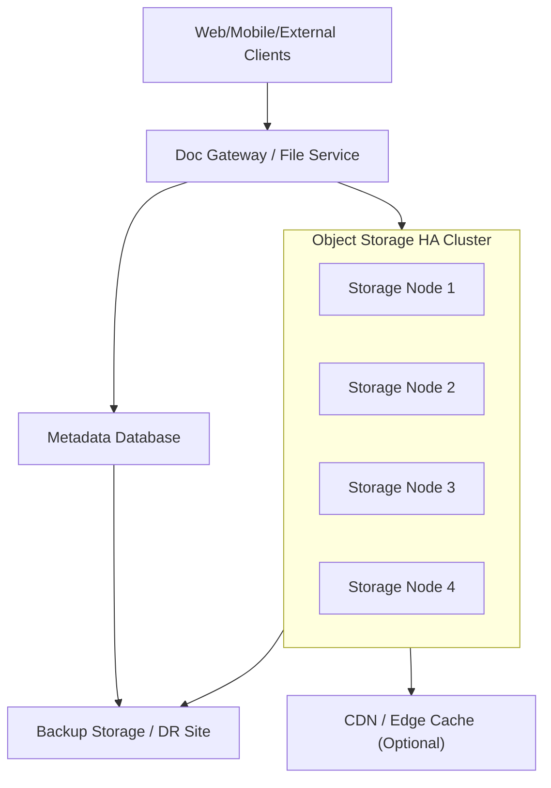

# Mô hình File Storage HA

## 1) Giới thiệu

Tài liệu này mô tả mô hình High Availability (HA) cho tầng lưu trữ file trong `demo-cmit-api`, phục vụ các use case upload/download tài liệu, file nghiệp vụ và dữ liệu xuất báo cáo.

Mục tiêu:
- Đảm bảo truy cập file liên tục khi một node storage gặp sự cố.
- Đảm bảo độ bền dữ liệu cao, hạn chế mất mát file.
- Tối ưu khả năng mở rộng dung lượng và thông lượng.

## 2) Thành phần chính

- `Doc Gateway` / `File Service`: tầng ứng dụng nhận và xử lý request file.
- `Object Storage Cluster` (MinIO/S3-compatible): lưu trữ file chính.
- `Metadata Store` (PostgreSQL/MongoDB): lưu thông tin metadata file.
- `CDN/Edge Cache` (tùy chọn): tăng tốc download file tĩnh phổ biến.
- `Backup Storage`: lưu bản sao lưu định kỳ, tách biệt vùng chính.

## 3) Diagram mô hình File Storage HA

## 4) Giải thích mô hình

### 4.1 Tầng truy cập file
- Toàn bộ upload/download đi qua `Doc Gateway` hoặc `File Service`.
- Service kiểm tra quyền truy cập, metadata và sinh URL truy cập an toàn.
- Không expose trực tiếp storage node ra internet nếu không cần thiết.

### 4.2 Tầng Object Storage HA
- Dùng cụm nhiều node để tránh single point of failure.
- Cấu hình erasure coding hoặc replication để tăng độ bền dữ liệu.
- Hỗ trợ scale-out bằng cách thêm node khi dung lượng/tải tăng.

### 4.3 Tầng metadata
- Metadata file (owner, size, mime-type, tags, version, policy) lưu ở DB riêng.
- Metadata cần backup độc lập với object data để phục hồi đầy đủ.

## 5) Chính sách HA và tính sẵn sàng

- Multi-node storage cluster, chịu lỗi theo số node cho phép.
- Health check định kỳ cho từng node storage.
- Cơ chế retry và timeout hợp lý ở tầng service khi storage tạm lỗi.
- Cân bằng tải request đọc/ghi qua gateway.

## 6) Backup và Disaster Recovery

- Backup object data theo lịch (incremental + full tùy chính sách).
- Backup metadata DB theo lịch riêng.
- Lưu backup ở vùng tách biệt (khác ổ đĩa, khác AZ hoặc khác site).
- Kiểm thử restore định kỳ để đảm bảo khả năng phục hồi thực tế.

## 7) Bảo mật lưu trữ file

- Mã hóa in-transit (HTTPS/TLS) và at-rest (server-side encryption).
- Dùng signed URL có thời hạn cho download/upload.
- Kiểm soát quyền theo role/tenant/entity.
- Quét malware đối với file upload nếu nghiệp vụ yêu cầu.

## 8) Giám sát vận hành

- Theo dõi dung lượng, tốc độ tăng trưởng dữ liệu, IOPS, latency.
- Theo dõi tỷ lệ lỗi upload/download theo service.
- Cảnh báo sớm khi gần hết dung lượng hoặc node storage degraded.

## 9) Kết luận

Mô hình File Storage HA giúp đảm bảo dữ liệu file an toàn, truy cập ổn định và sẵn sàng mở rộng theo nhu cầu tăng trưởng của hệ thống.
