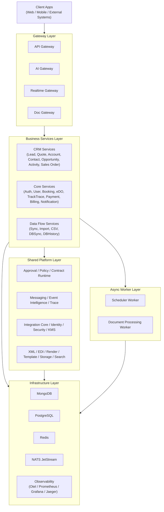

# Mô hình giải pháp tổng thể

## 1) Giới thiệu

Tài liệu này mô tả mô hình tổng thể cho hệ sinh thái `demo-cmit-api` theo định hướng microservices và platform dùng chung.

Mục tiêu của mô hình:
- Chuẩn hóa kiến trúc để dễ mở rộng theo domain nghiệp vụ.
- Tách rõ lớp Gateway, lớp Services nghiệp vụ, lớp Platform dùng chung và lớp hạ tầng.
- Đảm bảo các yêu cầu vận hành quan trọng: bảo mật, giám sát, truy vết, scale và độ sẵn sàng cao.

## 2) Diagram tổng quan

## 3) Giải thích các thành phần

### 3.1 Gateway Layer
- `API Gateway`: điểm vào chính cho request API, routing, governance, audit và orchestration liên service.
- `AI Gateway`: lớp giao tiếp mở rộng cho use case AI/assistant.
- `Realtime Gateway`: xử lý kênh realtime (event push, stream, notification realtime).
- `Doc Gateway`: cổng chuyên biệt cho tài liệu/file, phân tách khỏi API nghiệp vụ chính.

### 3.2 Business Services Layer
- `CRM Services`: xử lý vòng đời khách hàng và quy trình bán hàng (lead -> quote -> opportunity -> sales order).
- `Core Services`: nhóm dịch vụ lõi vận hành sản phẩm (auth, user, payment, notification, tracktrace...).
- `Data Flow Services`: xử lý đồng bộ dữ liệu, nhập liệu, lịch sử thay đổi và truy vết.

### 3.3 Shared Platform Layer
- `Approval / Policy / Contract Runtime`: chuẩn hóa hợp đồng dữ liệu, đánh giá chính sách, điều phối luồng phê duyệt.
- `Messaging / Event Intelligence / Trace`: event mesh, causation tracing, audit và phân tích sự kiện.
- `Integration / Identity / Security`: adapter tích hợp ngoài, identity, mã hóa khóa và cấu hình bảo mật.
- `XML / EDI / Render / Template`: engine xử lý định dạng dữ liệu, mẫu in ấn và tài liệu đầu ra.

### 3.4 Async Worker Layer
- `Scheduler Worker`: thực thi tác vụ nền theo lịch (batch, retry, định kỳ).
- `Document Processing Worker`: xử lý hậu kỳ file/tài liệu (transform, pipeline tác vụ nền).

### 3.5 Infrastructure Layer
- `MongoDB`: lưu dữ liệu linh hoạt, audit/event, document-centric data.
- `PostgreSQL`: lưu dữ liệu quan hệ và giao dịch.
- `Redis`: cache, queue phụ trợ, tăng tốc truy cập.
- `NATS JetStream`: message bus cho publish/subscribe và xử lý bất đồng bộ.
- `Observability`: theo dõi metrics, trace, log, cảnh báo phục vụ vận hành production.

## 4) Kết luận

Mô hình tổng thể này giúp hệ thống:
- Dễ mở rộng theo domain và theo tải.
- Dễ kiểm soát bảo mật, truy vết và tuân thủ.
- Dễ vận hành, bảo trì và triển khai nhiều môi trường.
