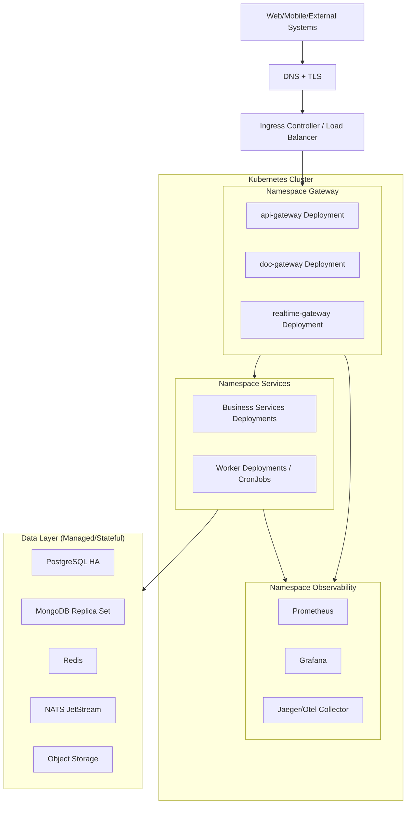

# Mô hình Kubernetes

## 1) Giới thiệu

Tài liệu này mô tả mô hình triển khai `demo-cmit-api` trên Kubernetes để đáp ứng yêu cầu auto scale, high availability và vận hành production.

Mục tiêu:
- Tự động scale theo tải thực tế.
- Giảm downtime khi deploy/nâng cấp.
- Chuẩn hóa vận hành đa môi trường (DEV/UAT/PROD).

## 2) Diagram mô hình Kubernetes

## 3) Thành phần triển khai chính

### 3.1 Ingress & Routing
- Dùng Ingress Controller để route theo host/path.
- TLS certificate quản lý theo từng domain/subdomain.
- Có thể tích hợp WAF/CDN ở lớp ngoài nếu cần.

### 3.2 Workload ứng dụng
- `Deployment` cho gateway và microservices.
- `StatefulSet` cho thành phần cần trạng thái nếu không dùng managed service.
- `CronJob` cho job định kỳ; `Deployment` cho worker chạy liên tục.

### 3.3 Cấu hình ứng dụng
- `ConfigMap` cho config không nhạy cảm.
- `Secret` hoặc external secret manager cho credentials.
- Health probes:
  - `livenessProbe`
  - `readinessProbe`
  - `startupProbe` (với service khởi động chậm)

## 4) Auto Scale

- Bật `HorizontalPodAutoscaler` cho gateway/services/worker.
- Metric đề xuất:
  - CPU/RAM utilization
  - Request per second
  - Queue lag (với worker)
- Khuyến nghị:
  - Thiết lập `minReplicas` đủ để chịu peak ngắn.
  - `maxReplicas` theo năng lực DB và messaging.

## 5) High Availability

- Chạy tối thiểu 3 node worker trong cluster production.
- Phân tán pod qua nhiều node/AZ bằng:
  - `topologySpreadConstraints`
  - `podAntiAffinity`
- Dùng `PodDisruptionBudget` để hạn chế gián đoạn khi bảo trì node.

## 6) Chiến lược triển khai

- Rolling Update mặc định cho thay đổi thông thường.
- Blue/Green hoặc Canary cho release rủi ro cao.
- CI/CD pipeline:
  - Build image
  - Scan bảo mật
  - Push registry
  - Deploy theo namespace/env

## 7) Logging, Metrics, Trace

- Thu metrics qua Prometheus.
- Dashboard qua Grafana.
- Trace qua OpenTelemetry + Jaeger.
- Chuẩn hóa `traceId`/`correlationId` xuyên suốt request chain.

## 8) Bảo mật trên Kubernetes

- Áp dụng `NetworkPolicy` để giới hạn traffic nội bộ.
- Giới hạn quyền service account theo nguyên tắc least privilege.
- Image phải được scan CVE trước khi deploy.
- Không lưu secret trong plain text file của repo.

## 9) Kết luận

Mô hình Kubernetes giúp hệ thống đạt khả năng scale linh hoạt, tăng độ sẵn sàng và chuẩn hóa vận hành production cho kiến trúc microservices.
