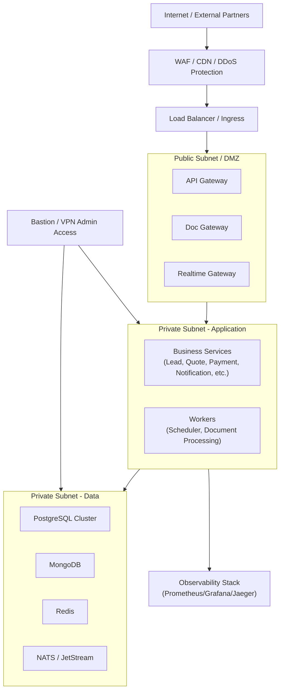

# Mô hình Network

## 1) Giới thiệu

Tài liệu này mô tả mô hình network cho `demo-cmit-api` theo hướng phân lớp rõ ràng giữa vùng public và private, giảm bề mặt tấn công và tối ưu vận hành.

Mục tiêu:
- Chỉ expose các cổng cần thiết ra internet.
- Cô lập dịch vụ nội bộ, database, cache và message broker.
- Hỗ trợ mở rộng lên mô hình HA và Kubernetes khi cần.

## 2) Diagram mô hình network

## 3) Giải thích các thành phần

### 3.1 Vùng Public Subnet / DMZ
- Chỉ đặt các thành phần cần nhận traffic từ bên ngoài: `API Gateway`, `Doc Gateway`, `Realtime Gateway`.
- Không đặt database hoặc message broker ở vùng này.
- Áp dụng TLS termination tại LB/Ingress hoặc gateway theo chuẩn triển khai.

### 3.2 Vùng Private Subnet - Application
- Chứa toàn bộ microservices nghiệp vụ và worker nền.
- Chỉ cho phép nhận request từ gateway hoặc từ các service nội bộ theo rule cụ thể.
- Chặn truy cập trực tiếp từ internet.

### 3.3 Vùng Private Subnet - Data
- Chứa PostgreSQL, MongoDB, Redis, NATS.
- Chỉ mở cổng cho application subnet hoặc bastion admin có kiểm soát.
- Bật cơ chế backup/replication theo chính sách HA.

### 3.4 Kênh quan sát và vận hành
- Stack giám sát thu metrics, traces, logs từ app/data layers.
- Admin truy cập qua bastion hoặc VPN, không truy cập trực tiếp từ internet.

## 4) Security group và firewall baseline

- Inbound internet:
  - Chỉ mở `80/443` vào LB/WAF.
- Inbound vào gateway:
  - Chỉ từ LB/WAF.
- Inbound vào service nội bộ:
  - Chỉ từ gateway và các subnet nội bộ được cấp quyền.
- Inbound vào DB/Redis/NATS:
  - Chỉ từ subnet ứng dụng hoặc bastion.
- Outbound:
  - Giới hạn theo danh sách đích cần thiết (DNS, package registry, provider API).

## 5) DNS và domain routing

- Ví dụ phân tách domain:
  - `api.<domain>` -> `API Gateway`
  - `docs.<domain>` -> `Doc Gateway`
  - `ws.<domain>` -> `Realtime Gateway`
- Dùng certificate wildcard hoặc certificate riêng theo subdomain.

## 6) Kết luận

Mô hình network phân lớp giúp hệ thống:
- Tăng độ an toàn thông tin.
- Giảm rủi ro truy cập trái phép vào tài nguyên nội bộ.
- Dễ kiểm soát luồng giao tiếp, giám sát và mở rộng khi tăng tải.
