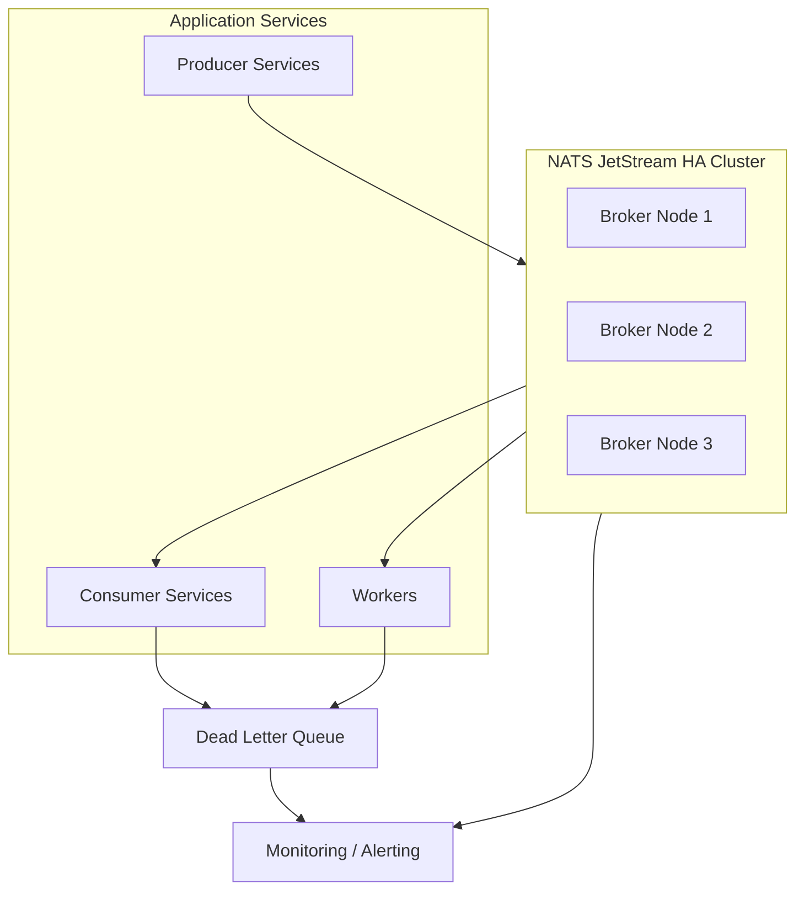

# Mô hình Stream Messaging HA

## 1) Giới thiệu

Tài liệu này mô tả mô hình High Availability (HA) cho tầng stream messaging trong `demo-cmit-api`, tập trung vào khả năng truyền sự kiện ổn định, chịu lỗi tốt và đảm bảo xử lý bất đồng bộ cho các luồng nghiệp vụ quan trọng.

Mục tiêu:
- Không gián đoạn luồng event khi một broker/node gặp lỗi.
- Đảm bảo tính bền vững của message (durable persistence).
- Hỗ trợ scale consumer theo tải xử lý thực tế.

## 2) Thành phần chính

- `NATS JetStream Cluster` (hoặc hệ tương đương): message broker trung tâm.
- `Producers`: các service phát sự kiện (lead, quote, payment, notification, sync...).
- `Consumers/Workers`: service hoặc worker subscribe và xử lý sự kiện.
- `DLQ` (Dead Letter Queue): lưu message lỗi sau số lần retry.
- `Observability`: giám sát lag, throughput, retry, error rate.

## 3) Diagram mô hình Stream Messaging HA

## 4) Giải thích mô hình

### 4.1 Cluster broker HA
- Tối thiểu 3 node broker để có quorum ổn định.
- Bật persistence để message không mất khi node restart.
- Stream quan trọng cần replication factor >= 3.

### 4.2 Producer/Consumer pattern
- Producer publish event theo topic/subject chuẩn hóa.
- Consumer dùng durable subscription để giữ trạng thái xử lý.
- Có cơ chế ack rõ ràng để tránh mất message hoặc xử lý trùng không kiểm soát.

### 4.3 DLQ và retry
- Message lỗi tạm thời: retry với backoff.
- Message lỗi không thể xử lý: chuyển vào DLQ.
- DLQ cần dashboard và quy trình reprocess có kiểm soát.

## 5) Chiến lược failover và độ tin cậy

- Khi một broker node lỗi, cluster vẫn phục vụ nhờ quorum còn lại.
- Consumer reconnect tự động, giữ offset/durable state.
- Hỗ trợ idempotency ở consumer để giảm rủi ro xử lý trùng sau reconnect/retry.
- Áp dụng timeout + circuit breaker ở điểm publish/consume khi cần.

## 6) Quy ước thiết kế event

- Event envelope nên có:
  - `eventId`, `traceId`, `causationId`
  - `eventType`, `occurredAt`, `actor`
  - `payload`, `version`
- Chuẩn hóa schema/version để hỗ trợ backward compatibility.
- Với event nghiệp vụ quan trọng, nên có policy retention rõ ràng.

## 7) Giám sát và cảnh báo

- Theo dõi chỉ số:
  - publish rate / consume rate
  - consumer lag
  - retry count / DLQ count
  - broker health, storage usage, replication status
- Cảnh báo khi:
  - lag tăng liên tục
  - broker mất quorum
  - DLQ tăng đột biến

## 8) Kết luận

Mô hình Stream Messaging HA giúp hệ thống event-driven hoạt động ổn định, giảm rủi ro mất message và tăng khả năng mở rộng cho các quy trình bất đồng bộ của nền tảng.
