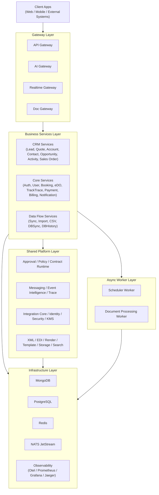
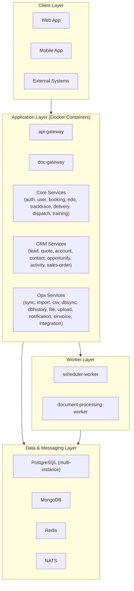
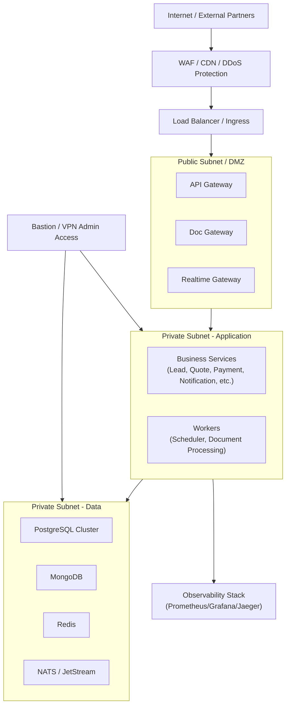
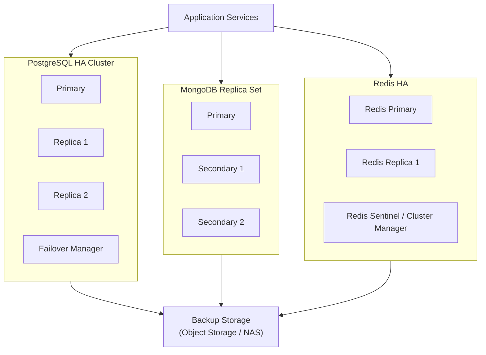
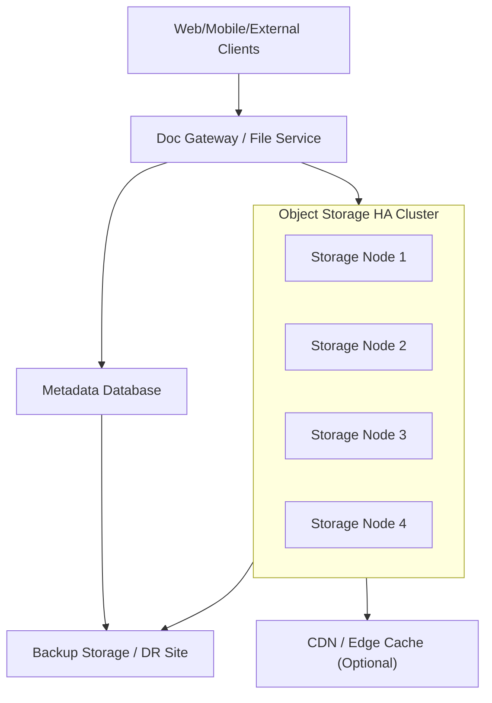
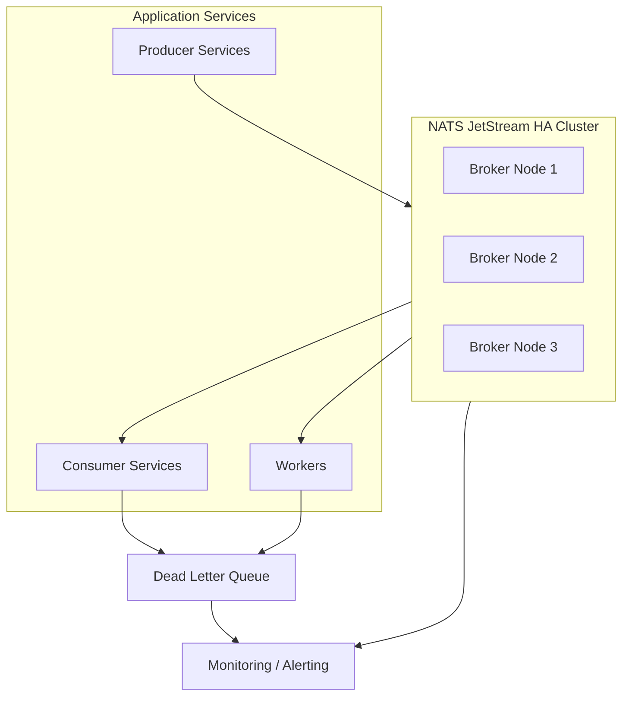
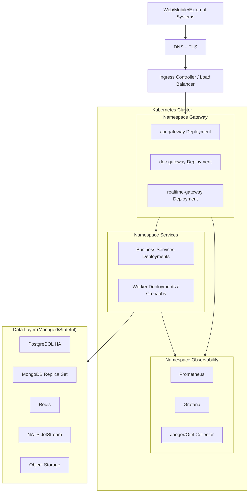

# Tong hop A - Thiet ke giai phap

Trang nay tong hop noi dung da gom tu cac file con nhom A.

## Mo hinh giai phap tong the

# Mô hình giải pháp tổng thể

## 1) Giới thiệu

Tài liệu này mô tả mô hình tổng thể cho hệ sinh thái `demo-cmit-api` theo định hướng microservices và platform dùng chung.

Mục tiêu của mô hình:
- Chuẩn hóa kiến trúc để dễ mở rộng theo domain nghiệp vụ.
- Tách rõ lớp Gateway, lớp Services nghiệp vụ, lớp Platform dùng chung và lớp hạ tầng.
- Đảm bảo các yêu cầu vận hành quan trọng: bảo mật, giám sát, truy vết, scale và độ sẵn sàng cao.

## 2) Diagram tổng quan

## 3) Giải thích các thành phần

### 3.1 Gateway Layer
- `API Gateway`: điểm vào chính cho request API, routing, governance, audit và orchestration liên service.
- `AI Gateway`: lớp giao tiếp mở rộng cho use case AI/assistant.
- `Realtime Gateway`: xử lý kênh realtime (event push, stream, notification realtime).
- `Doc Gateway`: cổng chuyên biệt cho tài liệu/file, phân tách khỏi API nghiệp vụ chính.

### 3.2 Business Services Layer
- `CRM Services`: xử lý vòng đời khách hàng và quy trình bán hàng (lead -> quote -> opportunity -> sales order).
- `Core Services`: nhóm dịch vụ lõi vận hành sản phẩm (auth, user, payment, notification, tracktrace...).
- `Data Flow Services`: xử lý đồng bộ dữ liệu, nhập liệu, lịch sử thay đổi và truy vết.

### 3.3 Shared Platform Layer
- `Approval / Policy / Contract Runtime`: chuẩn hóa hợp đồng dữ liệu, đánh giá chính sách, điều phối luồng phê duyệt.
- `Messaging / Event Intelligence / Trace`: event mesh, causation tracing, audit và phân tích sự kiện.
- `Integration / Identity / Security`: adapter tích hợp ngoài, identity, mã hóa khóa và cấu hình bảo mật.
- `XML / EDI / Render / Template`: engine xử lý định dạng dữ liệu, mẫu in ấn và tài liệu đầu ra.

### 3.4 Async Worker Layer
- `Scheduler Worker`: thực thi tác vụ nền theo lịch (batch, retry, định kỳ).
- `Document Processing Worker`: xử lý hậu kỳ file/tài liệu (transform, pipeline tác vụ nền).

### 3.5 Infrastructure Layer
- `MongoDB`: lưu dữ liệu linh hoạt, audit/event, document-centric data.
- `PostgreSQL`: lưu dữ liệu quan hệ và giao dịch.
- `Redis`: cache, queue phụ trợ, tăng tốc truy cập.
- `NATS JetStream`: message bus cho publish/subscribe và xử lý bất đồng bộ.
- `Observability`: theo dõi metrics, trace, log, cảnh báo phục vụ vận hành production.

## 4) Kết luận

Mô hình tổng thể này giúp hệ thống:
- Dễ mở rộng theo domain và theo tải.
- Dễ kiểm soát bảo mật, truy vết và tuân thủ.
- Dễ vận hành, bảo trì và triển khai nhiều môi trường.

## Giai phap ha tang

# Mô hình Cài đặt

## 1) Giới thiệu

Tài liệu này mô tả mô hình cài đặt cho hệ thống `demo-cmit-api` theo hướng triển khai bằng Docker Compose cho môi trường DEV/UAT và mở rộng lên mô hình production.

Mục tiêu:
- Chuẩn hóa cách dựng môi trường nhanh, đồng nhất giữa các máy.
- Tách rõ lớp ứng dụng, lớp xử lý nền và lớp hạ tầng dữ liệu.
- Dễ mở rộng thành mô hình HA/Auto Scale khi chuyển sang Kubernetes.

## 2) Diagram mô hình cài đặt

## 3) Giải thích các thành phần

### 3.1 Client Layer
- `Web App`, `Mobile App`, và hệ thống ngoài gọi vào qua API.
- Toàn bộ request đi qua gateway trước khi vào service nghiệp vụ.

### 3.2 Application Layer
- `api-gateway`: gateway chính, routing và orchestration liên service.
- `doc-gateway`: cổng tài liệu/file chuyên biệt.
- `Core Services`: dịch vụ nền tảng vận hành chung.
- `CRM Services`: dịch vụ nghiệp vụ bán hàng và chăm sóc khách hàng.
- `Ops Services`: dịch vụ tích hợp, import/sync, lịch sử và vận hành dữ liệu.

### 3.3 Worker Layer
- `scheduler-worker`: xử lý job nền theo lịch và pipeline không đồng bộ.
- `document-processing-worker`: xử lý hậu kỳ tài liệu/file.

### 3.4 Data & Messaging Layer
- `PostgreSQL`: lưu trữ dữ liệu quan hệ theo từng service.
- `MongoDB`: lưu dữ liệu document, event/audit, lịch sử.
- `Redis`: cache và queue phụ trợ.
- `NATS`: kênh messaging event-driven giữa các thành phần.

## 4) Quy trình cài đặt cơ bản

1. Clone source code và kiểm tra `.env` cho từng service cần chạy.
2. Build toàn bộ image:
   - `docker compose build`
3. Khởi động hệ thống:
   - `docker compose up -d`
4. Kiểm tra trạng thái:
   - `docker compose ps`
5. Kiểm tra gateway:
   - `http://localhost:8080`

## 5) Kết luận

Mô hình cài đặt theo container giúp rút ngắn thời gian triển khai, dễ quản trị cấu hình, và tạo nền tảng sẵn sàng để nâng cấp sang kiến trúc HA/Auto Scale trong giai đoạn production.

# Cấu hình server yêu cầu

## 1) Mục tiêu

Tài liệu này định nghĩa cấu hình server tối thiểu và khuyến nghị cho hệ thống `demo-cmit-api` theo từng môi trường triển khai.

## 2) Cấu hình đề xuất theo môi trường

### 2.1 Development (DEV)
- CPU: 8 vCPU
- RAM: 16 GB
- Disk: 200 GB SSD
- OS: Ubuntu 22.04 LTS hoặc tương đương
- Mục đích: chạy Docker Compose, test API, debug service

### 2.2 Staging (UAT)
- CPU: 16 vCPU
- RAM: 32 GB
- Disk: 500 GB SSD
- OS: Ubuntu 22.04 LTS hoặc tương đương
- Mục đích: kiểm thử tải vừa, kiểm thử tích hợp và release candidate

### 2.3 Production (PROD) - Khuyến nghị ban đầu
- Mô hình tối thiểu: 3 node application + 3 node database (HA)
- Mỗi node application:
  - CPU: 16 vCPU
  - RAM: 32 GB
  - Disk: 300 GB SSD
- Mỗi node database:
  - CPU: 16-32 vCPU
  - RAM: 64 GB
  - Disk: 1 TB NVMe SSD
- Mục tiêu: High Availability, dễ mở rộng ngang, giảm downtime

## 3) Yêu cầu hệ điều hành và runtime

- OS:
  - Linux ưu tiên: Ubuntu 22.04 LTS / RHEL 9
  - Đồng bộ timezone hệ thống theo `Asia/Ho_Chi_Minh`
- Runtime:
  - Docker Engine >= 24
  - Docker Compose Plugin >= 2.20
  - Node.js LTS (cho thao tác build thủ công khi cần)
- Đồng bộ thời gian:
  - Bật NTP trên tất cả server

## 4) Yêu cầu network và security baseline

- Mở cổng theo nguyên tắc tối thiểu:
  - 80/443 cho gateway
  - Cổng DB/Redis/NATS chỉ mở nội bộ VPC/VLAN
- Phân tách network:
  - Public subnet: gateway/reverse proxy
  - Private subnet: services, DB, cache, messaging
- Bảo mật:
  - TLS cho ingress
  - Secrets không hardcode trong source
  - Giới hạn IP truy cập các endpoint admin
  - Bật audit log cho thao tác nhạy cảm

## 5) Yêu cầu lưu trữ và backup

- Storage class:
  - Database: SSD/NVMe ưu tiên IOPS cao
  - File/object: tách riêng volume hoặc object storage
- Backup:
  - PostgreSQL/MongoDB: backup định kỳ theo ngày + retention
  - Redis: snapshot theo chính sách dữ liệu nghiệp vụ
  - Kiểm tra restore định kỳ tối thiểu mỗi tháng

## 6) Yêu cầu monitoring và vận hành

- Monitoring:
  - CPU, RAM, Disk, Network, container health
  - DB latency, queue lag, error rate API
- Logging:
  - Centralized logs theo service
  - Correlation/trace id xuyên suốt request chain
- Alert:
  - Cảnh báo downtime, high error rate, disk gần đầy, memory pressure

## 7) Checklist trước khi go-live

- Đủ tài nguyên theo sizing đã phê duyệt
- Kiểm tra HA failover cho DB và messaging
- Backup và restore test đạt yêu cầu
- TLS/Domain/DNS hoạt động đúng
- Dashboard giám sát và cảnh báo đã bật
- Runbook vận hành và xử lý sự cố đã sẵn sàng

# Mô hình Network

## 1) Giới thiệu

Tài liệu này mô tả mô hình network cho `demo-cmit-api` theo hướng phân lớp rõ ràng giữa vùng public và private, giảm bề mặt tấn công và tối ưu vận hành.

Mục tiêu:
- Chỉ expose các cổng cần thiết ra internet.
- Cô lập dịch vụ nội bộ, database, cache và message broker.
- Hỗ trợ mở rộng lên mô hình HA và Kubernetes khi cần.

## 2) Diagram mô hình network

## 3) Giải thích các thành phần

### 3.1 Vùng Public Subnet / DMZ
- Chỉ đặt các thành phần cần nhận traffic từ bên ngoài: `API Gateway`, `Doc Gateway`, `Realtime Gateway`.
- Không đặt database hoặc message broker ở vùng này.
- Áp dụng TLS termination tại LB/Ingress hoặc gateway theo chuẩn triển khai.

### 3.2 Vùng Private Subnet - Application
- Chứa toàn bộ microservices nghiệp vụ và worker nền.
- Chỉ cho phép nhận request từ gateway hoặc từ các service nội bộ theo rule cụ thể.
- Chặn truy cập trực tiếp từ internet.

### 3.3 Vùng Private Subnet - Data
- Chứa PostgreSQL, MongoDB, Redis, NATS.
- Chỉ mở cổng cho application subnet hoặc bastion admin có kiểm soát.
- Bật cơ chế backup/replication theo chính sách HA.

### 3.4 Kênh quan sát và vận hành
- Stack giám sát thu metrics, traces, logs từ app/data layers.
- Admin truy cập qua bastion hoặc VPN, không truy cập trực tiếp từ internet.

## 4) Security group và firewall baseline

- Inbound internet:
  - Chỉ mở `80/443` vào LB/WAF.
- Inbound vào gateway:
  - Chỉ từ LB/WAF.
- Inbound vào service nội bộ:
  - Chỉ từ gateway và các subnet nội bộ được cấp quyền.
- Inbound vào DB/Redis/NATS:
  - Chỉ từ subnet ứng dụng hoặc bastion.
- Outbound:
  - Giới hạn theo danh sách đích cần thiết (DNS, package registry, provider API).

## 5) DNS và domain routing

- Ví dụ phân tách domain:
  - `api.<domain>` -> `API Gateway`
  - `docs.<domain>` -> `Doc Gateway`
  - `ws.<domain>` -> `Realtime Gateway`
- Dùng certificate wildcard hoặc certificate riêng theo subdomain.

## 6) Kết luận

Mô hình network phân lớp giúp hệ thống:
- Tăng độ an toàn thông tin.
- Giảm rủi ro truy cập trái phép vào tài nguyên nội bộ.
- Dễ kiểm soát luồng giao tiếp, giám sát và mở rộng khi tăng tải.

# Cấu hình Network/Domain

## 1) Mục tiêu

Tài liệu này mô tả chuẩn cấu hình network và domain cho hệ thống `demo-cmit-api`, đảm bảo truy cập ổn định, bảo mật, dễ mở rộng và dễ vận hành theo nhiều môi trường.

## 2) Quy ước domain theo môi trường

Ví dụ quy ước:
- DEV:
  - `api.dev.cmit.local`
  - `docs.dev.cmit.local`
  - `ws.dev.cmit.local`
- UAT:
  - `api.uat.cmit.vn`
  - `docs.uat.cmit.vn`
  - `ws.uat.cmit.vn`
- PROD:
  - `api.cmit.vn`
  - `docs.cmit.vn`
  - `ws.cmit.vn`

Nguyên tắc:
- Tách subdomain theo vai trò (API, Docs, Realtime).
- Không dùng chung một endpoint cho tất cả loại traffic.
- Tên domain phải phản ánh rõ môi trường.

## 3) Cấu hình DNS khuyến nghị

### 3.1 Record cơ bản
- `A/AAAA`:
  - Trỏ `api.*`, `docs.*`, `ws.*` về Load Balancer/Ingress public.
- `CNAME`:
  - Dùng khi cần alias giữa các tên miền dịch vụ.
- `TXT`:
  - Phục vụ xác minh domain, bảo mật mail hoặc xác thực provider.

### 3.2 TTL
- DEV/UAT: `TTL 60-300s` để đổi nhanh khi test.
- PROD: `TTL 300-600s` để cân bằng giữa ổn định và khả năng failover.

## 4) Cấu hình TLS/SSL

- Bắt buộc HTTPS cho toàn bộ endpoint public.
- Chứng chỉ:
  - Wildcard: `*.cmit.vn` hoặc
  - Chứng chỉ riêng theo từng subdomain.
- TLS policy:
  - Chỉ cho phép TLS 1.2 trở lên.
  - Tắt cipher yếu, bật HSTS theo chính sách bảo mật.
- Gia hạn chứng chỉ:
  - Tự động hóa và cảnh báo trước khi hết hạn.

## 5) Cấu hình Ingress/Load Balancer

- Routing theo host:
  - `api.*` -> `api-gateway`
  - `docs.*` -> `doc-gateway`
  - `ws.*` -> `realtime-gateway`
- Thiết lập health check riêng cho từng backend.
- Bật sticky session khi use case realtime yêu cầu.
- Giới hạn request size/timeout theo loại traffic (API thường, upload file, streaming).

## 6) Cấu hình bảo mật network

- Chỉ mở public inbound:
  - `80` (redirect sang 443)
  - `443` (HTTPS chính thức)
- Cổng nội bộ (DB, Redis, NATS):
  - Chỉ cho phép private subnet hoặc security group được chỉ định.
- IP allowlist:
  - Áp dụng cho endpoint admin và endpoint nội bộ nhạy cảm.
- DDoS/WAF:
  - Bật protection ở lớp edge nếu có public internet traffic lớn.

## 7) Cấu hình CORS và trusted origins

- DEV:
  - Cho phép origin kiểm soát theo danh sách local dev.
- UAT/PROD:
  - Chỉ allow danh sách frontend domain chính thức.
- Không dùng wildcard `*` cho API có auth credentials.

## 8) Quan sát và kiểm soát vận hành

- Theo dõi:
  - TLS handshake error
  - DNS resolution error
  - 4xx/5xx theo host
  - Latency theo endpoint/domain
- Cảnh báo:
  - Domain/certificate sắp hết hạn
  - Tăng đột biến error rate theo host
  - Backend unhealthy sau LB

## 9) Checklist go-live Network/Domain

- Domain và DNS record đúng môi trường
- TLS certificate hợp lệ và còn hạn
- Route host -> gateway/backend đúng
- CORS origin đúng whitelist
- Security group/firewall đã khóa cổng không cần thiết
- Monitoring/alert theo host đã hoạt động

## Giai phap HA va platforms

# Mô hình Database HA

## 1) Giới thiệu

Tài liệu này mô tả mô hình High Availability (HA) cho tầng database trong `demo-cmit-api`, nhằm đảm bảo hệ thống chịu lỗi tốt, giảm downtime và duy trì tính nhất quán dữ liệu.

Mục tiêu:
- Không có điểm lỗi đơn (single point of failure) ở tầng dữ liệu.
- Tự động failover khi node chính gặp sự cố.
- Có cơ chế backup/restore định kỳ và kiểm thử phục hồi.

## 2) Thành phần chính

- `PostgreSQL`: lưu dữ liệu quan hệ nghiệp vụ.
- `MongoDB`: lưu document/event/audit.
- `Redis`: cache và queue phụ trợ.
- `NATS JetStream`: lớp messaging cần cấu hình HA theo cụm.
- `Backup Storage`: nơi lưu bản backup định kỳ và snapshot.

## 3) Diagram mô hình Database HA

## 4) Giải thích mô hình

### 4.1 PostgreSQL HA
- Dùng 1 `Primary` + tối thiểu 2 `Replica`.
- Streaming replication đồng bộ hoặc bất đồng bộ theo SLA.
- Dùng failover manager để tự động promote replica khi primary lỗi.

### 4.2 MongoDB HA
- Dùng Replica Set 3 node (1 primary, 2 secondary).
- Ứng dụng kết nối qua connection string replica set để tự động chuyển node.
- Ưu tiên ghi vào primary, đọc có thể scale từ secondary cho báo cáo.

### 4.3 Redis HA
- Dùng `Primary + Replica` kết hợp Sentinel hoặc Redis Cluster.
- Redis chủ yếu cho cache/ephemeral nên cần chính sách persistence phù hợp.
- Khi primary lỗi, sentinel/cluster manager bầu chọn node mới.

## 5) Cơ chế failover

- Health check liên tục cho từng node DB.
- Tự động chuyển vai trò node dự phòng khi node chính không khả dụng.
- Ứng dụng cần retry logic và timeout hợp lý để giảm gián đoạn.
- Có runbook xử lý sự cố cho các tình huống split-brain/network partition.

## 6) Backup và phục hồi

- PostgreSQL:
  - Full backup hằng ngày, WAL archiving theo chu kỳ.
- MongoDB:
  - Snapshot + oplog backup.
- Redis:
  - RDB/AOF theo mức quan trọng dữ liệu.
- Luôn kiểm thử restore định kỳ (ít nhất 1 lần/tháng).

## 7) Khuyến nghị vận hành

- Tách node DB sang subnet riêng, không public internet.
- Giám sát replication lag, disk IOPS, CPU, memory, connections.
- Cảnh báo sớm khi dung lượng gần đầy hoặc lag tăng bất thường.
- Mã hóa dữ liệu at-rest và in-transit theo chuẩn bảo mật.

## 8) Kết luận

Mô hình Database HA giúp hệ thống:
- Tăng độ sẵn sàng và khả năng chịu lỗi.
- Giảm rủi ro mất dữ liệu.
- Đảm bảo phục vụ liên tục cho các nghiệp vụ quan trọng.

# Mô hình File Storage HA

## 1) Giới thiệu

Tài liệu này mô tả mô hình High Availability (HA) cho tầng lưu trữ file trong `demo-cmit-api`, phục vụ các use case upload/download tài liệu, file nghiệp vụ và dữ liệu xuất báo cáo.

Mục tiêu:
- Đảm bảo truy cập file liên tục khi một node storage gặp sự cố.
- Đảm bảo độ bền dữ liệu cao, hạn chế mất mát file.
- Tối ưu khả năng mở rộng dung lượng và thông lượng.

## 2) Thành phần chính

- `Doc Gateway` / `File Service`: tầng ứng dụng nhận và xử lý request file.
- `Object Storage Cluster` (MinIO/S3-compatible): lưu trữ file chính.
- `Metadata Store` (PostgreSQL/MongoDB): lưu thông tin metadata file.
- `CDN/Edge Cache` (tùy chọn): tăng tốc download file tĩnh phổ biến.
- `Backup Storage`: lưu bản sao lưu định kỳ, tách biệt vùng chính.

## 3) Diagram mô hình File Storage HA

## 4) Giải thích mô hình

### 4.1 Tầng truy cập file
- Toàn bộ upload/download đi qua `Doc Gateway` hoặc `File Service`.
- Service kiểm tra quyền truy cập, metadata và sinh URL truy cập an toàn.
- Không expose trực tiếp storage node ra internet nếu không cần thiết.

### 4.2 Tầng Object Storage HA
- Dùng cụm nhiều node để tránh single point of failure.
- Cấu hình erasure coding hoặc replication để tăng độ bền dữ liệu.
- Hỗ trợ scale-out bằng cách thêm node khi dung lượng/tải tăng.

### 4.3 Tầng metadata
- Metadata file (owner, size, mime-type, tags, version, policy) lưu ở DB riêng.
- Metadata cần backup độc lập với object data để phục hồi đầy đủ.

## 5) Chính sách HA và tính sẵn sàng

- Multi-node storage cluster, chịu lỗi theo số node cho phép.
- Health check định kỳ cho từng node storage.
- Cơ chế retry và timeout hợp lý ở tầng service khi storage tạm lỗi.
- Cân bằng tải request đọc/ghi qua gateway.

## 6) Backup và Disaster Recovery

- Backup object data theo lịch (incremental + full tùy chính sách).
- Backup metadata DB theo lịch riêng.
- Lưu backup ở vùng tách biệt (khác ổ đĩa, khác AZ hoặc khác site).
- Kiểm thử restore định kỳ để đảm bảo khả năng phục hồi thực tế.

## 7) Bảo mật lưu trữ file

- Mã hóa in-transit (HTTPS/TLS) và at-rest (server-side encryption).
- Dùng signed URL có thời hạn cho download/upload.
- Kiểm soát quyền theo role/tenant/entity.
- Quét malware đối với file upload nếu nghiệp vụ yêu cầu.

## 8) Giám sát vận hành

- Theo dõi dung lượng, tốc độ tăng trưởng dữ liệu, IOPS, latency.
- Theo dõi tỷ lệ lỗi upload/download theo service.
- Cảnh báo sớm khi gần hết dung lượng hoặc node storage degraded.

## 9) Kết luận

Mô hình File Storage HA giúp đảm bảo dữ liệu file an toàn, truy cập ổn định và sẵn sàng mở rộng theo nhu cầu tăng trưởng của hệ thống.

# Mô hình Stream Messaging HA

## 1) Giới thiệu

Tài liệu này mô tả mô hình High Availability (HA) cho tầng stream messaging trong `demo-cmit-api`, tập trung vào khả năng truyền sự kiện ổn định, chịu lỗi tốt và đảm bảo xử lý bất đồng bộ cho các luồng nghiệp vụ quan trọng.

Mục tiêu:
- Không gián đoạn luồng event khi một broker/node gặp lỗi.
- Đảm bảo tính bền vững của message (durable persistence).
- Hỗ trợ scale consumer theo tải xử lý thực tế.

## 2) Thành phần chính

- `NATS JetStream Cluster` (hoặc hệ tương đương): message broker trung tâm.
- `Producers`: các service phát sự kiện (lead, quote, payment, notification, sync...).
- `Consumers/Workers`: service hoặc worker subscribe và xử lý sự kiện.
- `DLQ` (Dead Letter Queue): lưu message lỗi sau số lần retry.
- `Observability`: giám sát lag, throughput, retry, error rate.

## 3) Diagram mô hình Stream Messaging HA

## 4) Giải thích mô hình

### 4.1 Cluster broker HA
- Tối thiểu 3 node broker để có quorum ổn định.
- Bật persistence để message không mất khi node restart.
- Stream quan trọng cần replication factor >= 3.

### 4.2 Producer/Consumer pattern
- Producer publish event theo topic/subject chuẩn hóa.
- Consumer dùng durable subscription để giữ trạng thái xử lý.
- Có cơ chế ack rõ ràng để tránh mất message hoặc xử lý trùng không kiểm soát.

### 4.3 DLQ và retry
- Message lỗi tạm thời: retry với backoff.
- Message lỗi không thể xử lý: chuyển vào DLQ.
- DLQ cần dashboard và quy trình reprocess có kiểm soát.

## 5) Chiến lược failover và độ tin cậy

- Khi một broker node lỗi, cluster vẫn phục vụ nhờ quorum còn lại.
- Consumer reconnect tự động, giữ offset/durable state.
- Hỗ trợ idempotency ở consumer để giảm rủi ro xử lý trùng sau reconnect/retry.
- Áp dụng timeout + circuit breaker ở điểm publish/consume khi cần.

## 6) Quy ước thiết kế event

- Event envelope nên có:
  - `eventId`, `traceId`, `causationId`
  - `eventType`, `occurredAt`, `actor`
  - `payload`, `version`
- Chuẩn hóa schema/version để hỗ trợ backward compatibility.
- Với event nghiệp vụ quan trọng, nên có policy retention rõ ràng.

## 7) Giám sát và cảnh báo

- Theo dõi chỉ số:
  - publish rate / consume rate
  - consumer lag
  - retry count / DLQ count
  - broker health, storage usage, replication status
- Cảnh báo khi:
  - lag tăng liên tục
  - broker mất quorum
  - DLQ tăng đột biến

## 8) Kết luận

Mô hình Stream Messaging HA giúp hệ thống event-driven hoạt động ổn định, giảm rủi ro mất message và tăng khả năng mở rộng cho các quy trình bất đồng bộ của nền tảng.

## Giai phap auto scale

# Mô hình Kubernetes

## 1) Giới thiệu

Tài liệu này mô tả mô hình triển khai `demo-cmit-api` trên Kubernetes để đáp ứng yêu cầu auto scale, high availability và vận hành production.

Mục tiêu:
- Tự động scale theo tải thực tế.
- Giảm downtime khi deploy/nâng cấp.
- Chuẩn hóa vận hành đa môi trường (DEV/UAT/PROD).

## 2) Diagram mô hình Kubernetes

## 3) Thành phần triển khai chính

### 3.1 Ingress & Routing
- Dùng Ingress Controller để route theo host/path.
- TLS certificate quản lý theo từng domain/subdomain.
- Có thể tích hợp WAF/CDN ở lớp ngoài nếu cần.

### 3.2 Workload ứng dụng
- `Deployment` cho gateway và microservices.
- `StatefulSet` cho thành phần cần trạng thái nếu không dùng managed service.
- `CronJob` cho job định kỳ; `Deployment` cho worker chạy liên tục.

### 3.3 Cấu hình ứng dụng
- `ConfigMap` cho config không nhạy cảm.
- `Secret` hoặc external secret manager cho credentials.
- Health probes:
  - `livenessProbe`
  - `readinessProbe`
  - `startupProbe` (với service khởi động chậm)

## 4) Auto Scale

- Bật `HorizontalPodAutoscaler` cho gateway/services/worker.
- Metric đề xuất:
  - CPU/RAM utilization
  - Request per second
  - Queue lag (với worker)
- Khuyến nghị:
  - Thiết lập `minReplicas` đủ để chịu peak ngắn.
  - `maxReplicas` theo năng lực DB và messaging.

## 5) High Availability

- Chạy tối thiểu 3 node worker trong cluster production.
- Phân tán pod qua nhiều node/AZ bằng:
  - `topologySpreadConstraints`
  - `podAntiAffinity`
- Dùng `PodDisruptionBudget` để hạn chế gián đoạn khi bảo trì node.

## 6) Chiến lược triển khai

- Rolling Update mặc định cho thay đổi thông thường.
- Blue/Green hoặc Canary cho release rủi ro cao.
- CI/CD pipeline:
  - Build image
  - Scan bảo mật
  - Push registry
  - Deploy theo namespace/env

## 7) Logging, Metrics, Trace

- Thu metrics qua Prometheus.
- Dashboard qua Grafana.
- Trace qua OpenTelemetry + Jaeger.
- Chuẩn hóa `traceId`/`correlationId` xuyên suốt request chain.

## 8) Bảo mật trên Kubernetes

- Áp dụng `NetworkPolicy` để giới hạn traffic nội bộ.
- Giới hạn quyền service account theo nguyên tắc least privilege.
- Image phải được scan CVE trước khi deploy.
- Không lưu secret trong plain text file của repo.

## 9) Kết luận

Mô hình Kubernetes giúp hệ thống đạt khả năng scale linh hoạt, tăng độ sẵn sàng và chuẩn hóa vận hành production cho kiến trúc microservices.

# Dockerized (Image/Container management)

## 1) Giới thiệu

Tài liệu này mô tả chuẩn Docker hóa hệ thống `demo-cmit-api`, bao gồm quản lý image, container, tagging, build pipeline và vận hành runtime.

Mục tiêu:
- Chuẩn hóa vòng đời image từ build đến deploy.
- Giảm khác biệt giữa môi trường DEV/UAT/PROD.
- Tăng độ an toàn và khả năng truy vết phiên bản phát hành.

## 2) Nguyên tắc Docker hóa

- Mỗi service có `Dockerfile` riêng, build độc lập.
- Chạy theo nguyên tắc `one process per container`.
- Không hardcode secret vào image.
- Image phải immutable, cấu hình runtime qua env/config.
- Ưu tiên base image gọn nhẹ, an toàn (ví dụ Alpine hoặc distroless phù hợp).

## 3) Quản lý Image

### 3.1 Tagging strategy
- `service-name:<semver>`
- `service-name:<git-sha>`
- `service-name:latest` chỉ dùng cho DEV/internal test, không dùng để pin production.

### 3.2 Registry strategy
- Dùng registry tập trung (Docker Hub private, GHCR, ECR, GitLab Registry...).
- Phân repo image theo domain service.
- Áp dụng retention policy cho tag cũ.

### 3.3 Image metadata
- Gắn label:
  - source repo
  - commit SHA
  - build time
  - version
- Hỗ trợ audit và rollback nhanh.

## 4) Quản lý Container runtime

- Cấu hình tài nguyên:
  - CPU limit/request
  - Memory limit/request
- Thiết lập:
  - healthcheck
  - restart policy
  - log driver/rotation
- Giới hạn quyền container:
  - run as non-root (khi khả thi)
  - read-only root filesystem (khi phù hợp)

## 5) Build pipeline khuyến nghị

1. Lint + unit test
2. Build image
3. Scan bảo mật image (CVE)
4. Push image lên registry
5. Deploy theo môi trường
6. Smoke test sau deploy

Khuyến nghị:
- Dùng cache layer để tăng tốc build.
- Pin base image theo digest khi lên production.

## 6) Docker Compose cho DEV/UAT

- Dùng `docker-compose.yml` để dựng nhanh full stack local/integration.
- Chia cấu hình theo file override:
  - `docker-compose.yml` (base)
  - `docker-compose.override.yml` (local dev)
  - `docker-compose.prod.yml` (nếu cần mô phỏng prod)

## 7) Bảo mật Image/Container

- Không để lộ secret trong:
  - Dockerfile
  - build args
  - source code
- Quét lỗ hổng định kỳ:
  - base image
  - dependency layer
- Bật policy chặn deploy image có lỗ hổng mức cao/chí mạng.

## 8) Monitoring và vận hành

- Theo dõi:
  - container restart count
  - OOMKilled events
  - CPU/memory usage
  - image pull errors
- Cảnh báo:
  - crash loop
  - unhealthy container
  - disk pressure do image/log growth

## 9) Checklist go-live Dockerized

- Đã chốt image tag theo version + git SHA.
- Đã scan bảo mật và xử lý CVE nghiêm trọng.
- Đã có healthcheck và restart policy cho từng container.
- Đã chuẩn hóa env vars và secret injection.
- Đã có runbook rollback theo image tag ổn định.

## Giai phap giam sat

# Giải pháp Giám sát

## Giới thiệu
Giải pháp giám sát cho `demo-cmit-api` tập trung vào 3 lớp: metrics, logs, traces để phát hiện sớm sự cố và tối ưu vận hành.

## Thành phần chính
- OpenTelemetry/Prometheus: thu thập metrics hệ thống và ứng dụng.
- Grafana Dashboard: trực quan hóa tình trạng dịch vụ theo thời gian thực.
- Alert Manager: cảnh báo theo ngưỡng lỗi, độ trễ, tài nguyên.

## Cách triển khai
- Chuẩn hóa metric endpoint cho từng service.
- Gắn `traceId` xuyên suốt request chain.
- Thiết lập dashboard theo domain: Gateway, CRM, Data, Worker.
- Định nghĩa alert theo severity: warning/high/critical.

## Kết quả kỳ vọng
- Giảm MTTR khi có sự cố.
- Chủ động phát hiện bottleneck.
- Tăng độ ổn định khi scale hệ thống.

## Giai phap truy vet va kiem soat

# Giải pháp Truy vết và kiểm soát

## Giới thiệu
Giải pháp truy vết và kiểm soát đảm bảo mọi hành động nghiệp vụ có thể theo dõi theo chuỗi nguyên nhân-kết quả.

## Thành phần chính
- JetStream: lưu và phân phối event bền vững.
- Jaeger UI: quan sát distributed trace theo `traceId`.
- Security Audit Store: lưu log bảo mật và quyết định policy.

## Nguyên tắc
- Mỗi event có `eventId`, `traceId`, `causationId`.
- Gắn actor, decision, reason trong event/audit.
- Lưu timeline sự kiện để phục vụ điều tra và compliance.

## Kết quả kỳ vọng
- Truy nguyên sự cố nhanh.
- Kiểm soát thay đổi nghiệp vụ rõ ràng.
- Đáp ứng yêu cầu kiểm toán nội bộ.

## Giai phap backup va recovery

# Giải pháp Backup và Recovery

## Phạm vi
- MongoDB
- Redis Cache
- PostgreSQL
- MSSQL/Oracle (nếu tích hợp ngoài)
- File System/MinIO

## Chiến lược backup
- Full backup hằng ngày.
- Incremental/WAL/oplog theo chu kỳ ngắn.
- Mã hóa backup và lưu tại vùng tách biệt.
- Retention theo chính sách dữ liệu.

## Chiến lược recovery
- Xác định RPO/RTO theo mức độ nghiệp vụ.
- Runbook phục hồi theo từng hệ dữ liệu.
- Kiểm thử restore định kỳ tối thiểu mỗi tháng.
- Đánh giá integrity dữ liệu sau restore.

## Kết quả kỳ vọng
- Giảm rủi ro mất dữ liệu.
- Đảm bảo khôi phục nhanh khi có thảm họa.
- Duy trì tính liên tục nghiệp vụ.

## Giai phap trien khai ha tang thay the

# Giải pháp Triển khai hạ tầng thay thế (Alternative To)

## Mục tiêu
Đưa ra phương án triển khai linh hoạt theo điều kiện hạ tầng thực tế.

## Các lựa chọn
- Trên Linux OS: ưu tiên production.
- Trên Windows Server OS: phục vụ hệ thống kế thừa.
- Trên môi trường DEV: tối ưu tốc độ cài đặt và debug.
- System File Storage: lưu file vật lý tại server nội bộ khi chưa dùng object storage.

## Nguyên tắc lựa chọn
- Ưu tiên phương án bảo trì đơn giản và ổn định.
- Đảm bảo tương thích với CI/CD và backup/restore.
- Có lộ trình nâng cấp lên mô hình HA chuẩn.

## Kết quả kỳ vọng
- Linh hoạt theo ngân sách/hạ tầng.
- Triển khai nhanh cho từng giai đoạn.
- Không khóa cứng kiến trúc vào một nền tảng duy nhất.

## Giai phap bao mat

# Giải pháp Bảo mật (Security)

## Các tiêu chuẩn/ISO áp dụng
- Tham chiếu ISO/IEC 27001 cho quản lý an toàn thông tin.
- Áp dụng nguyên tắc least privilege và defense-in-depth.

## Thiết kế bảo mật chính
- Xác thực và phân quyền nhiều lớp (Identity, MFA, Authorization).
- Mã hóa dữ liệu in-transit và at-rest.
- Quản lý secret tập trung, không hardcode.
- Audit log đầy đủ cho thao tác nhạy cảm.
- IP allowlist cho endpoint quản trị.

## Kiểm soát vận hành
- Quét lỗ hổng định kỳ cho image/dependency.
- Theo dõi bất thường truy cập và cảnh báo thời gian thực.
- Kiểm thử khôi phục và diễn tập sự cố bảo mật.

## Checklist cai dat

# Các Checklist cài đặt

## 1) Infrastructure (Server)
- Đủ CPU/RAM/Disk theo sizing.
- OS/runtime đúng version chuẩn.
- NTP, DNS, TLS và firewall đã cấu hình.

## 2) Platforms (Phần mềm hệ thống)
- DB/Redis/NATS/Object Storage hoạt động ổn định.
- Monitoring/Alert đã bật.
- Backup/Restore test thành công.

## 3) Application (API/Microservices)
- Tất cả service healthcheck pass.
- Gateway route đúng.
- OpenAPI/Swagger truy cập được.
- Audit/trace hoạt động xuyên suốt.

## Giai phap trien khai ung dung

# Giải pháp Triển khai ứng dụng

## Thành phần
- Github/GitLab (Auto CI/CD)
- Delivery và Auto Rollback
- Môi trường triển khai DEV/UAT/PROD

## Luồng triển khai chuẩn
1. Commit + pull request + review.
2. CI chạy lint/test/build/scan.
3. Build image và push registry.
4. Deploy theo môi trường.
5. Smoke test và giám sát sau deploy.
6. Rollback tự động khi vượt ngưỡng lỗi.

## Kết quả kỳ vọng
- Rút ngắn thời gian phát hành.
- Giảm rủi ro lỗi production.
- Tăng khả năng truy vết phiên bản.

## Cac tai lieu huong dan

# Các tài liệu hướng dẫn

## Danh mục
- Notebook cài đặt mới và thay đổi bổ sung.
- Notebook kiểm tra và bảo trì.
- Notebook backup và recovery.
- Mobile setup (Apple Store và Google Play).

## Mục tiêu
- Chuẩn hóa tài liệu vận hành.
- Giảm phụ thuộc cá nhân khi bàn giao.
- Đảm bảo có tài liệu đối ứng cho từng thay đổi hệ thống.

## Cac thuat ngu su dung

# Các thuật ngữ sử dụng

- HA: High Availability.
- DR: Disaster Recovery.
- RPO: Recovery Point Objective.
- RTO: Recovery Time Objective.
- CI/CD: Continuous Integration/Continuous Delivery.
- HPA: Horizontal Pod Autoscaler.
- DLQ: Dead Letter Queue.
- TraceId/CausationId: mã truy vết xuyên suốt chuỗi sự kiện.

## Ket qua

# Kết quả giải pháp

## Mục tiêu đạt được
- Bảo mật hệ thống và người dùng.
- No Downtime và Auto Scale theo tải.
- An toàn thông tin và nhất quán dữ liệu.
- Tăng khả năng bảo trì và triển khai.

## Chỉ số đánh giá khuyến nghị
- Uptime theo tháng/quý.
- MTTR khi xảy ra sự cố.
- Tỷ lệ lỗi theo API và workflow.
- Tỷ lệ backup/restore thành công.
