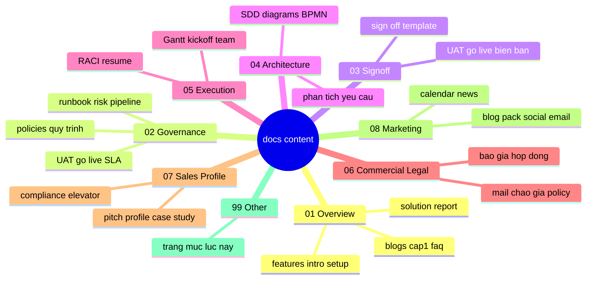

# 99-other | Other

Trang nay liet ke **tat ca** file Markdown trong `docs/content/` (nhom theo thu muc). De tim theo chu de nghiep vu, dung them [Danh muc | Catalog](../../catalog.md).

[Danh muc | Catalog](../../catalog.md){ .md-button .md-button--primary }
[Home page](../../index.md){ .md-button }

## So do thu muc docs content | Mind map

**VI:** Tom tat cac nhom `docs/content/` tuong ung menu ben trai.  
**EN:** High-level map of `docs/content/` groups (same as the docs nav).

## 01 Overview

- [blogs listing](../01-overview/blogs_listing.md)
- [cap1](../01-overview/cap1.md)
- [faq list](../01-overview/faq_list.md)
- [features listing](../01-overview/features_listing.md)
- [huong dan cai dat va su dung](../01-overview/huong_dan_cai_dat_va_su_dung.md)
- [huong dan cai dat va su dung bilingual](../01-overview/huong_dan_cai_dat_va_su_dung_bilingual.md)
- [index](../01-overview/index.md)
- [introduction](../01-overview/introduction.md)
- [introduction report](../01-overview/introduction_report.md)
- [solution](../01-overview/solution.md)
- [user guideline help](../01-overview/user_guideline_help.md)

## 02 Governance

- [chinh sach bao tri](../02-governance/chinh_sach_bao_tri.md)
- [comment policy](../02-governance/comment_policy.md)
- [go live checklist](../02-governance/go_live_checklist.md)
- [index](../02-governance/index.md)
- [operations index](../02-governance/operations_index.md)
- [pipeline theo tung nhom thanh vien](../02-governance/pipeline_theo_tung_nhom_thanh_vien.md)
- [quy trinh giai quyet khieu nai khieu kien](../02-governance/quy_trinh_giai_quyet_khieu_nai_khieu_kien.md)
- [quy trinh quan ly du an](../02-governance/quy_trinh_quan_ly_du_an.md)
- [quy trinh tiep nhan yeu cau](../02-governance/quy_trinh_tiep_nhan_yeu_cau.md)
- [report policy](../02-governance/report_policy.md)
- [risk register](../02-governance/risk_register.md)
- [runbook incident](../02-governance/runbook_incident.md)
- [slo sla](../02-governance/slo_sla.md)
- [uat checklist](../02-governance/uat_checklist.md)

## 03 Signoff

- [go live sign off bien ban](../03-signoff/go_live_sign_off_bien_ban.md)
- [index](../03-signoff/index.md)
- [sign off template](../03-signoff/sign_off_template.md)
- [uat sign off bien ban](../03-signoff/uat_sign_off_bien_ban.md)

## 04 Architecture

- [bpmn quy trinh nghiep vu](../04-architecture/bpmn_quy_trinh_nghiep_vu.md)
- [index](../04-architecture/index.md)
- [tai lieu kien truc va diagrams](../04-architecture/tai_lieu_kien_truc_va_diagrams.md)
- [tai lieu kien truc va diagrams bilingual](../04-architecture/tai_lieu_kien_truc_va_diagrams_bilingual.md)
- [tai lieu phan tich yeu cau](../04-architecture/tai_lieu_phan_tich_yeu_cau.md)
- [tai lieu thiet ke he thong](../04-architecture/tai_lieu_thiet_ke_he_thong.md)
- [tai lieu thiet ke he thong bilingual](../04-architecture/tai_lieu_thiet_ke_he_thong_bilingual.md)

## 05 Execution

- [index](../05-execution/index.md)
- [kickoff playbook](../05-execution/kickoff_playbook.md)
- [member resume profiles](../05-execution/member_resume_profiles.md)
- [project plan gantt](../05-execution/project_plan_gantt.md)
- [project plan gantt by package ABC](../05-execution/project_plan_gantt_by_package_ABC.md)
- [team profile](../05-execution/team_profile.md)
- [to chuc du an team role va thuc hien](../05-execution/to_chuc_du_an_team_role_va_thuc_hien.md)

## 06 Commercial Legal

- [bao gia de xuat](../06-commercial-legal/bao_gia_de_xuat.md)
- [bao gia rut gon 1 trang](../06-commercial-legal/bao_gia_rut_gon_1_trang.md)
- [bao gia rut gon 1 trang bilingual](../06-commercial-legal/bao_gia_rut_gon_1_trang_bilingual.md)
- [bao gia rut gon 1 trang bilingual usd reference](../06-commercial-legal/bao_gia_rut_gon_1_trang_bilingual_usd_reference.md)
- [checklist ky hop dong](../06-commercial-legal/checklist_ky_hop_dong.md)
- [contract pack index](../06-commercial-legal/contract_pack_index.md)
- [contract signing cover email](../06-commercial-legal/contract_signing_cover_email.md)
- [hop dong dich vu trien khai chatbot bilingual](../06-commercial-legal/hop_dong_dich_vu_trien_khai_chatbot_bilingual.md)
- [hop dong dich vu trien khai chatbot mau](../06-commercial-legal/hop_dong_dich_vu_trien_khai_chatbot_mau.md)
- [hop dong dich vu trien khai chatbot rut gon](../06-commercial-legal/hop_dong_dich_vu_trien_khai_chatbot_rut_gon.md)
- [index](../06-commercial-legal/index.md)
- [mail chao gia offers](../06-commercial-legal/mail_chao_gia_offers.md)
- [mail chao gia theo goi ABC](../06-commercial-legal/mail_chao_gia_theo_goi_ABC.md)
- [mail chao gia theo goi ABC bilingual](../06-commercial-legal/mail_chao_gia_theo_goi_ABC_bilingual.md)
- [payment policy](../06-commercial-legal/payment_policy.md)
- [privacy policy](../06-commercial-legal/privacy_policy.md)
- [terms of service](../06-commercial-legal/terms_of_service.md)

## 07 Sales Profile

- [case study demo chatbot](../07-sales-profile/case_study_demo_chatbot.md)
- [case study demo chatbot detailed](../07-sales-profile/case_study_demo_chatbot_detailed.md)
- [company profile](../07-sales-profile/company_profile.md)
- [customer compliance elevator pitch 30s](../07-sales-profile/customer_compliance_elevator_pitch_30s.md)
- [customer compliance elevator pitch 30s technical buyer](../07-sales-profile/customer_compliance_elevator_pitch_30s_technical_buyer.md)
- [customer compliance elevator pitch 30s variants](../07-sales-profile/customer_compliance_elevator_pitch_30s_variants.md)
- [customer compliance statement](../07-sales-profile/customer_compliance_statement.md)
- [customer compliance statement bilingual](../07-sales-profile/customer_compliance_statement_bilingual.md)
- [customer compliance statement executive](../07-sales-profile/customer_compliance_statement_executive.md)
- [customer compliance statement slide ready](../07-sales-profile/customer_compliance_statement_slide_ready.md)
- [customer compliance statement slide ready bilingual](../07-sales-profile/customer_compliance_statement_slide_ready_bilingual.md)
- [customer compliance talk track 2min](../07-sales-profile/customer_compliance_talk_track_2min.md)
- [customer compliance talk track 5min](../07-sales-profile/customer_compliance_talk_track_5min.md)
- [customer profile](../07-sales-profile/customer_profile.md)
- [index](../07-sales-profile/index.md)
- [meeting template 15min](../07-sales-profile/meeting_template_15min.md)
- [pitch pack](../07-sales-profile/pitch_pack.md)

## 08 Marketing

- [email newsletter pack](../08-marketing/email_newsletter_pack.md)
- [index](../08-marketing/index.md)
- [marketing blog 01 demo vs production](../08-marketing/marketing_blog_01_demo_vs_production.md)
- [marketing blog 02 go live checklist](../08-marketing/marketing_blog_02_go_live_checklist.md)
- [marketing blog 03 case study](../08-marketing/marketing_blog_03_case_study.md)
- [marketing blog 04 security compliance](../08-marketing/marketing_blog_04_security_compliance.md)
- [marketing blog 05 kpi slo sla](../08-marketing/marketing_blog_05_kpi_slo_sla.md)
- [marketing blog pack](../08-marketing/marketing_blog_pack.md)
- [marketing campaign calendar](../08-marketing/marketing_campaign_calendar.md)
- [news feed](../08-marketing/news_feed.md)
- [social post pack](../08-marketing/social_post_pack.md)
