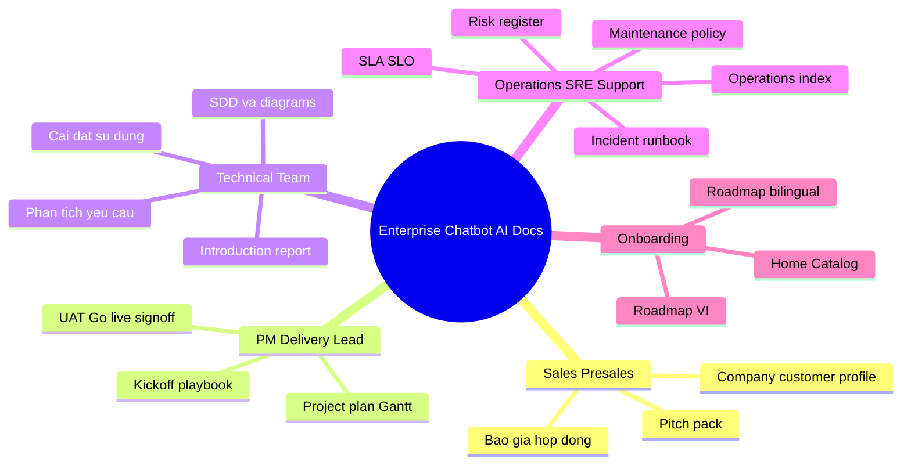

# Enterprise Chatbot | AI — Docs Library

Thu vien tai lieu chinh thuc de public tren GitHub Pages.

## 1. Tong quan | Overview

Tai lieu nay duoc to chuc de ho tro toan bo vong doi chatbot production-ready: Presales -> Delivery -> Governance -> Operations -> Go-live.

!!! info "Gia tri thu vien tai lieu | Why this docs library matters"
    - Chuan hoa de xuat, pham vi va goi dich vu chatbot cho khach hang.
    - Kiem soat chat luong trien khai voi checklist UAT, sign-off, go-live.
    - Van hanh on dinh voi SLA/SLO, incident runbook va governance docs.
    - Tang toc onboarding team ky thuat, business va operations.

[Danh muc day du | Full Catalog](./catalog.md){ .md-button .md-button--primary }
[Lo trinh theo vai tro | Role Roadmap](./roadmap.md){ .md-button }
[Lo trinh theo vai tro | Role Roadmap bilingual](./roadmap_bilingual.md){ .md-button }
[Huong dan publish | Publish Guide](./publish_github_pages.md){ .md-button }

## 2. Bat dau nhanh | Quick Start

- [Tong quan du an](./content/01-overview/introduction_report.md)
- [Huong dan cai dat va su dung](./content/01-overview/huong_dan_cai_dat_va_su_dung.md)
- [Operations index](./content/02-governance/operations_index.md)
- [Features listing](./content/01-overview/features_listing.md)
- [Blogs listing](./content/01-overview/blogs_listing.md)

## 3. Danh muc tai lieu | Document Catalog

- [Catalog day du theo nhom | Full grouped catalog](./catalog.md)
- [Huong dan publish GitHub Pages | Publish guide](./publish_github_pages.md)

## 4. Nhom tai lieu quan trong | Key Document Groups

### 4.1 Business & Presales

- [Company profile](./content/07-sales-profile/company_profile.md)
- [Customer profile](./content/07-sales-profile/customer_profile.md)
- [Pitch pack](./content/07-sales-profile/pitch_pack.md)
- [Contract pack / bao gia](./content/06-commercial-legal/contract_pack_index.md)

### 4.2 Delivery & Governance

- [Project plan (Gantt)](./content/05-execution/project_plan_gantt.md)
- [Project plan theo goi A/B/C](./content/05-execution/project_plan_gantt_by_package_ABC.md)
- [Kickoff playbook](./content/05-execution/kickoff_playbook.md)
- [Report policy](./content/02-governance/report_policy.md)

### 4.3 Quality & Go-live

- [UAT checklist](./content/02-governance/uat_checklist.md)
- [Go-live checklist](./content/02-governance/go_live_checklist.md)
- [Sign-off template](./content/03-signoff/sign_off_template.md)

### 4.4 Operations & Security

- [SLA/SLO](./content/02-governance/slo_sla.md)
- [Runbook incident](./content/02-governance/runbook_incident.md)
- [Risk register](./content/02-governance/risk_register.md)
- [Chinh sach bao tri](./content/02-governance/chinh_sach_bao_tri.md)

### 4.5 Architecture & Analysis

- [Tai lieu thiet ke he thong](./content/04-architecture/tai_lieu_thiet_ke_he_thong.md)
- [Tai lieu thiet ke he thong (song ngu)](./content/04-architecture/tai_lieu_thiet_ke_he_thong_bilingual.md)
- [Tai lieu kien truc & diagrams](./content/04-architecture/tai_lieu_kien_truc_va_diagrams.md)
- [Tai lieu kien truc & diagrams (song ngu)](./content/04-architecture/tai_lieu_kien_truc_va_diagrams_bilingual.md)
- [Tai lieu phan tich yeu cau](./content/04-architecture/tai_lieu_phan_tich_yeu_cau.md)

### 4.6 Marketing & Content

- [Marketing blog 01](./content/08-marketing/marketing_blog_01_demo_vs_production.md)
- [Marketing blog 02](./content/08-marketing/marketing_blog_02_go_live_checklist.md)
- [Marketing blog 03](./content/08-marketing/marketing_blog_03_case_study.md)
- [Marketing blog 04](./content/08-marketing/marketing_blog_04_security_compliance.md)
- [Marketing blog 05](./content/08-marketing/marketing_blog_05_kpi_slo_sla.md)
- [Social post pack](./content/08-marketing/social_post_pack.md)
- [Email newsletter pack](./content/08-marketing/email_newsletter_pack.md)
- [Marketing campaign calendar](./content/08-marketing/marketing_campaign_calendar.md)

## 5. Web demo pages | Trang demo web

- [Landing page (VI)](./frontend/landing.html)
- [Landing page](./frontend/landing_bilingual.html)
- [Blogs web](./frontend/blogs.html)
- [Features web](./frontend/features.html)
- [News web](./frontend/news.html)

## 6. Mindmap lo trinh theo vai tro | Role roadmap (tom tat)

**VI:** So do tu duy: bon nhom vai tro chinh trong thu vien tai lieu + cac buoc onboarding.  
**EN:** Mind map of the four role tracks and onboarding entry points.

