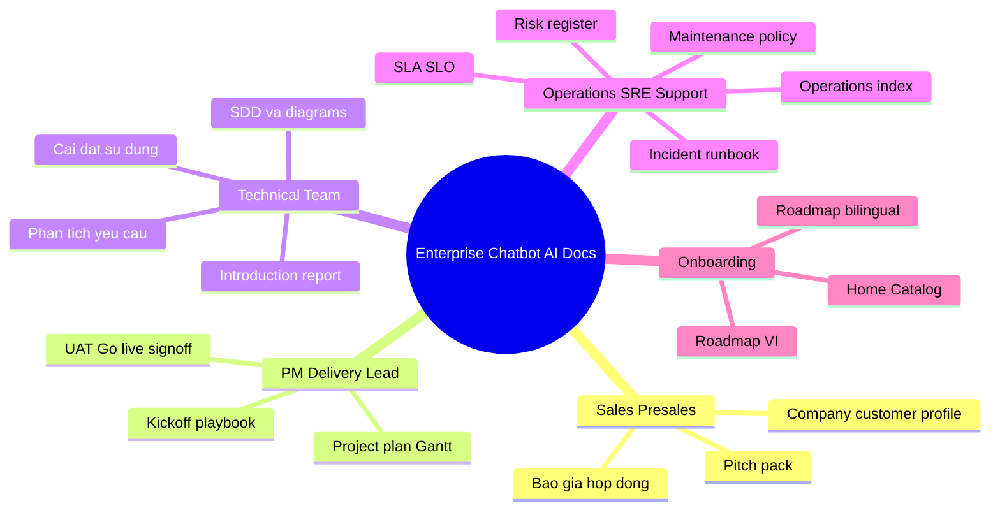

# Lo Trinh Tai Lieu Theo Vai Tro | Role-Based Docs Roadmap

Trang nay giup moi nhom vai tro tim nhanh tai lieu can doc theo thu tu uu tien.  
This page helps each role quickly find the right documents in recommended order.

## Sales / Presales

**Muc tieu / Goal:** Chot scope nhanh, thong diep nhat quan, de xuat dung muc.  
Close scope quickly, keep messaging consistent, and propose the right package.

1. [Company profile](./content/07-sales-profile/company_profile.md)
2. [Customer profile](./content/07-sales-profile/customer_profile.md)
3. [Pitch pack](./content/07-sales-profile/pitch_pack.md)
4. [Bao gia de xuat](./content/06-commercial-legal/bao_gia_de_xuat.md)
5. [Contract pack index](./content/06-commercial-legal/contract_pack_index.md)

## PM / Delivery Lead

**Muc tieu / Goal:** Quan ly pham vi, tien do, quality gates va ban giao.  
Manage scope, timeline, quality gates, and delivery readiness.

1. [Project plan gantt](./content/05-execution/project_plan_gantt.md)
2. [Kickoff playbook](./content/05-execution/kickoff_playbook.md)
3. [UAT checklist](./content/02-governance/uat_checklist.md)
4. [Go-live checklist](./content/02-governance/go_live_checklist.md)
5. [Sign-off template](./content/03-signoff/sign_off_template.md)

## Technical Team (Architect / Dev / QA)

**Muc tieu / Goal:** Hieu kien truc, y/c nghiep vu, va cach trien khai.  
Understand architecture, requirements, and implementation flow.

1. [Introduction report](./content/01-overview/introduction_report.md)
2. [Tai lieu thiet ke he thong](./content/04-architecture/tai_lieu_thiet_ke_he_thong.md)
3. [Architecture diagrams](./content/04-architecture/tai_lieu_kien_truc_va_diagrams.md)
4. [Tai lieu phan tich yeu cau](./content/04-architecture/tai_lieu_phan_tich_yeu_cau.md)
5. [Huong dan cai dat va su dung](./content/01-overview/huong_dan_cai_dat_va_su_dung.md)

## Operations / SRE / Support

**Muc tieu / Goal:** Van hanh an toan, xu ly su co nhanh, theo doi chat luong.  
Operate safely, resolve incidents quickly, and track service quality.

1. [Operations index](./content/02-governance/operations_index.md)
2. [SLA/SLO](./content/02-governance/slo_sla.md)
3. [Incident runbook](./content/02-governance/runbook_incident.md)
4. [Risk register](./content/02-governance/risk_register.md)
5. [Maintenance policy](./content/02-governance/chinh_sach_bao_tri.md)

## Thu tu de xuat khi onboarding du an / Recommended Onboarding Order

1. [Home page](./index.md)
2. [Catalog](./catalog.md)
3. [Roadmap theo vai tro](./roadmap.md)
4. [Roadmap theo vai tro bilingual](./roadmap_bilingual.md)
5. Bo tai lieu theo vai tro cua ban / Role-specific documents listed above

## Mindmap tom tat | Summary mind map

**VI:** So do tu duy tong hop 4 nhom vai tro + onboarding (trung voi [Home](./index.md) muc 6).  
**EN:** One-page mind map for the four role tracks and onboarding (same as Home section 6).

